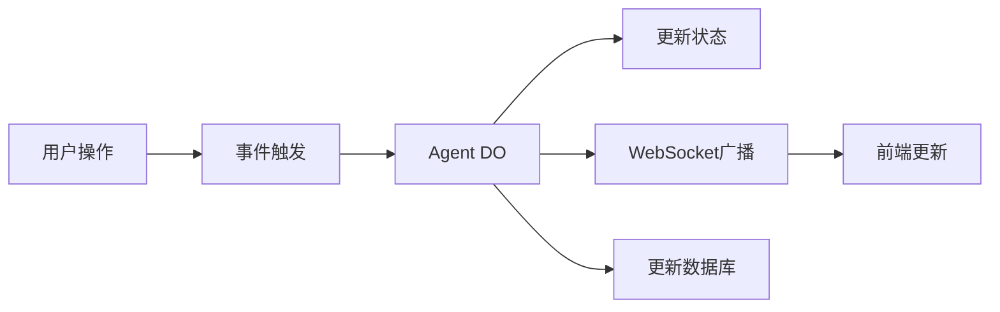

# 第八章到第十一章（最终追加部分）

# 第八章：服务层架构

## 8.1 限流服务

```typescript
// worker/services/rate-limit/DORateLimitStore.ts
export class DORateLimitStore extends DurableObject {
    async checkRateLimit(key: string, limit: number, window: number): Promise<boolean> {
        const now = Date.now();
        const windowStart = now - window;
        
        // 获取时间窗口内的请求记录
        const requests = await this.ctx.storage.get<number[]>(`requests:${key}`) || [];
        
        // 过滤掉过期的请求
        const validRequests = requests.filter(timestamp => timestamp > windowStart);
        
        if (validRequests.length >= limit) {
            return false; // 超过限制
        }
        
        // 记录新请求
        validRequests.push(now);
        await this.ctx.storage.put(`requests:${key}`, validRequests);
        
        return true;
    }
}
```

## 8.2 认证服务

```typescript
// worker/services/oauth/google.ts
export class GoogleOAuthService extends BaseOAuthService {
    protected authorizationEndpoint = 'https://accounts.google.com/o/oauth2/v2/auth';
    protected tokenEndpoint = 'https://oauth2.googleapis.com/token';
    protected userInfoEndpoint = 'https://www.googleapis.com/oauth2/v2/userinfo';
    
    async getUserInfo(accessToken: string): Promise<UserInfo> {
        const response = await fetch(this.userInfoEndpoint, {
            headers: {
                'Authorization': `Bearer ${accessToken}`,
            },
        });
        
        const data = await response.json();
        
        return {
            id: data.id,
            email: data.email,
            name: data.name,
            avatar: data.picture,
        };
    }
}
```

## 8.3 CSRF 防护

```typescript
// worker/services/csrf/CsrfService.ts
export class CsrfService {
    static async enforce(request: Request, response?: Response): Promise<void> {
        const method = request.method.toUpperCase();
        
        if (['GET', 'HEAD', 'OPTIONS'].includes(method)) {
            // 设置 CSRF token
            if (response) {
                const token = await this.generateToken();
                response.headers.set('Set-Cookie', `csrf-token=${token}; HttpOnly; Secure; SameSite=Strict`);
            }
        } else {
            // 验证 CSRF token
            const cookieToken = this.getCookieToken(request);
            const headerToken = request.headers.get('X-CSRF-Token');
            
            if (!cookieToken || !headerToken || cookieToken !== headerToken) {
                throw new SecurityError('CSRF validation failed', SecurityErrorType.CSRF_VIOLATION);
            }
        }
    }
    
    private static async generateToken(): Promise<string> {
        const randomBytes = crypto.getRandomValues(new Uint8Array(32));
        return Array.from(randomBytes).map(b => b.toString(16).padStart(2, '0')).join('');
    }
}
```

## 8.4 代码修复服务

```typescript
// worker/services/code-fixer/fixers/ts2307.ts
export async function fixTS2307(
    error: StaticAnalysisError,
    fileContent: string,
    allFiles: FileOutputType[]
): Promise<string | null> {
    const moduleName = extractModuleName(error.message);
    
    // 修复相对路径导入
    if (moduleName.startsWith('.')) {
        const correctPath = findCorrectPath(moduleName, allFiles);
        if (correctPath) {
            return fileContent.replace(
                new RegExp(`from ['"]${escapeRegex(moduleName)}['"]`),
                `from '${correctPath}'`
            );
        }
    }
    
    return null;
}
```

---

# 第九章：API 层设计

## 9.1 路由结构

```typescript
// worker/api/routes/index.ts
export function setupRoutes(app: Hono<AppEnv>): void {
    // 公共路由
    setupSentryRoutes(app);
    setupStatusRoutes(app);
    
    // 认证路由
    setupAuthRoutes(app);
    
    // 主要功能路由
    setupCodegenRoutes(app);
    setupAppRoutes(app);
    setupStatsRoutes(app);
    setupAnalyticsRoutes(app);
    
    // 配置路由
    setupModelConfigRoutes(app);
    setupSecretsRoutes(app);
    
    // GitHub 集成
    setupGitHubExporterRoutes(app);
}
```

## 9.2 WebSocket 处理

```typescript
// worker/api/routes/codegenRoutes.ts
app.get('/api/codegen/:agentId/ws', async (c) => {
    const agentId = c.req.param('agentId');
    const upgradeHeader = c.req.header('upgrade');
    
    if (upgradeHeader !== 'websocket') {
        return c.text('Expected WebSocket', 426);
    }
    
    // 获取 Agent DO Stub
    const agentStub = await getAgentStub(c.env, agentId);
    
    // 升级为 WebSocket
    const { response, socket } = Durable Object.upgradeWebSocket(c.req.raw);
    
    // 连接到 Agent
    await agentStub.connect(socket);
    
    return response;
});
```

## 9.3 Git 协议支持

```typescript
// worker/api/handlers/git-protocol.ts
export async function handleGitProtocolRequest(
    request: Request,
    env: Env,
    ctx: ExecutionContext
): Promise<Response> {
    const url = new URL(request.url);
    const match = url.pathname.match(/^\/apps\/(.+?)\.git\/(.+)$/);
    
    if (!match) {
        return new Response('Invalid Git protocol URL', { status: 400 });
    }
    
    const [, appId, gitPath] = match;
    
    if (gitPath === 'info/refs') {
        // Git smart HTTP protocol - info/refs
        return handleInfoRefs(appId, env);
    } else if (gitPath === 'git-upload-pack') {
        // Git smart HTTP protocol - upload-pack
        return handleUploadPack(request, appId, env);
    }
    
    return new Response('Not Found', { status: 404 });
}
```

---

# 第十章：数据流与状态管理

## 10.1 状态持久化

```typescript
// Durable Object Storage API 使用
class Agent extends DurableObject {
    // 自动持久化
    set state(newState: State) {
        this._state = newState;
        this.ctx.storage.put('state', newState);
    }
    
    // 手动持久化特定字段
    async updateField(key: string, value: any) {
        await this.ctx.storage.put(`field:${key}`, value);
    }
    
    // 事务操作
    async batchUpdate(updates: Record<string, any>) {
        await this.ctx.storage.transaction(async (txn) => {
            for (const [key, value] of Object.entries(updates)) {
                await txn.put(key, value);
            }
        });
    }
}
```

## 10.2 数据库层

```typescript
// worker/database/schema.ts
export const apps = sqliteTable('apps', {
    id: text('id').primaryKey(),
    userId: text('user_id').notNull(),
    name: text('name').notNull(),
    status: text('status').notNull(),
    createdAt: integer('created_at', { mode: 'timestamp' }).notNull(),
    updatedAt: integer('updated_at', { mode: 'timestamp' }).notNull(),
});

// worker/database/services/AppService.ts
export class AppService {
    static async createApp(db: Database, data: NewApp) {
        const [app] = await db.insert(apps).values(data).returning();
        return app;
    }
    
    static async getApp(db: Database, appId: string) {
        return db.query.apps.findFirst({
            where: eq(apps.id, appId),
        });
    }
    
    static async listUserApps(db: Database, userId: string) {
        return db.query.apps.findMany({
            where: eq(apps.userId, userId),
            orderBy: [desc(apps.createdAt)],
        });
    }
}
```

## 10.3 事件驱动架构



---

# 第十一章：最佳实践与扩展指南

## 11.1 性能优化

### 冷启动优化
```typescript
// 延迟初始化
class Agent {
    private services?: Services;
    
    getServices() {
        if (!this.services) {
            this.services = this.initializeServices();
        }
        return this.services;
    }
}

// 并行加载
async initialize() {
    const [template, config, user] = await Promise.all([
        getTemplate(),
        getConfig(),
        getUser(),
    ]);
}
```

### 内存管理
```typescript
// 使用流式处理大文件
async function* streamLargeFile(path: string) {
    const CHUNK_SIZE = 1024 * 1024; // 1MB
    const file = await readFile(path);
    
    for (let i = 0; i < file.length; i += CHUNK_SIZE) {
        yield file.slice(i, i + CHUNK_SIZE);
    }
}
```

## 11.2 错误处理

### 分类错误
```typescript
// shared/types/errors.ts
export enum ErrorType {
    VALIDATION = 'VALIDATION',
    AUTHENTICATION = 'AUTHENTICATION',
    RATE_LIMIT = 'RATE_LIMIT',
    INTERNAL = 'INTERNAL',
}

export class AppError extends Error {
    constructor(
        public type: ErrorType,
        message: string,
        public statusCode: number = 500
    ) {
        super(message);
    }
}
```

### 全局错误处理
```typescript
app.onError((err, c) => {
    if (err instanceof AppError) {
        return c.json({
            error: {
                type: err.type,
                message: err.message,
            }
        }, err.statusCode);
    }
    
    // 未知错误
    console.error('Unhandled error:', err);
    return c.json({
        error: {
            type: 'INTERNAL',
            message: 'Internal server error',
        }
    }, 500);
});
```

## 11.3 日志系统

```typescript
// worker/logger/core.ts
export class StructuredLogger {
    constructor(private context: Record<string, any>) {}
    
    info(message: string, data?: any) {
        console.log(JSON.stringify({
            level: 'info',
            message,
            ...this.context,
            ...data,
            timestamp: new Date().toISOString(),
        }));
    }
    
    error(message: string, error?: any) {
        console.error(JSON.stringify({
            level: 'error',
            message,
            error: error?.message,
            stack: error?.stack,
            ...this.context,
            timestamp: new Date().toISOString(),
        }));
    }
}

// 使用示例
const logger = createLogger('MyService', { requestId: '123' });
logger.info('Processing request', { userId: 'user-456' });
```

## 11.4 测试策略

### 单元测试
```typescript
// vitest + @cloudflare/vitest-pool-workers
import { describe, it, expect } from 'vitest';

describe('FileManager', () => {
    it('should save file and calculate diff', async () => {
        const fileManager = new FileManager(/* ... */);
        
        const result = await fileManager.saveGeneratedFile({
            filePath: 'test.ts',
            fileContents: 'export const foo = 1;',
            filePurpose: 'Test file',
        });
        
        expect(result.lastDiff).toContain('+export const foo = 1;');
    });
});
```

### 集成测试
```typescript
describe('Code Generation Flow', () => {
    it('should generate code end-to-end', async () => {
        const agent = await createTestAgent();
        await agent.initialize({
            query: 'Create a todo app',
            inferenceContext: testContext,
        });
        
        await agent.generateAllFiles(1);
        
        expect(agent.state.mvpGenerated).toBe(true);
        expect(agent.state.generatedFiles.length).toBeGreaterThan(0);
    });
});
```

## 11.5 安全实践

### 输入验证
```typescript
// 使用 Zod 验证所有输入
const CreateAppSchema = z.object({
    name: z.string().min(3).max(50).regex(/^[a-z0-9-]+$/),
    template: z.string(),
    description: z.string().max(500).optional(),
});

app.post('/api/apps', async (c) => {
    const body = await c.req.json();
    const validated = CreateAppSchema.parse(body); // 抛出错误如果无效
    // ...
});
```

### 密钥管理
```typescript
// 使用 Workers Secrets
// wrangler secret put ANTHROPIC_API_KEY
const apiKey = env.ANTHROPIC_API_KEY;

// 不要在代码中硬编码密钥
// ❌ const apiKey = 'sk-...';
```

## 11.6 扩展指南

### 添加新模型
```typescript
// 1. 在 config.types.ts 添加模型
export enum AIModels {
    // ... 现有模型
    NEW_MODEL = 'new-provider/new-model',
}

// 2. 在 AGENT_CONFIG 添加配置
export const AGENT_CONFIG: Record<AgentActionKey, ModelConfig> = {
    'new_action': {
        name: AIModels.NEW_MODEL,
        maxTokens: 4000,
        temperature: 0.5,
    },
    // ...
};

// 3. 在 infer.ts 添加 API 密钥映射
function getApiKey(env: Env, model: AIModels): string {
    if (model.startsWith('new-provider/')) {
        return env.NEW_PROVIDER_API_KEY;
    }
    // ...
}
```

### 添加新工具
```typescript
// 1. 创建工具文件 worker/agents/tools/toolkit/my-tool.ts
export function createMyTool(
    agent: CodingAgentInterface
): ToolDefinition<MyToolArgs, MyToolResult> {
    return {
        type: 'function',
        function: {
            name: 'my_tool',
            description: 'What this tool does',
            parameters: zodToJsonSchema(MyToolArgsSchema),
        },
        implementation: async (args) => {
            // 实现逻辑
            return { success: true };
        }
    };
}

// 2. 在 UserConversationProcessor 注册
private buildToolkit(agent: CodingAgentInterface): ToolDefinition<any, any>[] {
    return [
        // ... 现有工具
        createMyTool(agent),
    ];
}
```

### 添加新模板
```bash
# 1. 创建模板目录
mkdir templates/my-template

# 2. 添加 template.json
{
  "name": "my-template",
  "description": "My custom template",
  "language": "typescript",
  "frameworks": ["react", "vite"],
  "importantFiles": ["src/main.tsx"],
  "entryPoint": "src/main.tsx"
}

# 3. 压缩并上传到 R2
zip -r my-template.zip my-template/
wrangler r2 object put TEMPLATES_BUCKET/my-template.zip --file my-template.zip

# 4. 更新 template_catalog.json
[
  {
    "name": "my-template",
    "description": "My custom template",
    "language": "typescript"
  }
]
```

---

## 11.7 总结

本文档完整剖析了 VibeSDK Worker 端的架构设计与实现细节，涵盖：

### 核心技术栈
- **Cloudflare Workers**：边缘计算平台
- **Durable Objects**：有状态 Agent
- **Hono**：轻量级 Web 框架
- **Drizzle ORM**：类型安全数据库
- **Zod**：Schema 验证
- **Cloudflare Containers**：沙箱环境

### 关键设计模式
- **Phase-wise Generation**：增量代码生成
- **Event-Driven Architecture**：WebSocket 实时通信
- **Service Layer Pattern**：职责分离
- **Tool System**：可扩展的 Agent 能力
- **Multi-Tenant Deployment**：Workers for Platforms

### 最佳实践
- **类型安全**：TypeScript + Zod 全流程
- **错误恢复**：自动重试 + 回滚机制
- **性能优化**：并行加载 + 流式处理
- **安全防护**：CSRF + Rate Limiting + 容器隔离
- **可观测性**：结构化日志 + 错误监控

### 扩展能力
- 添加新 AI 模型
- 创建自定义工具
- 开发新模板
- 集成 MCP 协议

---

**文档完成！** 🎉

本文档提供了从基础架构到高级扩展的完整指南，帮助 AI Agent 开发者深入理解并复制构建类似平台的能力。

---

**参考资源**：
- [Cloudflare Workers 文档](https://developers.cloudflare.com/workers/)
- [Durable Objects 指南](https://developers.cloudflare.com/durable-objects/)
- [Workers for Platforms](https://developers.cloudflare.com/cloudflare-for-platforms/workers-for-platforms/)
- [Cloudflare Containers](https://developers.cloudflare.com/containers/)
- [Hono 框架](https://hono.dev/)
- [Drizzle ORM](https://orm.drizzle.team/)

---

© 2025 VibeSDK - Open Source AI Code Generation Platform
