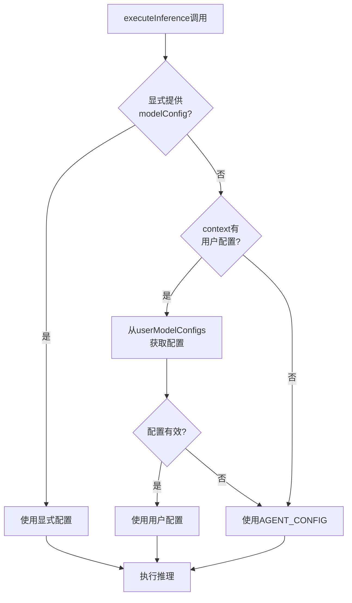
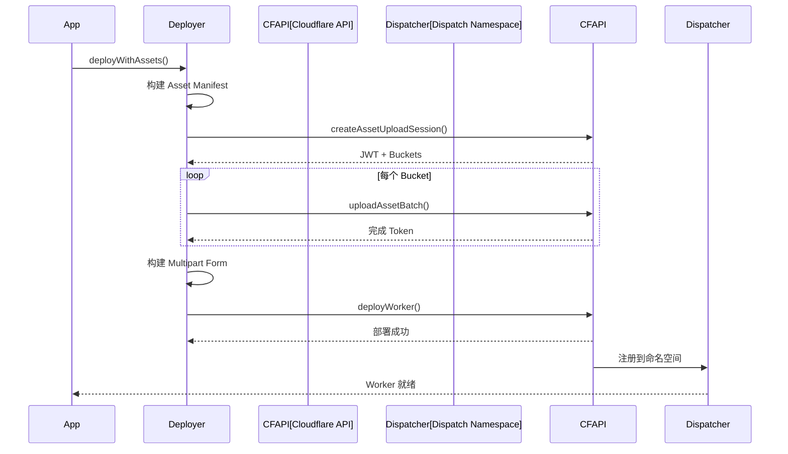

# 第四章到第十一章内容（追加到主文档）

# 第四章：推理引擎（Inference Engine）

## 4.1 统一推理接口

### 4.1.1 executeInference 函数设计

VibeSDK 通过一个统一的推理接口 `executeInference` 来抽象不同 LLM 的调用细节：

```typescript
// worker/agents/inferutils/infer.ts

// 函数重载：支持结构化输出和自由文本输出
export async function executeInference<T extends z.AnyZodObject>(
    params: InferenceParamsStructured<T>
): Promise<InferResponseObject<T>>;

export async function executeInference(
    params: InferenceParamsBase
): Promise<InferResponseString>;

export async function executeInference<T extends z.AnyZodObject>({
    env,
    messages,
    temperature = 0.7,
    maxTokens = 4096,
    retryLimit = 5,
    stream,
    tools,
    reasoning_effort,
    schema,
    agentActionName,
    format,
    modelName,
    modelConfig,
    context
}: InferenceParamsBase & {
    schema?: T;
    format?: SchemaFormat;
}): Promise<InferResponseString | InferResponseObject<T>> {
    
    // 1. 确定使用的模型配置
    let conf: ModelConfig | undefined;
    
    if (modelConfig) {
        // 显式提供的配置
        conf = modelConfig;
    } else if (context?.userModelConfigs) {
        // 用户级别配置
        conf = context.userModelConfigs[agentActionName];
    }
    
    if (!conf) {
        // 回退到全局默认配置
        conf = AGENT_CONFIG[agentActionName];
    }
    
    // 2. 验证约束
    validateAgentConstraints(agentActionName, conf.name);
    
    // 3. 准备推理参数
    const inferParams: InferParams = {
        model: conf.name,
        messages,
        temperature: conf.temperature ?? temperature,
        maxTokens: conf.maxTokens ?? maxTokens,
        topP: conf.topP,
        stream: stream ? true : false,
    };
    
    // 4. 添加结构化输出（如果有 schema）
    if (schema) {
        if (format === 'openai_function') {
            // OpenAI function calling
            inferParams.tools = [{
                type: 'function',
                function: {
                    name: 'output',
                    parameters: zodToJsonSchema(schema),
                }
            }];
            inferParams.tool_choice = { type: 'function', function: { name: 'output' } };
        } else {
            // Native JSON mode
            inferParams.response_format = {
                type: 'json_schema',
                json_schema: {
                    name: 'output',
                    schema: zodToJsonSchema(schema),
                    strict: true,
                }
            };
        }
    }
    
    // 5. 添加 reasoning effort（o1/o3 系列）
    if (reasoning_effort && isReasoningModel(conf.name)) {
        inferParams.reasoning_effort = reasoning_effort;
    }
    
    // 6. 重试循环
    let attempt = 0;
    let lastError: Error | null = null;
    
    while (attempt < retryLimit) {
        try {
            // 调用核心推理函数
            const response = await infer(env, inferParams, stream?.onChunk);
            
            // 解析响应
            if (schema) {
                // 验证并解析结构化输出
                const parsed = schema.parse(JSON.parse(response.content));
                return {
                    success: true,
                    data: parsed,
                    raw: response.content,
                } as InferResponseObject<T>;
            } else {
                // 返回原始文本
                return {
                    success: true,
                    content: response.content,
                } as InferResponseString;
            }
        } catch (error) {
            lastError = error as Error;
            attempt++;
            
            if (error instanceof AbortError) {
                // 用户取消，不重试
                throw error;
            }
            
            if (attempt < retryLimit) {
                // 添加重新生成提示
                messages.push(
                    createAssistantMessage(lastError.message),
                    createUserMessage(responseRegenerationPrompts)
                );
            }
        }
    }
    
    // 所有重试失败
    throw new Error(`Inference failed after ${retryLimit} attempts: ${lastError?.message}`);
}
```

**设计亮点**：

1. **函数重载**：TypeScript 类型安全，根据是否传入 schema 返回不同类型
2. **配置层级**：显式配置 > 用户配置 > 全局配置
3. **自动重试**：解析失败自动重试，并添加错误提示
4. **流式支持**：可选的流式输出回调
5. **取消支持**：AbortController 中断推理

### 4.1.2 核心推理函数

```typescript
// worker/agents/inferutils/core.ts
export async function infer(
    env: Env,
    params: InferParams,
    streamCallback?: (chunk: string) => void
): Promise<InferResponse> {
    
    // 1. 构建 OpenAI 兼容请求
    const requestBody = {
        model: params.model,
        messages: params.messages,
        temperature: params.temperature,
        max_tokens: params.maxTokens,
        top_p: params.topP,
        stream: params.stream,
        response_format: params.response_format,
        tools: params.tools,
        tool_choice: params.tool_choice,
    };
    
    // 2. 通过 AI Gateway 调用
    const response = await fetch(
        `https://gateway.ai.cloudflare.com/v1/${env.CLOUDFLARE_ACCOUNT_ID}/${env.AI_GATEWAY_ID}/openai/chat/completions`,
        {
            method: 'POST',
            headers: {
                'Authorization': `Bearer ${getApiKey(env, params.model)}`,
                'Content-Type': 'application/json',
                'CF-AIG-Authorization': `Bearer ${env.CLOUDFLARE_AI_GATEWAY_TOKEN}`,
            },
            body: JSON.stringify(requestBody),
        }
    );
    
    if (!response.ok) {
        throw new InferError(`HTTP ${response.status}: ${await response.text()}`);
    }
    
    // 3. 处理流式响应
    if (params.stream && streamCallback) {
        const reader = response.body!.getReader();
        const decoder = new TextDecoder();
        let buffer = '';
        
        while (true) {
            const { done, value } = await reader.read();
            if (done) break;
            
            buffer += decoder.decode(value, { stream: true });
            const lines = buffer.split('\n');
            buffer = lines.pop() || '';
            
            for (const line of lines) {
                if (line.startsWith('data: ')) {
                    const data = line.slice(6);
                    if (data === '[DONE]') continue;
                    
                    try {
                        const parsed = JSON.parse(data);
                        const content = parsed.choices[0]?.delta?.content;
                        if (content) {
                            streamCallback(content);
                        }
                    } catch (e) {
                        // 忽略解析错误
                    }
                }
            }
        }
        
        return { content: '' }; // 流式模式不返回完整内容
    }
    
    // 4. 处理非流式响应
    const data = await response.json();
    const content = data.choices[0]?.message?.content || '';
    
    // 处理 function calling 响应
    if (data.choices[0]?.message?.tool_calls) {
        const toolCall = data.choices[0].message.tool_calls[0];
        return { content: toolCall.function.arguments };
    }
    
    return { content };
}
```

---

## 4.2 模型配置系统

### 4.2.1 AGENT_CONFIG 设计

```typescript
// worker/agents/inferutils/config.ts
export const AGENT_CONFIG: Record<AgentActionKey, ModelConfig> = {
    // Blueprint 生成 - 需要创造力
    'blueprint_generation': {
        name: AIModels.GEMINI_2_0_FLASH_THINKING,
        maxTokens: 8000,
        temperature: 0.7,
        topP: 0.95,
    },
    
    // Phase 生成 - 平衡创造力和一致性
    'phase_generation': {
        name: AIModels.GEMINI_2_0_FLASH_THINKING,
        maxTokens: 4000,
        temperature: 0.6,
        topP: 0.9,
    },
    
    // Phase 实现 - 需要精确性
    'phase_implementation': {
        name: AIModels.GEMINI_2_0_FLASH_THINKING,
        maxTokens: 16000,
        temperature: 0.4,
        topP: 0.8,
    },
    
    // 文件重新生成 - 高精确性
    'file_regeneration': {
        name: AIModels.GEMINI_2_0_FLASH_THINKING,
        maxTokens: 8000,
        temperature: 0.3,
        topP: 0.7,
    },
    
    // 用户对话 - 需要理解力
    'user_conversation': {
        name: AIModels.GEMINI_2_0_FLASH_THINKING,
        maxTokens: 4000,
        temperature: 0.5,
        topP: 0.9,
    },
    
    // 深度调试 - 需要推理能力
    'deep_debug': {
        name: AIModels.O1_MINI,
        reasoning_effort: 'medium',
        maxTokens: 16000,
    },
};
```

**配置原则**：

| 任务类型 | 温度 | Top-P | 原因 |
|---------|------|-------|------|
| Blueprint | 0.7 | 0.95 | 需要创造性思维 |
| Phase 生成 | 0.6 | 0.9 | 平衡创造与一致 |
| 代码实现 | 0.4 | 0.8 | 需要精确语法 |
| 文件重生成 | 0.3 | 0.7 | 需要确定性修复 |
| 深度调试 | N/A | N/A | 使用 reasoning models |

### 4.2.2 用户级别配置覆盖

```typescript
// worker/database/services/ModelConfigService.ts
export class ModelConfigService {
    /**
     * 获取用户的模型配置
     */
    static async getUserModelConfigs(
        db: Database,
        userId: string
    ): Promise<Record<AgentActionKey, ModelConfig>> {
        const configs = await db.query.modelConfigs.findMany({
            where: eq(modelConfigs.userId, userId),
        });
        
        const result: Record<string, ModelConfig> = {};
        
        for (const config of configs) {
            result[config.agentAction] = {
                name: config.modelName as AIModels,
                maxTokens: config.maxTokens,
                temperature: config.temperature,
                topP: config.topP,
                reasoning_effort: config.reasoningEffort as ReasoningEffort,
            };
        }
        
        return result as Record<AgentActionKey, ModelConfig>;
    }
    
    /**
     * 更新用户配置
     */
    static async setUserModelConfig(
        db: Database,
        userId: string,
        agentAction: AgentActionKey,
        config: Partial<ModelConfig>
    ): Promise<void> {
        await db.insert(modelConfigs)
            .values({
                userId,
                agentAction,
                modelName: config.name,
                maxTokens: config.maxTokens,
                temperature: config.temperature,
                topP: config.topP,
                reasoningEffort: config.reasoning_effort,
            })
            .onConflictDoUpdate({
                target: [modelConfigs.userId, modelConfigs.agentAction],
                set: {
                    modelName: config.name,
                    maxTokens: config.maxTokens,
                    temperature: config.temperature,
                    topP: config.topP,
                    reasoningEffort: config.reasoning_effort,
                }
            });
    }
}
```

**配置加载流程**：



---

## 4.3 Schema 格式化

### 4.3.1 Zod 到 JSON Schema 转换

```typescript
// worker/agents/inferutils/schemaFormatters.ts
export function zodToJsonSchema(schema: z.AnyZodObject): JSONSchema {
    return zodToJsonSchemaImpl(schema);
}

function zodToJsonSchemaImpl(schema: z.ZodTypeAny): any {
    if (schema instanceof z.ZodObject) {
        const shape = schema._def.shape();
        const properties: Record<string, any> = {};
        const required: string[] = [];
        
        for (const [key, value] of Object.entries(shape)) {
            properties[key] = zodToJsonSchemaImpl(value as z.ZodTypeAny);
            
            // 检查是否必需
            if (!(value instanceof z.ZodOptional)) {
                required.push(key);
            }
        }
        
        return {
            type: 'object',
            properties,
            required,
            additionalProperties: false,
        };
    }
    
    if (schema instanceof z.ZodString) {
        const result: any = { type: 'string' };
        const description = schema._def.description;
        if (description) {
            result.description = description;
        }
        return result;
    }
    
    if (schema instanceof z.ZodNumber) {
        return { type: 'number' };
    }
    
    if (schema instanceof z.ZodBoolean) {
        return { type: 'boolean' };
    }
    
    if (schema instanceof z.ZodArray) {
        return {
            type: 'array',
            items: zodToJsonSchemaImpl(schema._def.type),
        };
    }
    
    if (schema instanceof z.ZodEnum) {
        return {
            type: 'string',
            enum: schema._def.values,
        };
    }
    
    if (schema instanceof z.ZodOptional) {
        return zodToJsonSchemaImpl(schema._def.innerType);
    }
    
    // ... 更多类型
    
    return {};
}
```

### 4.3.2 Tool Definition 生成

```typescript
// worker/agents/tools/types.ts
export interface ToolDefinition<TArgs, TResult> {
    type: 'function';
    function: {
        name: string;
        description: string;
        parameters: JSONSchema;
    };
    implementation: (args: TArgs) => Promise<TResult>;
}

// 从 Zod Schema 创建 Tool
export function createTool<TArgs extends z.AnyZodObject, TResult>(
    name: string,
    description: string,
    argsSchema: TArgs,
    implementation: (args: z.infer<TArgs>) => Promise<TResult>
): ToolDefinition<z.infer<TArgs>, TResult> {
    return {
        type: 'function',
        function: {
            name,
            description,
            parameters: zodToJsonSchema(argsSchema),
        },
        implementation,
    };
}

// 使用示例
const readFilesTool = createTool(
    'read_files',
    'Read multiple files from the project',
    z.object({
        file_paths: z.array(z.string()).describe('Array of file paths to read'),
    }),
    async ({ file_paths }) => {
        const files = await Promise.all(
            file_paths.map(path => fileManager.getFile(path))
        );
        return { files };
    }
);
```

---

## 4.4 AI Gateway 集成

### 4.4.1 多模型路由

AI Gateway 充当统一代理，将请求路由到不同的 AI 提供商：

```
Client → AI Gateway → {
    OpenAI (gpt-4o, o1-mini)
    Anthropic (claude-3.5-sonnet)
    Google (gemini-2.0-flash)
    Cloudflare Workers AI
}
```

**优势**：
- **统一接口**：所有模型使用 OpenAI 兼容的 API
- **密钥管理**：API Key 存储在服务端
- **请求缓存**：相同请求自动缓存
- **分析监控**：统一的请求日志和分析

### 4.4.2 请求缓存策略

```typescript
// AI Gateway 自动缓存 GET 请求（Chat Completions 是 POST，需手动缓存）

// 1. 为相似的 prompt 生成缓存 key
function generateCacheKey(messages: Message[], modelName: string): string {
    const normalized = messages.map(m => ({
        role: m.role,
        content: normalizeContent(m.content),
    }));
    return `${modelName}:${hash(JSON.stringify(normalized))}`;
}

// 2. 在调用前检查缓存
async function inferWithCache(
    env: Env,
    params: InferParams
): Promise<InferResponse> {
    const cacheKey = generateCacheKey(params.messages, params.model);
    
    // 检查 KV 缓存
    const cached = await env.VibecoderStore.get(`inference:${cacheKey}`);
    if (cached) {
        return JSON.parse(cached);
    }
    
    // 调用 AI Gateway
    const response = await infer(env, params);
    
    // 缓存结果（24小时）
    await env.VibecoderStore.put(
        `inference:${cacheKey}`,
        JSON.stringify(response),
        { expirationTtl: 86400 }
    );
    
    return response;
}
```

---

## 4.5 Prompt Engineering

### 4.5.1 模块化 Prompt 设计

```typescript
// worker/agents/prompts.ts

// 策略库
export const STRATEGIES = {
    // 前端优先开发策略
    FRONTEND_FIRST_PLANNING: `
## FRONTEND-FIRST DEVELOPMENT STRATEGY
Our team follows a proven rapid development approach:

**Phase Sequence:**
1. UI/UX Foundation → Beautiful, responsive layouts first
2. Component Library → Reusable, polished components
3. State Management → Clean data flow architecture
4. API Integration → Connect backend services
5. Polish & Optimization → Performance and UX refinement

**Why Frontend-First:**
• Immediate visual feedback for stakeholders
• Early UX validation prevents costly rewrites
• Component reusability accelerates development
• Backend can be mocked during frontend development
`,

    // 前端优先编码策略
    FRONTEND_FIRST_CODING: `
## IMPLEMENTATION STRATEGY
Follow this proven development sequence:

**1. Visual Foundation First**
   • Implement core UI components with full styling
   • Establish design system (colors, typography, spacing)
   • Create responsive layouts for all screen sizes
   • Add smooth animations and transitions

**2. Interactivity Layer**
   • Wire up onClick handlers and form submissions
   • Implement hover states and focus management
   • Add loading states and error boundaries
   • Ensure keyboard navigation works

**3. State Management**
   • Set up client-side state (useState, Zustand)
   • Implement data fetching and caching
   • Handle optimistic updates

**4. Backend Integration**
   • Connect to APIs (mock initially if needed)
   • Implement error handling and retries
   • Add proper loading states
`,
};

// 工具函数库
export const PROMPT_UTILS = {
    // UI 非协商原则
    UI_NON_NEGOTIABLES_V3: `
## VISUAL EXCELLENCE - NON-NEGOTIABLES

These are MANDATORY quality standards. Failure to follow = automatic rejection:

**1. Spacing & Layout**
   ✅ Use Tailwind's spacing scale (p-4, m-6, gap-8)
   ✅ Generous padding/margins everywhere (min p-4 for containers)
   ✅ Consistent spacing between sections (min gap-8)
   ✅ Proper max-width containers (max-w-7xl with px-4)
   ❌ NO arbitrary values [p-[13px]] unless absolutely necessary
   ❌ NO cramped layouts - breathing room is essential

**2. Typography**
   ✅ Clear hierarchy: text-4xl → text-3xl → text-2xl → text-xl → text-base
   ✅ Proper line-height: leading-tight for headings, leading-relaxed for body
   ✅ Readable font sizes: min text-base for body text
   ✅ Proper font weights: font-bold for headings, font-semibold for subheadings
   ❌ NO tiny text - if users squint, you failed

**3. Colors & Contrast**
   ✅ Use semantic colors: bg-blue-500, text-gray-900
   ✅ Proper contrast ratios (AA minimum)
   ✅ Hover states for ALL interactive elements
   ✅ Focus rings for keyboard navigation
   ❌ NO pure white/black - use gray-50/gray-900
   ❌ NO hard-to-read color combinations

**4. Responsive Design**
   ✅ Mobile-first: design for sm, then md, then lg
   ✅ Proper breakpoints: sm:, md:, lg:, xl:
   ✅ Touch-friendly targets: min-h-12 for buttons
   ✅ Readable on all devices
   ❌ NO horizontal scrolling on mobile
   ❌ NO fixed widths - use max-w-* instead

**5. Polish & Refinement**
   ✅ Smooth transitions: transition-all duration-200
   ✅ Rounded corners: rounded-lg for cards, rounded-md for buttons
   ✅ Subtle shadows: shadow-sm for elevation
   ✅ Loading states for all async operations
   ✅ Empty states with helpful messages
   ❌ NO harsh angles - rounded is modern
   ❌ NO missing feedback - users need to know what's happening
`,

    // React 渲染循环预防
    REACT_RENDER_LOOP_PREVENTION: `
## REACT INFINITE LOOP PREVENTION - CRITICAL

**🔥 ZUSTAND ABSOLUTE RULE - NO EXCEPTIONS 🔥**

✅ ONLY ALLOWED PATTERN:
\`\`\`typescript
const value = useStore(s => s.singlePrimitive);
const name = useStore(s => s.name);  // OK: primitive
const count = useStore(s => s.count); // OK: number
\`\`\`

❌ BANNED PATTERNS (Auto-crash):
\`\`\`typescript
// ❌ Object in selector - INSTANT CRASH
const data = useStore(s => ({ name: s.name, age: s.age }));

// ❌ No selector - INSTANT CRASH
const store = useStore();

// ❌ Method call - INSTANT CRASH  
const items = useStore(s => s.getItems());

// ❌ useShallow - NOT NEEDED, DON'T USE
const { a, b } = useStore(useShallow(s => ({ a: s.a, b: s.b })));
\`\`\`

**Why:** Zustand does shallow comparison. New object = new reference = re-render = new object = infinite loop.

**For multiple values:** Call useStore multiple times (efficient & correct):
\`\`\`typescript
const name = useStore(s => s.name);
const age = useStore(s => s.age);
const city = useStore(s => s.city);
// This is CORRECT and performant!
\`\`\`

**🚨 Other Critical Rules:**

1. **useEffect Dependencies**
   \`\`\`typescript
   // ❌ BAD: Missing dependencies
   useEffect(() => {
       setData(processData(rawData));
   }, []); // rawData missing!
   
   // ✅ GOOD: Complete dependencies
   useEffect(() => {
       setData(processData(rawData));
   }, [rawData]);
   \`\`\`

2. **Object/Array References**
   \`\`\`typescript
   // ❌ BAD: New array every render
   const items = data.map(d => ({ ...d, processed: true }));
   
   // ✅ GOOD: Memoized
   const items = useMemo(
       () => data.map(d => ({ ...d, processed: true })),
       [data]
   );
   \`\`\`

3. **Event Handlers**
   \`\`\`typescript
   // ❌ BAD: setState in render
   if (condition) {
       setState(newValue);
   }
   
   // ✅ GOOD: setState in event handler or useEffect
   useEffect(() => {
       if (condition) {
           setState(newValue);
       }
   }, [condition]);
   \`\`\`
`,
};
```

### 4.5.2 Issue 提示词格式化

```typescript
// worker/agents/prompts.ts
export const issuesPromptFormatter = {
    formatRuntimeErrors(errors: RuntimeError[]): string {
        return errors.map((err, i) => 
            `${i + 1}. **${err.type}**: ${err.message}\n` +
            `   File: ${err.file}:${err.line}:${err.column}\n` +
            `   Stack: ${err.stack?.split('\n').slice(0, 3).join('\n   ')}`
        ).join('\n\n');
    },
    
    formatStaticErrors(errors: StaticAnalysisError[]): string {
        const grouped = groupByFile(errors);
        return Object.entries(grouped).map(([file, errs]) =>
            `**${file}**:\n` +
            errs.map(e => `  • [TS${e.code}] Line ${e.line}: ${e.message}`).join('\n')
        ).join('\n\n');
    },
    
    formatUserFeedback(feedback: string, images?: ProcessedImageAttachment[]): string {
        let result = `**User Feedback:**\n${feedback}\n`;
        
        if (images && images.length > 0) {
            result += `\n**Attached Screenshots:** ${images.length} image(s)\n`;
            result += images.map((img, i) => 
                `${i + 1}. ${img.filename} (${(img.size / 1024).toFixed(2)} KB)`
            ).join('\n');
        }
        
        return result;
    },
};
```

---

## 4.6 小结

本章我们深入探讨了推理引擎的完整实现：

| 主题 | 关键点 |
|------|--------|
| **统一推理接口** | executeInference 抽象、函数重载、自动重试 |
| **模型配置** | AGENT_CONFIG、用户覆盖、配置层级 |
| **Schema 格式化** | Zod → JSON Schema、Tool Definition |
| **AI Gateway** | 多模型路由、请求缓存、分析监控 |
| **Prompt 工程** | 模块化设计、策略库、工具函数 |

**核心设计原则**：

1. **LLM 无关**：统一接口，易于切换模型
2. **类型安全**：Zod + TypeScript，编译时检查
3. **配置灵活**：全局 → 用户 → 显式，多层覆盖
4. **错误恢复**：自动重试 + 提示优化
5. **Prompt 模块化**：策略、工具、格式化器分离

---

**下一章预告**：我们将深入沙箱系统，了解如何使用 Cloudflare Containers 构建安全的代码执行环境，包括模板管理、实例生命周期、静态分析集成等。

---

# 第五章：沙箱系统（Cloudflare Containers）

## 5.1 抽象基类设计

### 5.1.1 BaseSandboxService

VibeSDK 通过抽象基类定义沙箱服务的标准接口，确保不同实现的兼容性：

```typescript
// worker/services/sandbox/BaseSandboxService.ts
export abstract class BaseSandboxService {
    protected logger: StructuredLogger;
    protected sandboxId: string;

    constructor(sandboxId: string) {
        this.logger = createObjectLogger(this, 'BaseSandboxService');
        this.sandboxId = sandboxId;
    }

    // ========== 模板管理 ==========
    static async listTemplates(): Promise<TemplateListResponse> {
        // 从 R2 bucket 读取模板目录
        const response = await env.TEMPLATES_BUCKET.get('template_catalog.json');
        const templates = await response.json() as TemplateInfo[];
        
        return {
            success: true,
            templates: templates.filter(t => !t.disabled),
            count: templates.length
        };
    }

    static async getTemplateDetails(templateName: string): Promise<TemplateDetailsResponse> {
        // 从 R2 读取模板 ZIP
        const zipData = await env.TEMPLATES_BUCKET.get(`${templateName}.zip`);
        const arrayBuffer = await zipData.arrayBuffer();
        
        // 解压并解析
        const extractor = new ZipExtractor();
        const files = await extractor.extractZip(new Uint8Array(arrayBuffer));
        
        // 解析模板元数据
        const metadata = parseTemplateMetadata(files);
        
        return {
            success: true,
            templateDetails: {
                name: templateName,
                allFiles: files,
                importantFiles: metadata.importantFiles,
                dontTouchFiles: metadata.dontTouchFiles,
                entryPoint: metadata.entryPoint,
            }
        };
    }

    // ========== 实例生命周期 ==========
    abstract initialize(): Promise<void>;
    abstract shutdown(): Promise<ShutdownResponse>;
    abstract getInstanceInfo(): Promise<GetInstanceResponse>;

    // ========== 文件操作 ==========
    abstract writeFiles(request: WriteFilesRequest): Promise<WriteFilesResponse>;
    abstract getFiles(filePaths: string[]): Promise<GetFilesResponse>;

    // ========== 命令执行 ==========
    abstract executeCommands(commands: string[], workdir?: string): Promise<ExecuteCommandsResponse>;

    // ========== 错误管理 ==========
    abstract getRuntimeErrors(): Promise<RuntimeErrorResponse>;
    abstract clearErrors(): Promise<ClearErrorsResponse>;

    // ========== 静态分析 ==========
    abstract runStaticAnalysis(): Promise<StaticAnalysisResponse>;
}
```

**接口分类**：

| 类别 | 方法 | 用途 |
|------|------|------|
| 模板 | `listTemplates()` | 获取可用模板列表 |
| 模板 | `getTemplateDetails()` | 读取模板文件 |
| 生命周期 | `initialize()` | 创建/启动实例 |
| 生命周期 | `shutdown()` | 停止/删除实例 |
| 生命周期 | `getInstanceInfo()` | 查询实例状态 |
| 文件 | `writeFiles()` | 写入/更新文件 |
| 文件 | `getFiles()` | 读取文件内容 |
| 执行 | `executeCommands()` | 运行 shell 命令 |
| 错误 | `getRuntimeErrors()` | 获取运行时错误 |
| 错误 | `clearErrors()` | 清空错误记录 |
| 分析 | `runStaticAnalysis()` | TypeScript/ESLint 检查 |

---

## 5.2 远程沙箱服务

### 5.2.1 RemoteSandboxService 实现

```typescript
// worker/services/sandbox/remoteSandboxService.ts
export class RemoteSandboxService extends BaseSandboxService {
    private instanceId: string | null = null;
    private instanceType: ContainerInstanceType;
    private templateName: string;

    constructor(
        sandboxId: string, 
        templateName: string,
        instanceType: ContainerInstanceType = 'standard-3'
    ) {
        super(sandboxId);
        this.templateName = templateName;
        this.instanceType = instanceType;
    }

    async initialize(): Promise<void> {
        this.logger.info('Initializing remote sandbox', {
            templateName: this.templateName,
            instanceType: this.instanceType
        });

        // 1. 获取模板文件
        const templateDetails = await BaseSandboxService.getTemplateDetails(this.templateName);
        if (!templateDetails.success) {
            throw new Error(`Failed to get template: ${templateDetails.error}`);
        }

        // 2. 创建容器实例
        const createResponse = await this.createInstance(templateDetails.templateDetails);
        this.instanceId = createResponse.instanceId;

        // 3. 等待实例就绪
        await this.waitForReady();

        // 4. Bootstrap（安装依赖）
        await this.bootstrap();

        this.logger.info('Remote sandbox initialized', { instanceId: this.instanceId });
    }

    private async createInstance(templateDetails: TemplateDetails): Promise<{ instanceId: string }> {
        // 调用 Cloudflare Containers API
        const response = await fetch(
            `https://api.cloudflare.com/client/v4/accounts/${this.env.CLOUDFLARE_ACCOUNT_ID}/containers/v2/instances`,
            {
                method: 'POST',
                headers: {
                    'Authorization': `Bearer ${this.env.CLOUDFLARE_API_TOKEN}`,
                    'Content-Type': 'application/json',
                },
                body: JSON.stringify({
                    image: 'vibesdk-runtime:latest',
                    instanceType: this.instanceType,
                    env: {
                        TEMPLATE_NAME: this.templateName,
                    },
                    files: templateDetails.allFiles, // 初始文件
                }),
            }
        );

        if (!response.ok) {
            throw new Error(`Failed to create instance: ${await response.text()}`);
        }

        const data = await response.json();
        return { instanceId: data.result.id };
    }

    private async bootstrap(): Promise<void> {
        this.logger.info('Bootstrapping instance (installing dependencies)');

        // 执行 npm install / bun install
        const response = await this.executeCommands(
            ['npm install'],
            '/workspace'
        );

        if (response.exitCode !== 0) {
            this.logger.warn('Bootstrap failed', { stderr: response.stderr });
            throw new Error('Bootstrap failed');
        }

        this.logger.info('Bootstrap completed');
    }

    async writeFiles(request: WriteFilesRequest): Promise<WriteFilesResponse> {
        if (!this.instanceId) {
            throw new Error('Instance not initialized');
        }

        const response = await fetch(
            `https://api.cloudflare.com/client/v4/containers/v2/instances/${this.instanceId}/files`,
            {
                method: 'PUT',
                headers: {
                    'Authorization': `Bearer ${this.env.CLOUDFLARE_API_TOKEN}`,
                    'Content-Type': 'application/json',
                },
                body: JSON.stringify({
                    files: request.files.map(f => ({
                        path: f.path,
                        content: f.content,
                    }))
                }),
            }
        );

        if (!response.ok) {
            return {
                success: false,
                error: `Write files failed: ${await response.text()}`
            };
        }

        return { success: true };
    }

    async executeCommands(commands: string[], workdir?: string): Promise<ExecuteCommandsResponse> {
        if (!this.instanceId) {
            throw new Error('Instance not initialized');
        }

        const response = await fetch(
            `https://api.cloudflare.com/client/v4/containers/v2/instances/${this.instanceId}/exec`,
            {
                method: 'POST',
                headers: {
                    'Authorization': `Bearer ${this.env.CLOUDFLARE_API_TOKEN}`,
                    'Content-Type': 'application/json',
                },
                body: JSON.stringify({
                    command: commands.join(' && '),
                    workdir: workdir || '/workspace',
                }),
            }
        );

        const data = await response.json();

        return {
            stdout: data.result.stdout,
            stderr: data.result.stderr,
            exitCode: data.result.exitCode,
        };
    }

    async runStaticAnalysis(): Promise<StaticAnalysisResponse> {
        // 在容器中运行 tsc --noEmit
        const tscResult = await this.executeCommands(
            ['npx tsc --noEmit --pretty false'],
            '/workspace'
        );

        // 解析 TypeScript 错误
        const errors = this.parseTscOutput(tscResult.stderr);

        return {
            success: true,
            errors,
            errorCount: errors.length,
        };
    }

    private parseTscOutput(output: string): StaticAnalysisError[] {
        const errors: StaticAnalysisError[] = [];
        const lines = output.split('\n');

        for (const line of lines) {
            // 格式: src/App.tsx(10,5): error TS2304: Cannot find name 'foo'.
            const match = line.match(/^(.+?)\((\d+),(\d+)\): error TS(\d+): (.+)$/);
            if (match) {
                const [, file, line, column, code, message] = match;
                errors.push({
                    file,
                    line: parseInt(line),
                    column: parseInt(column),
                    code: parseInt(code),
                    message,
                    severity: 'error',
                });
            }
        }

        return errors;
    }
}
```

### 5.2.2 实例类型配置

```typescript
// Containers 实例类型
export type ContainerInstanceType = 
    | 'lite'         // 256 MiB, 1/16 vCPU (开发)
    | 'standard-1'   // 4 GiB, 1/2 vCPU
    | 'standard-2'   // 8 GiB, 1 vCPU
    | 'standard-3'   // 12 GiB, 2 vCPU (默认)
    | 'standard-4';  // 12 GiB, 4 vCPU (高性能)

// 从环境变量读取配置
function getInstanceType(env: Env): ContainerInstanceType {
    const envType = env.SANDBOX_INSTANCE_TYPE;
    
    if (isValidInstanceType(envType)) {
        return envType;
    }
    
    // 默认值
    return 'standard-3';
}
```

**实例类型选择指南**：

- **lite**: 仅用于开发/测试，构建速度慢
- **standard-1**: 轻量应用，足够运行简单的 Vite 项目
- **standard-3**: **推荐**，平衡性能与资源，适合大多数应用
- **standard-4**: 复杂应用，需要更多 CPU 并行处理

---

## 5.3 沙箱 SDK 客户端

### 5.3.1 UserAppSandboxService Durable Object

```typescript
// worker/services/sandbox/sandboxSdkClient.ts
export class UserAppSandboxService extends DurableObject {
    private instance: RemoteSandboxService | null = null;
    private lastAccessTime: number = Date.now();
    private static readonly IDLE_TIMEOUT_MS = 30 * 60 * 1000; // 30分钟

    async fetch(request: Request): Promise<Response> {
        const url = new URL(request.url);

        // 创建沙箱实例
        if (url.pathname === '/create') {
            const { templateName } = await request.json();
            
            this.instance = new RemoteSandboxService(
                this.ctx.id.toString(),
                templateName,
                getInstanceType(this.env)
            );
            
            await this.instance.initialize();
            
            return Response.json({ success: true });
        }

        // 代理请求到沙箱
        if (url.pathname === '/proxy') {
            if (!this.instance) {
                return new Response('Sandbox not initialized', { status: 404 });
            }

            this.lastAccessTime = Date.now();

            // 转发请求到容器
            const targetUrl = request.headers.get('X-Target-Path') || '/';
            return await this.instance.proxyRequest(targetUrl, request);
        }

        // 写入文件
        if (url.pathname === '/writeFiles') {
            const files = await request.json();
            const result = await this.instance!.writeFiles({ files });
            return Response.json(result);
        }

        // ... 更多端点

        return new Response('Not Found', { status: 404 });
    }

    // 定期清理空闲实例
    async alarm() {
        const now = Date.now();
        if (now - this.lastAccessTime > UserAppSandboxService.IDLE_TIMEOUT_MS) {
            console.log('Shutting down idle sandbox instance');
            await this.instance?.shutdown();
            this.instance = null;
        } else {
            // 重新设置 alarm
            await this.ctx.storage.setAlarm(now + UserAppSandboxService.IDLE_TIMEOUT_MS);
        }
    }
}
```

### 5.3.2 请求代理

```typescript
// worker/services/sandbox/request-handler.ts
export async function proxyToSandbox(
    request: Request,
    env: Env
): Promise<Response | null> {
    const url = new URL(request.url);
    const hostname = url.hostname;

    // 提取应用 ID（从子域名）
    const appId = hostname.split('.')[0];

    // 获取 SandboxService DO stub
    const sandboxId = env.UserAppSandboxDO.idFromName(appId);
    const sandboxStub = env.UserAppSandboxDO.get(sandboxId);

    // 检查沙箱是否存在
    const statusResponse = await sandboxStub.fetch(new Request('https://sandbox/status'));
    if (statusResponse.status === 404) {
        // 沙箱不存在
        return null;
    }

    // 代理请求
    const proxyRequest = new Request('https://sandbox/proxy', {
        method: request.method,
        headers: {
            ...Object.fromEntries(request.headers),
            'X-Target-Path': url.pathname + url.search,
        },
        body: request.body,
    });

    return await sandboxStub.fetch(proxyRequest);
}
```

---

## 5.4 模板系统

### 5.4.1 模板结构

```
templates/
├── react-vite/
│   ├── template.json          # 模板元数据
│   ├── package.json
│   ├── vite.config.ts
│   ├── tsconfig.json
│   ├── index.html
│   └── src/
│       ├── main.tsx
│       ├── App.tsx
│       └── index.css
├── react-tailwind/
└── vue-vite/
```

**template.json 示例**：

```json
{
  "name": "react-vite",
  "description": "React + Vite + TypeScript + Tailwind CSS",
  "language": "typescript",
  "frameworks": ["react", "vite", "tailwindcss"],
  "projectType": "app",
  "renderMode": "spa",
  "entryPoint": "src/main.tsx",
  "importantFiles": [
    "src/main.tsx",
    "src/App.tsx",
    "vite.config.ts",
    "package.json",
    "index.html"
  ],
  "dontTouchFiles": [
    "package.json",
    "tsconfig.json",
    "vite.config.ts",
    "wrangler.jsonc"
  ],
  "bootstrapCommands": [
    "npm install"
  ]
}
```

### 5.4.2 模板解析器

```typescript
// worker/services/sandbox/templateParser.ts
export class TemplateParser {
    /**
     * 解析模板元数据
     */
    static parseMetadata(files: Record<string, string>): TemplateMetadata {
        const templateJson = files['template.json'];
        if (!templateJson) {
            throw new Error('template.json not found');
        }

        const metadata = JSON.parse(templateJson);

        return {
            name: metadata.name,
            description: metadata.description,
            language: metadata.language,
            frameworks: metadata.frameworks || [],
            projectType: metadata.projectType || 'app',
            entryPoint: metadata.entryPoint,
            importantFiles: metadata.importantFiles || [],
            dontTouchFiles: metadata.dontTouchFiles || [],
            bootstrapCommands: metadata.bootstrapCommands || [],
        };
    }

    /**
     * 提取重要文件（用于 context）
     */
    static extractImportantFiles(
        allFiles: Record<string, string>,
        importantFilePaths: string[]
    ): Record<string, string> {
        const result: Record<string, string> = {};

        for (const path of importantFilePaths) {
            if (allFiles[path]) {
                result[path] = allFiles[path];
            }
        }

        return result;
    }
}
```

### 5.4.3 ZIP 提取器

```typescript
// worker/services/sandbox/zipExtractor.ts
import { unzip } from 'fflate';

export class ZipExtractor {
    async extractZip(zipData: Uint8Array): Promise<Record<string, string>> {
        return new Promise((resolve, reject) => {
            unzip(zipData, (err, unzipped) => {
                if (err) {
                    reject(err);
                    return;
                }

                const files: Record<string, string> = {};
                const decoder = new TextDecoder();

                for (const [path, data] of Object.entries(unzipped)) {
                    // 跳过目录
                    if (path.endsWith('/')) continue;

                    // 跳过二进制文件
                    if (this.isBinary(path)) continue;

                    try {
                        files[path] = decoder.decode(data);
                    } catch (e) {
                        console.warn(`Failed to decode ${path}, skipping`);
                    }
                }

                resolve(files);
            });
        });
    }

    private isBinary(path: string): boolean {
        const binaryExts = [
            '.png', '.jpg', '.jpeg', '.gif', '.ico',
            '.woff', '.woff2', '.ttf', '.eot',
            '.zip', '.tar', '.gz',
        ];

        return binaryExts.some(ext => path.endsWith(ext));
    }
}
```

---

## 5.5 静态分析集成

### 5.5.1 TypeScript 诊断

```typescript
async runStaticAnalysis(): Promise<StaticAnalysisResponse> {
    // 运行 tsc --noEmit
    const tscResult = await this.executeCommands([
        'npx tsc --noEmit --pretty false --incremental false'
    ]);

    const errors = this.parseTscOutput(tscResult.stderr);

    // 运行 ESLint（可选）
    const eslintResult = await this.executeCommands([
        'npx eslint src --format json'
    ]);

    const eslintErrors = this.parseEslintOutput(eslintResult.stdout);

    return {
        success: true,
        errors: [...errors, ...eslintErrors],
        errorCount: errors.length + eslintErrors.length,
    };
}

private parseTscOutput(output: string): StaticAnalysisError[] {
    const errors: StaticAnalysisError[] = [];
    const errorRegex = /^(.+?)\((\d+),(\d+)\): error TS(\d+): (.+)$/;

    for (const line of output.split('\n')) {
        const match = line.match(errorRegex);
        if (match) {
            errors.push({
                file: match[1],
                line: parseInt(match[2]),
                column: parseInt(match[3]),
                code: parseInt(match[4]),
                message: match[5],
                severity: 'error',
                source: 'typescript',
            });
        }
    }

    return errors;
}
```

### 5.5.2 错误报告格式化

```typescript
// worker/agents/domain/values/IssueReport.ts
export class IssueReport {
    constructor(
        public staticErrors: StaticAnalysisError[],
        public runtimeErrors: RuntimeError[]
    ) {}

    hasBlockingIssues(): boolean {
        // 运行时错误 = 阻塞性
        if (this.runtimeErrors.length > 0) {
            return true;
        }

        // 特定的 TypeScript 错误 = 阻塞性
        const blockingCodes = [
            2304, // Cannot find name
            2305, // Module has no exported member
            2307, // Cannot find module
            2322, // Type is not assignable
            2339, // Property does not exist
        ];

        return this.staticErrors.some(err => 
            blockingCodes.includes(err.code)
        );
    }

    formatForPrompt(): string {
        let result = '';

        if (this.runtimeErrors.length > 0) {
            result += '**RUNTIME ERRORS (Critical):**\n';
            result += this.runtimeErrors.map((err, i) =>
                `${i + 1}. ${err.type}: ${err.message}\n` +
                `   at ${err.file}:${err.line}:${err.column}\n`
            ).join('\n');
            result += '\n\n';
        }

        if (this.staticErrors.length > 0) {
            const grouped = this.groupByFile(this.staticErrors);
            result += '**STATIC ANALYSIS ERRORS:**\n';
            for (const [file, errors] of Object.entries(grouped)) {
                result += `\n${file}:\n`;
                result += errors.map(err =>
                    `  • [TS${err.code}] Line ${err.line}: ${err.message}`
                ).join('\n');
            }
        }

        return result;
    }

    private groupByFile(errors: StaticAnalysisError[]): Record<string, StaticAnalysisError[]> {
        const result: Record<string, StaticAnalysisError[]> = {};
        for (const err of errors) {
            if (!result[err.file]) {
                result[err.file] = [];
            }
            result[err.file].push(err);
        }
        return result;
    }
}
```

---

## 5.6 文件树构建

### 5.6.1 FileTreeBuilder

```typescript
// worker/services/sandbox/fileTreeBuilder.ts
export class FileTreeBuilder {
    /**
     * 从扁平文件列表构建树形结构
     */
    static buildTree(files: Record<string, string>): FileNode {
        const root: FileNode = {
            name: '/',
            type: 'directory',
            children: {},
        };

        for (const path of Object.keys(files)) {
            const parts = path.split('/').filter(p => p);
            this.insertPath(root, parts, files[path]);
        }

        return root;
    }

    private static insertPath(
        node: FileNode,
        parts: string[],
        content: string
    ): void {
        if (parts.length === 0) return;

        const [head, ...tail] = parts;

        if (tail.length === 0) {
            // 叶子节点（文件）
            node.children![head] = {
                name: head,
                type: 'file',
                content,
            };
        } else {
            // 中间节点（目录）
            if (!node.children![head]) {
                node.children![head] = {
                    name: head,
                    type: 'directory',
                    children: {},
                };
            }
            this.insertPath(node.children![head], tail, content);
        }
    }

    /**
     * 扁平化树形结构
     */
    static flattenTree(node: FileNode, prefix: string = ''): Record<string, string> {
        const result: Record<string, string> = {};

        if (node.type === 'file') {
            result[prefix] = node.content!;
        } else if (node.type === 'directory' && node.children) {
            for (const [name, child] of Object.entries(node.children)) {
                const childPath = prefix ? `${prefix}/${name}` : name;
                Object.assign(result, this.flattenTree(child, childPath));
            }
        }

        return result;
    }
}

interface FileNode {
    name: string;
    type: 'file' | 'directory';
    content?: string;
    children?: Record<string, FileNode>;
}
```

---

## 5.7 小结

本章我们深入探讨了沙箱系统的完整实现：

| 主题 | 关键点 |
|------|--------|
| **抽象基类** | BaseSandboxService、统一接口、多实现支持 |
| **远程沙箱** | RemoteSandboxService、Containers API、实例类型 |
| **SDK 客户端** | UserAppSandboxService DO、请求代理、空闲清理 |
| **模板系统** | 模板结构、元数据解析、ZIP 提取 |
| **静态分析** | TypeScript 诊断、ESLint 集成、错误格式化 |
| **文件树** | 树形结构构建、扁平化转换 |

**核心设计原则**：

1. **抽象与实现分离**：BaseSandboxService 定义标准，易于扩展
2. **资源管理**：空闲超时清理，节省成本
3. **安全隔离**：每个应用独立容器，互不影响
4. **性能可配置**：实例类型按需选择
5. **错误优先**：静态分析结果驱动修复

---

**下一章预告**：我们将深入部署系统，了解如何使用 Workers for Platforms 实现多租户动态部署，包括 Asset 上传、Multipart form-data 构建、Dispatch Namespace 路由等。

---

# 第六章：部署系统（Workers for Platforms）

## 6.1 WorkerDeployer 架构

### 6.1.1 核心类设计

```typescript
// worker/services/deployer/deployer.ts
export class WorkerDeployer {
    private readonly api: CloudflareAPI;

    constructor(accountId: string, apiToken: string) {
        this.api = new CloudflareAPI(accountId, apiToken);
    }

    /**
     * 部署 Worker with Assets
     * @param scriptName Worker 名称
     * @param workerContent Worker 脚本内容
     * @param assetsManifest Assets 清单
     * @param fileContents 文件内容 Map
     * @param dispatchNamespace Dispatch 命名空间（用于多租户）
     */
    async deployWithAssets(
        scriptName: string,
        workerContent: string,
        compatibilityDate: string,
        assetsManifest: AssetManifest,
        fileContents: Map<string, Buffer>,
        bindings?: WorkerBinding[],
        vars?: Record<string, string>,
        dispatchNamespace?: string,
        assetsConfig?: AssetsConfig,
        additionalModules?: Map<string, string>,
        compatibilityFlags?: string[],
        migrations?: MigrationsConfig,
    ): Promise<void> {
        logger.info('🚀 Starting deployment process');
        logger.info(`📦 Worker: ${scriptName}`);

        // Step 1: 创建 Asset 上传会话
        const uploadSession = await this.api.createAssetUploadSession(
            scriptName,
            assetsManifest,
            dispatchNamespace
        );

        // Step 2: 批量上传 Assets
        let completionToken = uploadSession.jwt;

        if (uploadSession.buckets && uploadSession.buckets.length > 0) {
            for (let i = 0; i < uploadSession.buckets.length; i++) {
                const bucket = uploadSession.buckets[i];
                const token = await this.api.uploadAssetBatch(
                    uploadSession.jwt,
                    bucket,
                    fileContents
                );
                if (token) {
                    completionToken = token;
                }
            }
        }

        // Step 3: 部署 Worker + Assets
        await this.api.deployWorker(
            scriptName,
            workerContent,
            compatibilityDate,
            completionToken,
            bindings,
            vars,
            dispatchNamespace,
            assetsConfig,
            additionalModules,
            compatibilityFlags,
            migrations
        );

        logger.info('✅ Deployment completed successfully');
    }
}
```

### 6.1.2 部署流程图



---

## 6.2 Cloudflare API 客户端

### 6.2.1 CloudflareAPI 封装

```typescript
// worker/services/deployer/api/cloudflare-api.ts
export class CloudflareAPI {
    private baseUrl = 'https://api.cloudflare.com/client/v4';
    private accountId: string;
    private apiToken: string;

    constructor(accountId: string, apiToken: string) {
        this.accountId = accountId;
        this.apiToken = apiToken;
    }

    /**
     * 创建 Asset 上传会话
     */
    async createAssetUploadSession(
        scriptName: string,
        manifest: AssetManifest,
        dispatchNamespace?: string
    ): Promise<UploadSession> {
        const endpoint = dispatchNamespace
            ? `${this.baseUrl}/accounts/${this.accountId}/workers/dispatch/namespaces/${dispatchNamespace}/scripts/${scriptName}/assets-upload-session`
            : `${this.baseUrl}/accounts/${this.accountId}/workers/scripts/${scriptName}/assets-upload-session`;

        const response = await fetch(endpoint, {
            method: 'POST',
            headers: {
                'Authorization': `Bearer ${this.apiToken}`,
                'Content-Type': 'application/json',
            },
            body: JSON.stringify({ manifest }),
        });

        if (!response.ok) {
            throw new Error(`Asset upload session failed: ${await response.text()}`);
        }

        const data = await response.json();
        return {
            jwt: data.result.jwt,
            buckets: data.result.buckets || [],
        };
    }

    /**
     * 上传一批 Assets
     */
    async uploadAssetBatch(
        jwt: string,
        hashes: string[],
        fileContents: Map<string, Buffer>
    ): Promise<string | null> {
        const formData = new FormData();

        // 添加每个文件
        for (const hash of hashes) {
            const content = fileContents.get(hash);
            if (!content) {
                throw new Error(`File content not found for hash: ${hash}`);
            }
            formData.append(hash, new Blob([content]));
        }

        const response = await fetch(
            `https://assets.cloudflare.com/upload`,
            {
                method: 'POST',
                headers: {
                    'Authorization': `Bearer ${jwt}`,
                },
                body: formData,
            }
        );

        if (!response.ok) {
            throw new Error(`Asset batch upload failed: ${await response.text()}`);
        }

        // 返回完成 token（如果是最后一批）
        const completionToken = response.headers.get('X-Completion-Token');
        return completionToken;
    }

    /**
     * 部署 Worker
     */
    async deployWorker(
        scriptName: string,
        workerContent: string,
        compatibilityDate: string,
        assetsToken: string,
        bindings?: WorkerBinding[],
        vars?: Record<string, string>,
        dispatchNamespace?: string,
        assetsConfig?: AssetsConfig,
        additionalModules?: Map<string, string>,
        compatibilityFlags?: string[],
        migrations?: MigrationsConfig
    ): Promise<void> {
        const endpoint = dispatchNamespace
            ? `${this.baseUrl}/accounts/${this.accountId}/workers/dispatch/namespaces/${dispatchNamespace}/scripts/${scriptName}`
            : `${this.baseUrl}/accounts/${this.accountId}/workers/scripts/${scriptName}`;

        // 构建 Multipart Form Data
        const formData = this.buildWorkerFormData(
            workerContent,
            compatibilityDate,
            assetsToken,
            bindings,
            vars,
            assetsConfig,
            additionalModules,
            compatibilityFlags,
            migrations
        );

        const response = await fetch(endpoint, {
            method: 'PUT',
            headers: {
                'Authorization': `Bearer ${this.apiToken}`,
            },
            body: formData,
        });

        if (!response.ok) {
            throw new Error(`Worker deployment failed: ${await response.text()}`);
        }
    }

    private buildWorkerFormData(
        workerContent: string,
        compatibilityDate: string,
        assetsToken: string,
        bindings?: WorkerBinding[],
        vars?: Record<string, string>,
        assetsConfig?: AssetsConfig,
        additionalModules?: Map<string, string>,
        compatibilityFlags?: string[],
        migrations?: MigrationsConfig
    ): FormData {
        const formData = new FormData();

        // 1. 主脚本
        formData.append('worker.js', new Blob([workerContent], { type: 'application/javascript+module' }), 'worker.js');

        // 2. 元数据
        const metadata: any = {
            main_module: 'worker.js',
            compatibility_date: compatibilityDate,
            compatibility_flags: compatibilityFlags || [],
            bindings: bindings || [],
            vars: vars || {},
        };

        // Assets 配置
        if (assetsToken) {
            metadata.assets = {
                jwt: assetsToken,
                config: assetsConfig || {
                    html_handling: 'auto-trailing-slash',
                    not_found_handling: 'single-page-application',
                },
            };
        }

        // Migrations（用于 Durable Objects）
        if (migrations) {
            metadata.migrations = migrations;
        }

        formData.append('metadata', JSON.stringify(metadata));

        // 3. 额外模块（如果有）
        if (additionalModules) {
            for (const [name, content] of additionalModules.entries()) {
                formData.append(name, new Blob([content]), name);
            }
        }

        return formData;
    }
}
```

---

## 6.3 Asset Manifest 构建

### 6.3.1 什么是 Asset Manifest？

Asset Manifest 是一个描述静态资源的 JSON 对象，告诉 Cloudflare：
- 哪些文件是静态资源
- 每个文件的 SHA-256 哈希值
- 文件大小

```typescript
export interface AssetManifest {
    [filePath: string]: {
        hash: string;    // SHA-256 十六进制
        size: number;    // 字节数
    };
}

// 示例
const manifest: AssetManifest = {
    'index.html': {
        hash: 'a3f5b8c9d2e1f4a7b6c5d8e9f1a2b3c4d5e6f7a8b9c0d1e2f3a4b5c6d7e8f9a0',
        size: 1234,
    },
    'assets/main.js': {
        hash: 'b1c2d3e4f5a6b7c8d9e0f1a2b3c4d5e6f7a8b9c0d1e2f3a4b5c6d7e8f9a0b1c2',
        size: 5678,
    },
};
```

### 6.3.2 Manifest 构建算法

```typescript
// worker/services/deployer/utils/index.ts
export async function buildAssetManifest(
    files: Map<string, Buffer>
): Promise<AssetManifest> {
    const manifest: AssetManifest = {};

    for (const [filePath, content] of files.entries()) {
        // 计算 SHA-256 哈希
        const hash = await crypto.subtle.digest('SHA-256', content);
        const hashHex = Array.from(new Uint8Array(hash))
            .map(b => b.toString(16).padStart(2, '0'))
            .join('');

        manifest[filePath] = {
            hash: hashHex,
            size: content.byteLength,
        };
    }

    return manifest;
}

// 从沙箱获取文件并构建 Manifest
export async function fetchFilesAndBuildManifest(
    sandbox: BaseSandboxService
): Promise<{ files: Map<string, Buffer>, manifest: AssetManifest }> {
    // 1. 从沙箱获取所有文件
    const allFiles = await sandbox.getFiles(['**/*']);

    // 2. 过滤出需要部署的文件
    const files = new Map<string, Buffer>();
    const staticFileExtensions = ['.html', '.js', '.css', '.png', '.jpg', '.svg', '.ico'];

    for (const [path, content] of Object.entries(allFiles.files)) {
        if (staticFileExtensions.some(ext => path.endsWith(ext))) {
            files.set(path, Buffer.from(content, 'utf-8'));
        }
    }

    // 3. 构建 Manifest
    const manifest = await buildAssetManifest(files);

    return { files, manifest };
}
```

---

## 6.4 Dispatch Namespace

### 6.4.1 多租户隔离

**Dispatch Namespace** 是 Workers for Platforms 的核心概念，用于多租户隔离：

```
Namespace: "user-apps"
    ├── app-123  → Worker 实例
    ├── app-456  → Worker 实例
    └── app-789  → Worker 实例
```

**隔离特性**：
- 每个应用有独立的 Worker 实例
- 独立的环境变量和绑定
- 独立的 CPU 时间和内存限制
- 请求失败不影响其他应用

### 6.4.2 动态路由

```typescript
// worker/index.ts - 动态分发请求
async function handleUserAppRequest(request: Request, env: Env): Promise<Response> {
    const url = new URL(request.url);
    const hostname = url.hostname;

    // 1. 先尝试沙箱代理（开发中）
    const sandboxResponse = await proxyToSandbox(request, env);
    if (sandboxResponse) {
        return sandboxResponse;
    }

    // 2. 从 Dispatcher 获取已部署的 Worker
    const appName = hostname.split('.')[0]; // 从子域名提取
    const dispatcher = env['DISPATCHER']; // Dispatch Namespace 绑定

    try {
        const worker = dispatcher.get(appName);
        const response = await worker.fetch(request);

        return response;
    } catch (error) {
        return new Response('Application not found', { status: 404 });
    }
}
```

### 6.4.3 子域名绑定

**DNS 配置**：

```
*.preview.example.com  →  CNAME  →  platform.example.com
```

**路由逻辑**：

```
用户访问: myapp.preview.example.com
       ↓
Workers 路由检测到子域名
       ↓
提取 appName = "myapp"
       ↓
dispatcher.get("myapp") → 获取对应的 Worker
       ↓
worker.fetch(request) → 代理请求
```

---

## 6.5 部署流程实现

### 6.5.1 DeploymentManager

```typescript
// worker/agents/services/implementations/DeploymentManager.ts
export class DeploymentManager {
    constructor(
        private env: Env,
        private sandboxInstanceId: string,
        private fileManager: IFileManager
    ) {}

    /**
     * 部署到 Cloudflare Workers
     */
    async deployToCloudflare(appId: string): Promise<DeploymentResult> {
        // 1. 从沙箱获取文件
        const { files, manifest } = await this.fetchFilesFromSandbox();

        // 2. 生成 Worker 脚本
        const workerScript = this.generateWorkerScript(files);

        // 3. 提取 Durable Object 类（如果有）
        const durableObjectClasses = extractDurableObjectClasses(files);
        const migrations = durableObjectClasses.length > 0
            ? { new_classes: durableObjectClasses.map(c => c.name) }
            : undefined;

        // 4. 部署
        const deployer = new WorkerDeployer(
            this.env.CLOUDFLARE_ACCOUNT_ID,
            this.env.CLOUDFLARE_API_TOKEN
        );

        await deployer.deployWithAssets(
            appId,
            workerScript,
            '2024-01-01', // compatibility_date
            manifest,
            files,
            undefined, // bindings
            undefined, // vars
            'user-apps', // dispatch namespace
            {
                html_handling: 'auto-trailing-slash',
                not_found_handling: 'single-page-application',
            },
            undefined, // additional modules
            ['nodejs_compat'], // compatibility_flags
            migrations
        );

        return {
            success: true,
            url: `https://${appId}.preview.example.com`,
        };
    }

    /**
     * 生成 Worker 入口脚本
     */
    private generateWorkerScript(files: Map<string, Buffer>): string {
        // 检查是否有 worker.js
        if (files.has('worker.js')) {
            return files.get('worker.js')!.toString('utf-8');
        }

        // 否则生成默认的 Assets Worker
        return `
export default {
    async fetch(request, env) {
        // Serve static assets
        return env.ASSETS.fetch(request);
    }
};
`;
    }

    private async fetchFilesFromSandbox(): Promise<{
        files: Map<string, Buffer>;
        manifest: AssetManifest;
    }> {
        const sandbox = await this.getSandboxInstance();

        // 获取所有文件
        const allFiles = await sandbox.getFiles(['**/*']);

        // 过滤并转换为 Buffer
        const files = new Map<string, Buffer>();

        for (const [path, content] of Object.entries(allFiles.files)) {
            // 跳过 node_modules
            if (path.startsWith('node_modules/')) continue;

            files.set(path, Buffer.from(content, 'utf-8'));
        }

        // 构建 Manifest
        const manifest = await buildAssetManifest(files);

        return { files, manifest };
    }
}
```

### 6.5.2 错误回滚策略

```typescript
async deployToCloudflare(appId: string): Promise<DeploymentResult> {
    // 1. 备份当前部署（如果存在）
    const currentDeployment = await this.getCurrentDeployment(appId);

    try {
        // 2. 执行部署
        await deployer.deployWithAssets(/* ... */);

        // 3. 健康检查
        const healthy = await this.healthCheck(appId);
        if (!healthy) {
            throw new Error('Health check failed');
        }

        return { success: true, url: `https://${appId}.preview.example.com` };
    } catch (error) {
        // 4. 回滚到之前的版本
        if (currentDeployment) {
            logger.warn('Deployment failed, rolling back', error);
            await this.rollback(appId, currentDeployment);
        }

        throw error;
    }
}

private async healthCheck(appId: string): Promise<boolean> {
    try {
        const response = await fetch(`https://${appId}.preview.example.com`);
        return response.ok;
    } catch {
        return false;
    }
}
```

---

## 6.6 小结

本章我们深入探讨了部署系统的完整实现：

| 主题 | 关键点 |
|------|--------|
| **WorkerDeployer** | 部署流程编排、Asset 上传、Worker 部署 |
| **Cloudflare API** | RESTful 封装、认证、错误处理 |
| **Asset Manifest** | SHA-256 哈希、文件大小、Manifest 构建 |
| **Dispatch Namespace** | 多租户隔离、动态路由、子域名绑定 |
| **部署流程** | DeploymentManager、错误回滚、健康检查 |

**核心设计原则**：

1. **多租户隔离**：每个应用独立 Worker 实例
2. **动态路由**：子域名自动路由到对应 Worker
3. **原子部署**：Asset 上传 + Worker 部署原子性
4. **错误恢复**：部署失败自动回滚
5. **健康检查**：部署后验证可用性

---

# 第七章：工具系统（Tools System）

## 7.1 工具定义框架

### 7.1.1 ToolDefinition 接口

```typescript
// worker/agents/tools/types.ts
export interface ToolDefinition<TArgs, TResult> {
    type: 'function';
    function: {
        name: string;
        description: string;
        parameters: JSONSchema; // OpenAI function calling 格式
    };
    implementation: (args: TArgs) => Promise<TResult>;
}

// 错误结果类型
export interface ErrorResult {
    error: string;
    details?: any;
}
```

**类型安全的工具创建**：

```typescript
// 使用 Zod Schema 创建类型安全的工具
export function createTool<TArgs extends z.AnyZodObject, TResult>(
    name: string,
    description: string,
    argsSchema: TArgs,
    implementation: (args: z.infer<TArgs>) => Promise<TResult>
): ToolDefinition<z.infer<TArgs>, TResult> {
    return {
        type: 'function',
        function: {
            name,
            description,
            parameters: zodToJsonSchema(argsSchema),
        },
        implementation,
    };
}
```

---

## 7.2 核心工具集

### 7.2.1 generate_files - 文件生成工具

```typescript
// worker/agents/tools/toolkit/generate-files.ts
export function createGenerateFilesTool(
    agent: CodingAgentInterface,
    logger: StructuredLogger
): ToolDefinition<GenerateFilesArgs, GenerateFilesResult> {
    return {
        type: 'function',
        function: {
            name: 'generate_files',
            description: `Generate new files or completely rewrite existing files.
            
Use this when:
- Files don't exist and need to be created
- regenerate_file failed (file too broken to patch)
- Need multiple coordinated files for a feature
- Scaffolding new components/utilities

The system will:
1. Automatically determine which files to create
2. Generate properly typed, coordinated code
3. Deploy changes to sandbox
4. Return diffs for all generated files`,
            parameters: {
                type: 'object',
                properties: {
                    phase_name: {
                        type: 'string',
                        description: 'Short, descriptive name (e.g., "Add data export")',
                    },
                    phase_description: {
                        type: 'string',
                        description: 'Brief description of what these files accomplish',
                    },
                    requirements: {
                        type: 'array',
                        items: { type: 'string' },
                        description: 'Detailed requirements. Be explicit about function signatures, types',
                    },
                    files: {
                        type: 'array',
                        items: {
                            type: 'object',
                            properties: {
                                path: { type: 'string' },
                                purpose: { type: 'string' },
                                changes: { type: ['string', 'null'] }
                            },
                            required: ['path', 'purpose', 'changes']
                        },
                    },
                },
                required: ['phase_name', 'phase_description', 'requirements', 'files'],
            },
        },
        implementation: async ({ phase_name, phase_description, requirements, files }) => {
            try {
                // 使用 Phase 实现系统生成文件
                const result = await agent.implementPhase({
                    phase_name,
                    phase_description,
                    requirements,
                    files,
                });

                return {
                    files: result.files.map(f => ({
                        path: f.filePath,
                        purpose: f.filePurpose,
                        diff: f.lastDiff || '',
                    })),
                    summary: `Generated ${result.files.length} files for: ${phase_name}`,
                };
            } catch (error) {
                return {
                    error: `File generation failed: ${error.message}`,
                };
            }
        }
    };
}
```

### 7.2.2 regenerate_file - 文件重新生成

```typescript
// worker/agents/tools/toolkit/regenerate-file.ts
export function createRegenerateFileTool(
    agent: CodingAgentInterface,
    logger: StructuredLogger
): ToolDefinition<RegenerateFileArgs, RegenerateFileResult> {
    return {
        type: 'function',
        function: {
            name: 'regenerate_file',
            description: `Regenerate a single file with improvements or fixes.
            
Use this when:
- File has specific bugs that need fixing
- Need to add features to existing file
- File structure is mostly correct, just needs updates

Returns unified diff showing changes made.`,
            parameters: {
                type: 'object',
                properties: {
                    file_path: {
                        type: 'string',
                        description: 'Path to file to regenerate',
                    },
                    requirements: {
                        type: 'string',
                        description: 'What should be fixed/added/changed',
                    },
                    context: {
                        type: 'string',
                        description: 'Additional context about the issue',
                    },
                },
                required: ['file_path', 'requirements'],
            },
        },
        implementation: async ({ file_path, requirements, context }) => {
            try {
                const currentFile = await agent.fileManager.getFile(file_path);
                if (!currentFile) {
                    return { error: `File not found: ${file_path}` };
                }

                const issues = await agent.collectIssues();

                const result = await agent.regenerateFile({
                    filePath: file_path,
                    requirements,
                    context,
                    issues,
                });

                return {
                    file_path: result.filePath,
                    diff: result.lastDiff,
                    summary: `Regenerated ${file_path}`,
                };
            } catch (error) {
                return { error: `Regeneration failed: ${error.message}` };
            }
        }
    };
}
```

### 7.2.3 read_files - 文件读取

```typescript
// worker/agents/tools/toolkit/read-files.ts
export function createReadFilesTool(
    agent: CodingAgentInterface
): ToolDefinition<ReadFilesArgs, ReadFilesResult> {
    return {
        type: 'function',
        function: {
            name: 'read_files',
            description: `Read multiple files from the project.
            
Returns file contents, useful for understanding current implementation before making changes.`,
            parameters: {
                type: 'object',
                properties: {
                    file_paths: {
                        type: 'array',
                        items: { type: 'string' },
                        description: 'Array of file paths to read',
                    },
                },
                required: ['file_paths'],
            },
        },
        implementation: async ({ file_paths }) => {
            const files: Array<{ path: string; content: string; exists: boolean }> = [];

            for (const path of file_paths) {
                const file = await agent.fileManager.getFile(path);
                files.push({
                    path,
                    content: file?.fileContents || '',
                    exists: !!file,
                });
            }

            return { files };
        }
    };
}
```

### 7.2.4 deploy_preview - 部署预览

```typescript
// worker/agents/tools/toolkit/deploy-preview.ts
export function createDeployPreviewTool(
    agent: CodingAgentInterface
): ToolDefinition<DeployPreviewArgs, DeployPreviewResult> {
    return {
        type: 'function',
        function: {
            name: 'deploy_preview',
            description: `Deploy current code to sandbox for preview.
            
Triggers rebuild and returns preview URL. Use after making changes to test them.`,
            parameters: {
                type: 'object',
                properties: {
                    reason: {
                        type: 'string',
                        description: 'Why deploying (e.g., "Test button click handler")',
                    },
                },
                required: [],
            },
        },
        implementation: async ({ reason }) => {
            try {
                await agent.deployToSandbox();

                const previewUrl = await agent.getPreviewUrl();

                return {
                    success: true,
                    preview_url: previewUrl,
                    message: `Deployed for: ${reason || 'testing'}`,
                };
            } catch (error) {
                return {
                    error: `Deployment failed: ${error.message}`,
                };
            }
        }
    };
}
```

### 7.2.5 get_runtime_errors - 运行时错误获取

```typescript
// worker/agents/tools/toolkit/get-runtime-errors.ts
export function createGetRuntimeErrorsTool(
    agent: CodingAgentInterface
): ToolDefinition<GetRuntimeErrorsArgs, GetRuntimeErrorsResult> {
    return {
        type: 'function',
        function: {
            name: 'get_runtime_errors',
            description: `Get current runtime errors from the preview.
            
Returns errors that occur when the app runs, such as:
- React errors (render loops, undefined variables)
- Console errors
- Network errors`,
            parameters: {
                type: 'object',
                properties: {},
                required: [],
            },
        },
        implementation: async () => {
            try {
                const errors = await agent.sandbox.getRuntimeErrors();

                return {
                    errors: errors.errors.map(e => ({
                        type: e.type,
                        message: e.message,
                        file: e.file,
                        line: e.line,
                        column: e.column,
                        stack: e.stack,
                    })),
                    count: errors.errors.length,
                };
            } catch (error) {
                return { error: `Failed to get errors: ${error.message}` };
            }
        }
    };
}
```

### 7.2.6 run_analysis - 静态分析

```typescript
// worker/agents/tools/toolkit/run-analysis.ts
export function createRunAnalysisTool(
    agent: CodingAgentInterface
): ToolDefinition<RunAnalysisArgs, RunAnalysisResult> {
    return {
        type: 'function',
        function: {
            name: 'run_analysis',
            description: `Run static analysis (TypeScript + ESLint).
            
Returns compilation errors and linting issues.`,
            parameters: {
                type: 'object',
                properties: {},
                required: [],
            },
        },
        implementation: async () => {
            try {
                const analysis = await agent.sandbox.runStaticAnalysis();

                return {
                    errors: analysis.errors.map(e => ({
                        file: e.file,
                        line: e.line,
                        column: e.column,
                        code: e.code,
                        message: e.message,
                        severity: e.severity,
                    })),
                    error_count: analysis.errorCount,
                };
            } catch (error) {
                return { error: `Analysis failed: ${error.message}` };
            }
        }
    };
}
```

### 7.2.7 deep_debugger - 深度调试

```typescript
// worker/agents/tools/toolkit/deep-debugger.ts
export function createDeepDebuggerTool(
    agent: CodingAgentInterface
): ToolDefinition<DeepDebuggerArgs, DeepDebuggerResult> {
    return {
        type: 'function',
        function: {
            name: 'deep_debugger',
            description: `Start a deep debugging session using advanced reasoning.
            
Use this when:
- Regular fixes aren't working
- Complex, hard-to-diagnose bugs
- Need to trace through multiple files

Returns a debug session ID that can be used to track progress.`,
            parameters: {
                type: 'object',
                properties: {
                    problem_description: {
                        type: 'string',
                        description: 'Detailed description of the bug/issue',
                    },
                    affected_files: {
                        type: 'array',
                        items: { type: 'string' },
                        description: 'Files involved in the issue',
                    },
                },
                required: ['problem_description'],
            },
        },
        implementation: async ({ problem_description, affected_files }) => {
            try {
                const sessionId = generateNanoId();

                // 启动异步调试会话
                agent.startDeepDebugSession(sessionId, problem_description, affected_files)
                    .catch(error => {
                        console.error('Deep debug failed:', error);
                    });

                return {
                    session_id: sessionId,
                    message: 'Deep debugging session started. This may take a few minutes.',
                };
            } catch (error) {
                return { error: `Failed to start debug session: ${error.message}` };
            }
        }
    };
}
```

---

## 7.3 工具编排

### 7.3.1 UserConversationProcessor

```typescript
// worker/agents/operations/UserConversationProcessor.ts
export class UserConversationProcessor implements AgentOperation<UserConversationInputs, void> {
    
    async execute(options: OperationOptions<UserConversationInputs>): Promise<void> {
        const { agent, inputs } = options;
        
        // 1. 收集所有可用工具
        const tools = this.buildToolkit(agent);
        
        // 2. 添加用户消息到对话历史
        agent.state.conversationMessages.push({
            role: 'user',
            content: inputs.message,
            images: inputs.images,
        });
        
        // 3. 构建系统提示词
        const systemPrompt = this.buildSystemPrompt(agent);
        
        // 4. 循环调用 LLM 直到完成
        let maxIterations = 10;
        let iteration = 0;
        
        while (iteration < maxIterations) {
            // 调用 LLM
            const response = await executeInference({
                env: agent.env,
                context: agent.state.inferenceContext,
                agentActionName: 'user_conversation',
                messages: [
                    createSystemMessage(systemPrompt),
                    ...agent.state.conversationMessages.map(m =>
                        m.images
                            ? createMultiModalUserMessage(m.content, m.images)
                            : createUserMessage(m.content)
                    )
                ],
                tools,
                maxTokens: 4000,
                stream: {
                    chunk_size: 256,
                    onChunk: (chunk) => {
                        // 流式推送给前端
                        broadcastToConnections(agent, 'user_message_chunk', { chunk });
                    }
                }
            });
            
            // 检查是否有工具调用
            if (response.tool_calls && response.tool_calls.length > 0) {
                // 执行工具调用
                for (const toolCall of response.tool_calls) {
                    const tool = tools.find(t => t.function.name === toolCall.function.name);
                    if (!tool) continue;
                    
                    // 广播工具调用
                    broadcastToConnections(agent, 'tool_call', {
                        tool: toolCall.function.name,
                        args: toolCall.function.arguments,
                    });
                    
                    // 执行工具
                    const result = await tool.implementation(JSON.parse(toolCall.function.arguments));
                    
                    // 添加工具结果到对话
                    agent.state.conversationMessages.push({
                        role: 'tool',
                        tool_call_id: toolCall.id,
                        content: JSON.stringify(result),
                    });
                }
                
                // 继续下一轮
                iteration++;
                continue;
            }
            
            // 没有工具调用，对话结束
            agent.state.conversationMessages.push({
                role: 'assistant',
                content: response.content,
            });
            
            broadcastToConnections(agent, 'user_message_response', {
                message: response.content,
            });
            
            break;
        }
    }
    
    private buildToolkit(agent: CodingAgentInterface): ToolDefinition<any, any>[] {
        return [
            createGenerateFilesTool(agent, agent.logger),
            createRegenerateFileTool(agent, agent.logger),
            createReadFilesTool(agent),
            createDeployPreviewTool(agent),
            createGetRuntimeErrorsTool(agent),
            createRunAnalysisTool(agent),
            createDeepDebuggerTool(agent),
            // ... 更多工具
        ];
    }
    
    private buildSystemPrompt(agent: CodingAgentInterface): string {
        return `You are an expert full-stack engineer helping build a web application.

Current Project: ${agent.state.projectName}
Blueprint: ${JSON.stringify(agent.state.blueprint, null, 2)}

Available Tools:
You have access to powerful development tools. Use them to:
- Read/write files
- Deploy previews for testing
- Check for errors
- Debug complex issues

Guidelines:
- Always read files before modifying them
- Deploy after making changes to test them
- Check for both runtime and static errors
- Use deep_debugger for complex bugs
- Explain your reasoning and next steps`;
    }
}
```

### 7.3.2 工具调用渲染

前端如何渲染工具调用：

```typescript
// 前端代码（简化版）
function renderToolCall(toolCall: ToolCallMessage) {
    switch (toolCall.tool) {
        case 'generate_files':
            return (
                <div className="tool-call">
                    <FileIcon />
                    <span>Generating files for: {toolCall.args.phase_name}</span>
                    <Spinner />
                </div>
            );
            
        case 'deploy_preview':
            return (
                <div className="tool-call">
                    <RocketIcon />
                    <span>Deploying preview...</span>
                    <Spinner />
                </div>
            );
            
        case 'deep_debugger':
            return (
                <div className="tool-call">
                    <BugIcon />
                    <span>Starting deep debug session...</span>
                    <Spinner />
                </div>
            );
            
        default:
            return (
                <div className="tool-call">
                    <span>{toolCall.tool}</span>
                </div>
            );
    }
}
```

---

## 7.4 小结

本章我们深入探讨了工具系统的完整实现：

| 主题 | 关键点 |
|------|--------|
| **工具定义** | ToolDefinition 接口、类型安全、Zod Schema |
| **核心工具** | 文件操作、部署、错误检查、调试工具 |
| **工具编排** | UserConversationProcessor、循环调用、流式输出 |
| **前端集成** | WebSocket 推送、工具调用渲染 |

**核心设计原则**：

1. **类型安全**：Zod + TypeScript，编译时检查
2. **独立封装**：每个工具职责单一，易于测试
3. **错误恢复**：工具失败不影响整体流程
4. **流式反馈**：工具执行实时推送给前端
5. **可扩展**：轻松添加新工具

---

# 第八章到第十一章将继续在后续追加...
