# VibeSDK Worker 架构深度解析

> **面向高级开发者的完整技术指南**  
> 深入剖析 AI 代码生成平台的核心实现、架构设计与最佳实践

---

## 📖 文档导读

本文档是 VibeSDK Worker 端的完整技术剖析，涵盖从底层 Cloudflare Workers 平台特性到上层 AI Agent 编排的所有核心模块。通过学习本文档，AI Agent 开发者能够：

- 理解如何在 Cloudflare Workers 上构建有状态的 AI Agent 系统
- 掌握 Phase-wise 代码生成的完整实现
- 学会构建安全的沙箱执行环境
- 实现多租户的动态部署系统
- 设计可扩展的工具系统和推理引擎

**适合人群**：具备 TypeScript、Node.js 基础，了解基本的 AI Agent 概念，希望深入学习生产级 AI 代码生成平台的开发者。

---

## 目录

1. [整体架构与技术选型](#第一章整体架构与技术选型)
2. [Durable Objects Agent 系统](#第二章durable-objects-agent-系统)
3. [代码生成流程（Phase-wise Generation）](#第三章代码生成流程phase-wise-generation)
4. [推理引擎（Inference Engine）](#第四章推理引擎inference-engine)
5. [沙箱系统（Cloudflare Containers）](#第五章沙箱系统cloudflare-containers)
6. [部署系统（Workers for Platforms）](#第六章部署系统workers-for-platforms)
7. [工具系统（Tools System）](#第七章工具系统tools-system)
8. [服务层架构](#第八章服务层架构)
9. [API 层设计](#第九章api-层设计)
10. [数据流与状态管理](#第十章数据流与状态管理)
11. [最佳实践与扩展指南](#第十一章最佳实践与扩展指南)

---

# 第一章：整体架构与技术选型

## 1.1 Cloudflare Workers 平台架构

### 1.1.1 Workers 运行时特性

Cloudflare Workers 基于 V8 隔离技术，提供了一个轻量级的无服务器计算环境。与传统的 Node.js 环境不同，Workers 运行时具有以下特点：

**核心特性**：
- **冷启动时间**：< 5ms，远快于传统 Lambda 函数
- **全球边缘网络**：代码在 300+ 个数据中心运行
- **隔离技术**：V8 Isolate 而非容器，资源占用更低
- **并发模型**：单线程事件循环，但支持高并发请求

**运行时限制**：
```typescript
// CPU 时间限制
// 免费: 10ms
// 付费: 50ms (HTTP), 30s (Cron/Queue), 15min (Durable Objects)

// 内存限制
// 128MB per request

// 请求大小限制
// 100MB (with Streams API)
```

### 1.1.2 Durable Objects 有状态编程模型

Durable Objects (DO) 是 Cloudflare 提供的强一致性状态存储解决方案，每个 DO 实例都是一个：

- **单一真相来源**：全局唯一的状态容器
- **强一致性**：所有请求串行化处理
- **持久化存储**：内置 transactional storage API
- **WebSocket 支持**：维持长连接状态

**关键代码模式**：
```typescript
// worker/agents/core/smartGeneratorAgent.ts (简化版)
export class SmartCodeGeneratorAgent extends Agent<Env, CodeGenState> {
    // 初始状态定义
    initialState: CodeGenState = {
        blueprint: {} as Blueprint,
        generatedFilesMap: {},
        generatedPhases: [],
        // ... 更多状态字段
    };
    
    // 状态自动持久化
    async initialize(initArgs: AgentInitArgs) {
        // 修改 this.state 会自动触发持久化
        this.state.query = initArgs.query;
        this.state.projectName = generateProjectName(initArgs.query);
    }
}
```

### 1.1.3 Workers for Platforms 多租户部署

Workers for Platforms 允许在单个 Worker 内动态分发请求到不同的"租户"Worker：

```typescript
// worker/index.ts - 动态分发示例
const dispatcher = env['DISPATCHER']; // Dispatch Namespace 绑定
const appName = hostname.split('.')[0]; // 从子域名提取应用名
const worker = dispatcher.get(appName);  // 获取租户 Worker
const response = await worker.fetch(request); // 代理请求
```

**架构优势**：
- 每个用户应用运行在独立的 Worker 实例
- 资源隔离，互不影响
- 动态路由，无需预部署

---

## 1.2 技术栈分析

### 1.2.1 Web 框架：Hono

**为什么选择 Hono？**

```typescript
// 对比传统 Express
// Express: 不支持 Workers 运行时，依赖 Node.js API
// Hono: 专为边缘环境设计，零依赖，极致轻量

import { Hono } from 'hono';
import { cors } from 'hono/cors';
import { secureHeaders } from 'hono/secure-headers';

const app = new Hono<AppEnv>();

// 中间件链式调用
app.use('*', secureHeaders());
app.use('/api/*', cors(getCORSConfig(env)));

// 类型安全的路由
app.get('/api/apps/:id', async (c) => {
    const id = c.req.param('id'); // 类型推导
    const user = c.get('user');   // Context 类型安全
    return c.json({ id, user });
});
```

**Hono 核心特性**：
- **超轻量**：仅 13KB minified
- **超快速**：路由性能优于 Express 3-4倍
- **类型安全**：完整的 TypeScript 支持
- **中间件生态**：内置 CORS、JWT、Cache 等

### 1.2.2 ORM 与数据库：Drizzle + D1

```typescript
// worker/database/schema.ts - Schema 定义
export const apps = sqliteTable('apps', {
    id: text('id').primaryKey(),
    userId: text('user_id').notNull(),
    name: text('name').notNull(),
    status: text('status').notNull(),
    createdAt: integer('created_at', { mode: 'timestamp' }).notNull(),
});

// worker/database/services/AppService.ts - Service 层
export class AppService {
    static async getApp(db: Database, appId: string) {
        return db.query.apps.findFirst({
            where: eq(apps.id, appId),
        });
    }
}
```

**Drizzle 优势**：
- **SQL-like API**：接近原生 SQL 的查询体验
- **类型安全**：Schema → TypeScript 类型自动推导
- **迁移系统**：基于文件的版本化迁移
- **零运行时开销**：编译时优化

### 1.2.3 Schema 验证：Zod

```typescript
// worker/agents/schemas.ts - 结构化输出 Schema
export const PhaseConceptGenerationSchema = z.object({
    phase_name: z.string().describe("Phase 的简短名称"),
    phase_description: z.string().describe("Phase 的详细描述"),
    requirements: z.array(z.string()).describe("需求列表"),
    files: z.array(FileConceptSchema).describe("涉及的文件"),
});

// 使用 Zod 进行 LLM 输出验证
const result = await executeInference({
    schema: PhaseConceptGenerationSchema,
    messages: [...],
});
// result.data 的类型自动推导为 PhaseConceptGenerationType
```

**Zod 在 AI 应用中的价值**：
- **结构化输出**：强制 LLM 返回符合 Schema 的 JSON
- **运行时验证**：防止 LLM 幻觉导致的类型错误
- **JSON Schema 转换**：Zod Schema → JSON Schema（OpenAI function calling）

### 1.2.4 容器沙箱：@cloudflare/sandbox

```typescript
// worker/services/sandbox/remoteSandboxService.ts
import { ContainersAPI } from '@cloudflare/sandbox';

// 创建沙箱实例
const instance = await ContainersAPI.createInstance({
    instanceType: 'standard-3', // 12GB RAM, 2 vCPU
    image: 'vibesdk-template',
});

// 在沙箱中执行命令
const result = await instance.executeCommand({
    command: 'npm run build',
    workdir: '/workspace',
});
```

**Cloudflare Containers 特性**：
- **完全隔离**：基于 gVisor 的安全沙箱
- **快速启动**：< 1s 冷启动时间
- **持久化文件系统**：支持文件读写
- **网络隔离**：独立的网络命名空间

### 1.2.5 Agent 框架：agents 库

```typescript
// agents 库提供的核心能力
import { Agent, AgentContext } from 'agents';

export class SmartCodeGeneratorAgent extends Agent<Env, CodeGenState> {
    // 自动状态持久化
    initialState: CodeGenState = { /* ... */ };
    
    // WebSocket 连接管理
    async webSocketMessage(ctx: ConnectionContext, message: string) {
        // 处理实时消息
    }
    
    // HTTP 请求处理
    async fetch(request: Request) {
        // 处理 REST API 调用
    }
}
```

**agents 库抽象的能力**：
- **状态管理**：自动序列化/反序列化
- **连接管理**：WebSocket 连接的生命周期
- **并发控制**：请求队列与锁机制

---

## 1.3 入口点剖析

### 1.3.1 主入口文件：worker/index.ts

```typescript
// worker/index.ts - 核心路由逻辑
const worker = {
    async fetch(request: Request, env: Env, ctx: ExecutionContext): Promise<Response> {
        const url = new URL(request.url);
        const { hostname, pathname } = url;

        // 🔒 安全检查：拒绝 IP 直连
        const ipRegex = /^\d{1,3}\.\d{1,3}\.\d{1,3}\.\d{1,3}$/;
        if (ipRegex.test(hostname)) {
            return new Response('Access denied. Please use domain name.', { status: 403 });
        }

        // 🌐 域名路由逻辑
        const isMainDomainRequest = 
            hostname === env.CUSTOM_DOMAIN || hostname === 'localhost';
        const isSubdomainRequest = 
            hostname.endsWith(`.${getPreviewDomain(env)}`);

        // ========== 路由 1：主域名请求 ==========
        if (isMainDomainRequest) {
            // Git 协议特殊处理
            if (isGitProtocolRequest(pathname)) {
                return handleGitProtocolRequest(request, env, ctx);
            }
            
            // AI Gateway 代理
            if (pathname.startsWith('/api/proxy/openai')) {
                return proxyToAiGateway(request, env, ctx);
            }
            
            // API 请求 → Hono 应用
            if (pathname.startsWith('/api/')) {
                const app = createApp(env);
                return app.fetch(request, env, ctx);
            }
            
            // 静态资源 → ASSETS 绑定
            return env.ASSETS.fetch(request);
        }

        // ========== 路由 2：子域名请求（用户应用） ==========
        if (isSubdomainRequest) {
            return handleUserAppRequest(request, env);
        }

        return new Response('Not Found', { status: 404 });
    },
};

export default worker;
```

**关键设计决策**：

1. **IP 拦截**：防止攻击者通过 IP 绕过域名安全策略
2. **域名分类路由**：主域名服务平台管理界面，子域名服务用户生成的应用
3. **Git 协议优先**：特殊路径 `/apps/:id.git/*` 需要在 API 路由前处理
4. **AI Gateway 代理**：允许用户应用通过平台代理调用 AI API（避免密钥泄露）

### 1.3.2 用户应用路由：handleUserAppRequest

```typescript
// worker/index.ts
async function handleUserAppRequest(request: Request, env: Env): Promise<Response> {
    const url = new URL(request.url);
    const hostname = url.hostname;

    // 🎯 策略 1：优先尝试沙箱代理（开发中的应用）
    const sandboxResponse = await proxyToSandbox(request, env);
    if (sandboxResponse) {
        // 标记响应类型
        const headers = new Headers(sandboxResponse.headers);
        headers.set('X-Preview-Type', 'sandbox');
        return new Response(sandboxResponse.body, {
            status: sandboxResponse.status,
            headers,
        });
    }

    // 🚀 策略 2：沙箱未命中，尝试 Dispatcher（已部署的应用）
    if (!isDispatcherAvailable(env)) {
        return new Response('Application not available.', { status: 404 });
    }

    const appName = hostname.split('.')[0]; // 从 "myapp.preview.dev" 提取 "myapp"
    const dispatcher = env['DISPATCHER'];
    
    try {
        const worker = dispatcher.get(appName);
        const dispatcherResponse = await worker.fetch(request);
        
        const headers = new Headers(dispatcherResponse.headers);
        headers.set('X-Preview-Type', 'dispatcher');
        return new Response(dispatcherResponse.body, {
            status: dispatcherResponse.status,
            headers,
        });
    } catch (error: any) {
        return new Response('Application loading error.', { status: 500 });
    }
}
```

**双层路由策略**：

```
用户访问 myapp.preview.dev
       ↓
[检查] 沙箱中是否有活跃实例？
       ↓
    [是] → 代理到 Container (开发预览)
       ↓
    [否] → Dispatcher.get("myapp") (生产部署)
```

**为什么这样设计？**
- **开发优先**：开发中的应用使用沙箱，支持热更新
- **生产回退**：部署后的应用使用 Dispatcher，性能更好
- **无缝切换**：前端无感知，后端自动选择最优路由

---

## 1.4 应用初始化：worker/app.ts

### 1.4.1 Hono 应用创建

```typescript
// worker/app.ts
export function createApp(env: Env): Hono<AppEnv> {
    const app = new Hono<AppEnv>();

    // ========== 中间件链（顺序很重要！） ==========
    
    // 1️⃣ 安全头部（跳过 WebSocket）
    app.use('*', async (c, next) => {
        if (c.req.header('upgrade')?.toLowerCase() === 'websocket') {
            return next();
        }
        return secureHeaders(getSecureHeadersConfig(env))(c, next);
    });
    
    // 2️⃣ CORS 配置（仅 API 路由）
    app.use('/api/*', cors(getCORSConfig(env)));
    
    // 3️⃣ CSRF 保护（双重提交 Cookie）
    app.use('*', async (c, next) => {
        const method = c.req.method.toUpperCase();
        
        if (c.req.header('upgrade')?.toLowerCase() === 'websocket') {
            return next();
        }
        
        if (['GET', 'HEAD', 'OPTIONS'].includes(method)) {
            await next();
            if (c.req.url.startsWith('/api/') && c.res.status < 400) {
                await CsrfService.enforce(c.req.raw, c.res);
            }
            return;
        }
        
        // 验证 CSRF Token
        await CsrfService.enforce(c.req.raw, undefined);
        await next();
    });

    // 4️⃣ 全局配置注入
    app.use('/api/*', async (c, next) => {
        const config = await getGlobalConfigurableSettings(env);
        c.set('config', config);
        
        // 全局限流
        await RateLimitService.enforceGlobalApiRateLimit(
            env, 
            c.get('config').security.rateLimit, 
            null, 
            c.req.raw
        );
        await next();
    });

    // 5️⃣ 默认认证保护
    app.use('/api/*', setAuthLevel(AuthConfig.ownerOnly));

    // 6️⃣ 注册所有路由
    setupRoutes(app);

    // 7️⃣ 404 回退到 ASSETS
    app.notFound((c) => c.env.ASSETS.fetch(c.req.raw));

    return app;
}
```

### 1.4.2 中间件链设计原则

**顺序为什么重要？**

```
请求 → [1] 安全头部
     → [2] CORS 预检
     → [3] CSRF 验证 (state-changing 方法)
     → [4] 全局配置 & 限流
     → [5] 认证检查
     → [6] 路由处理
     → [7] 404 回退
```

**关键细节**：

1. **WebSocket 特殊处理**：
   ```typescript
   if (c.req.header('upgrade')?.toLowerCase() === 'websocket') {
       return next(); // 跳过安全头部和 CSRF
   }
   ```
   原因：WebSocket 升级不能设置某些 HTTP 头部

2. **CSRF 的 GET 请求处理**：
   ```typescript
   if (['GET', 'HEAD', 'OPTIONS'].includes(method)) {
       await next();
       // 响应后才设置 CSRF Cookie
       if (c.req.url.startsWith('/api/') && c.res.status < 400) {
           await CsrfService.enforce(c.req.raw, c.res);
       }
   }
   ```
   原因：GET 请求不需要验证 Token，但需要在响应中设置 Token

3. **认证层级**：
   ```typescript
   // 默认所有 API 需要认证
   app.use('/api/*', setAuthLevel(AuthConfig.ownerOnly));
   
   // 特定路由覆盖
   app.post('/api/auth/login', setAuthLevel(AuthConfig.public), loginHandler);
   ```

### 1.4.3 安全配置深度解析

```typescript
// worker/config/security.ts
export function getSecureHeadersConfig(env: Env): SecureHeadersConfig {
    return {
        // CSP - 内容安全策略
        contentSecurityPolicy: {
            defaultSrc: ["'self'"],
            scriptSrc: [
                "'self'",
                "'strict-dynamic'", // 允许动态脚本（需要 nonce）
                ...(isDev(env) ? ["'unsafe-eval'"] : []) // 开发模式允许 eval
            ],
            styleSrc: [
                "'self'",
                "'unsafe-inline'", // Tailwind CSS 需要
                "https://fonts.googleapis.com"
            ],
            connectSrc: [
                "'self'",
                `wss://${env.CUSTOM_DOMAIN}`, // WebSocket
                "https://api.github.com",
            ],
            frameSrc: ["'none'"], // 禁止 iframe
            objectSrc: ["'none'"], // 禁止 <object> <embed>
        },
        
        // HSTS - 强制 HTTPS
        strictTransportSecurity: 
            'max-age=31536000; includeSubDomains; preload',
        
        // 防止点击劫持
        xFrameOptions: 'DENY',
        
        // 防止 MIME 嗅探
        xContentTypeOptions: 'nosniff',
        
        // 跨域策略
        crossOriginEmbedderPolicy: 'require-corp',
        crossOriginResourcePolicy: 'same-origin',
        crossOriginOpenerPolicy: 'same-origin',
    };
}
```

---

## 1.5 架构全景图

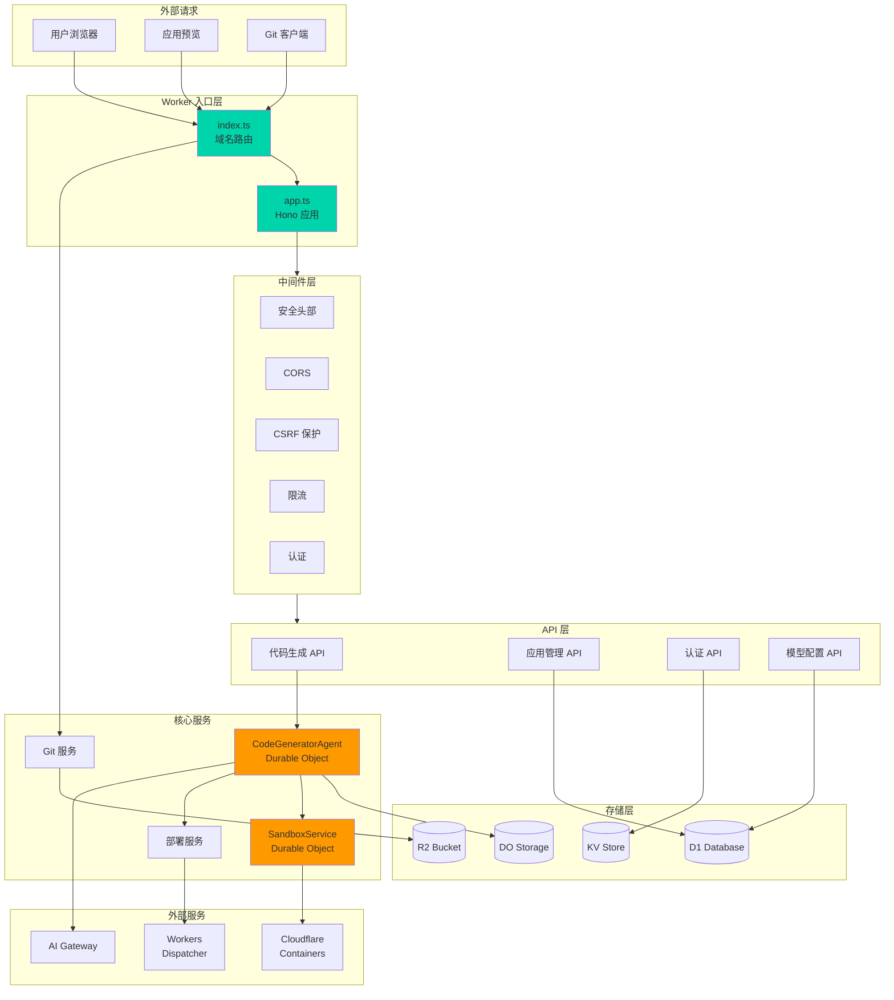

---

## 1.6 关键技术决策总结

| 决策点 | 选择 | 理由 |
|--------|------|------|
| Web 框架 | Hono | 轻量、快速、原生支持 Workers |
| ORM | Drizzle | 类型安全、SQL-like、零运行时开销 |
| 验证库 | Zod | 结构化输出、JSON Schema 转换 |
| 状态管理 | Durable Objects | 强一致性、全局唯一、内置持久化 |
| 沙箱 | Cloudflare Containers | 安全隔离、快速启动、持久化文件系统 |
| 部署 | Workers for Platforms | 多租户隔离、动态路由、边缘部署 |
| 认证 | JWT + OAuth | 无状态、标准协议、易于扩展 |
| 限流 | Durable Objects + KV | 分布式限流、精确控制 |

---

# 第二章：Durable Objects Agent 系统

## 2.1 Agent 基础框架

### 2.1.1 agents 库的核心概念

VibeSDK 使用 `agents` 库来简化 Durable Objects 的开发。这个库提供了一个高层次的抽象：

```typescript
// 从 agents 库导入基类
import { Agent, AgentContext, Connection, ConnectionContext } from 'agents';

// 定义 Agent 的状态类型
export class SmartCodeGeneratorAgent extends Agent<Env, CodeGenState> {
    // 初始状态 - 在第一次创建时使用
    initialState: CodeGenState = {
        blueprint: {} as Blueprint,
        projectName: "",
        query: "",
        generatedPhases: [],
        generatedFilesMap: {},
        // ... 更多字段
    };
    
    // 状态自动持久化
    // 修改 this.state.xxx 会触发写入 DO Storage
}
```

**agents 库提供的能力**：

1. **自动状态持久化**
   ```typescript
   // 不需要手动调用 storage.put()
   this.state.projectName = "MyApp";  // 自动持久化
   ```

2. **WebSocket 连接管理**
   ```typescript
   // 获取所有连接
   getWebSockets(): WebSocket[]
   
   // WebSocket 消息处理
   async webSocketMessage(ctx: ConnectionContext, message: string)
   
   // WebSocket 关闭处理
   async webSocketClose(ctx: ConnectionContext, code: number, reason: string)
   ```

3. **HTTP 请求处理**
   ```typescript
   async fetch(request: Request): Promise<Response>
   ```

### 2.1.2 DurableObject 生命周期

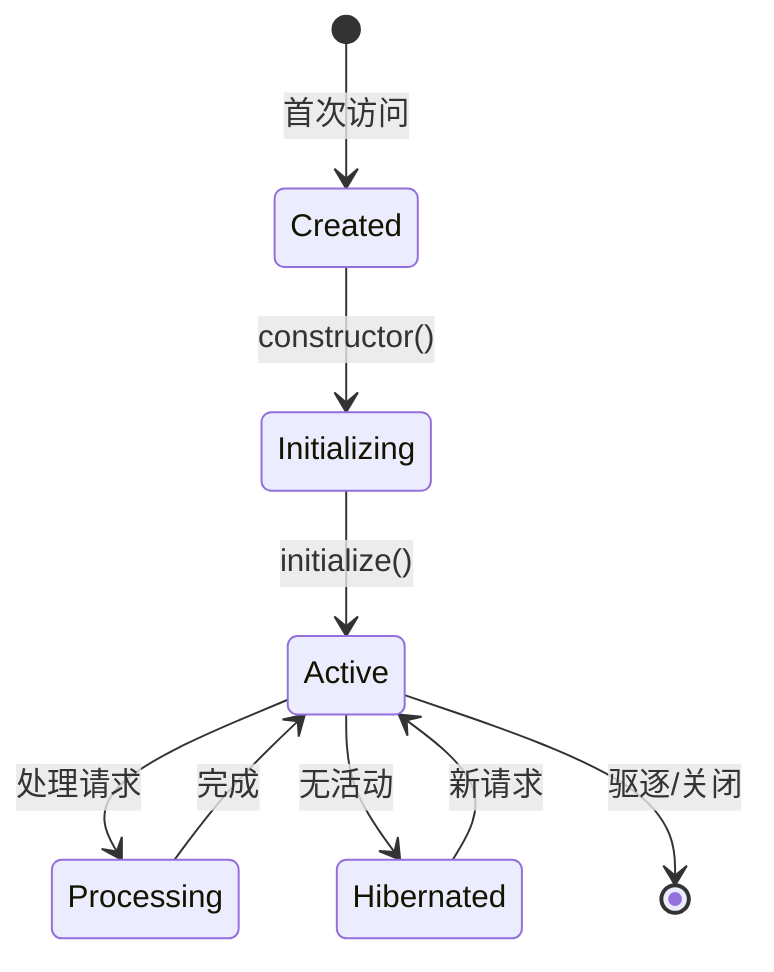

**生命周期方法**：

```typescript
export class SmartCodeGeneratorAgent extends Agent<Env, CodeGenState> {
    // 1. 构造函数 - DO 首次创建时调用
    constructor(ctx: DurableObjectState, env: Env) {
        super(ctx, env);
        // 初始化非持久化字段
        this.generationPromise = null;
        this.pendingUserImages = [];
    }
    
    // 2. 初始化 - 用户调用 initialize() 时
    async initialize(initArgs: AgentInitArgs): Promise<CodeGenState> {
        // 设置持久化状态
        this.state.query = initArgs.query;
        this.state.inferenceContext = initArgs.inferenceContext;
        
        // 初始化服务层
        this.stateManager = new StateManager(
            () => this.state,
            (newState) => this.state = newState
        );
        
        return this.state;
    }
    
    // 3. 请求处理 - HTTP 或 WebSocket
    async fetch(request: Request): Promise<Response> {
        // 处理 REST API 调用
        const url = new URL(request.url);
        if (url.pathname === '/state') {
            return Response.json(this.state);
        }
        // ...
    }
}
```

---

## 2.2 SmartCodeGeneratorAgent 架构

### 2.2.1 继承层级

```typescript
// 继承关系
SmartCodeGeneratorAgent
    ↓ extends
SimpleCodeGeneratorAgent
    ↓ extends
Agent<Env, CodeGenState> (from agents library)
    ↓ extends
DurableObject (from Cloudflare Workers)
```

**为什么有两层 Agent？**

- **SimpleCodeGeneratorAgent**：确定性模式，基于状态机
- **SmartCodeGeneratorAgent**：智能模式，基于 LLM 编排（未完全实现）

```typescript
// worker/agents/core/smartGeneratorAgent.ts
export class SmartCodeGeneratorAgent extends SimpleCodeGeneratorAgent {
    async generateAllFiles(reviewCycles: number = 10): Promise<void> {
        if (this.state.agentMode === 'deterministic') {
            // 使用父类的确定性流程
            return super.generateAllFiles(reviewCycles);
        } else {
            // 使用 LLM 驱动的智能流程（TODO）
            return this.builderLoop();
        }
    }
}
```

### 2.2.2 核心字段与服务

```typescript
// worker/agents/core/simpleGeneratorAgent.ts
export class SimpleCodeGeneratorAgent extends Agent<Env, CodeGenState> {
    // ========== 服务层 ==========
    protected stateManager!: StateManager;
    protected fileManager!: FileManager;
    protected deploymentManager!: DeploymentManager;
    protected codingAgent: CodingAgentInterface;
    protected git: GitVersionControl;
    
    // ========== 缓存字段 ==========
    private previewUrlCache: string = '';
    private templateDetailsCache: TemplateDetails | null = null;
    
    // ========== 临时数据（不持久化） ==========
    private pendingUserImages: ProcessedImageAttachment[] = [];
    private generationPromise: Promise<void> | null = null;
    private currentAbortController?: AbortController;
    private githubTokenCache: { /* ... */ } | null = null;
    
    // ========== 操作层 ==========
    protected operations: Operations = {
        regenerateFile: new FileRegenerationOperation(),
        generateNextPhase: new PhaseGenerationOperation(),
        implementPhase: new PhaseImplementationOperation(),
        fastCodeFixer: new FastCodeFixerOperation(),
        processUserMessage: new UserConversationProcessor()
    };
}
```

**字段设计原则**：

1. **持久化状态** (`this.state.*`)：必须可序列化的数据
2. **缓存字段**：可从其他来源重建的数据
3. **临时数据**：DO 驱逐后可丢失的数据（如上传的图片）

---

## 2.3 状态管理

### 2.3.1 CodeGenState 接口设计

```typescript
// worker/agents/core/state.ts
export interface CodeGenState {
    // ========== 项目元信息 ==========
    blueprint: Blueprint;              // PRD 文档
    projectName: string;               // 项目名称
    query: string;                     // 用户原始请求
    templateName: string;              // 使用的模板
    hostname: string;                  // 预览域名
    
    // ========== 代码生成状态 ==========
    generatedFilesMap: Record<string, FileState>;  // 已生成的文件
    generatedPhases: PhaseState[];                 // 已完成的 Phase
    currentPhase?: PhaseConceptType;               // 当前 Phase
    phasesCounter: number;                         // Phase 计数器
    
    // ========== 运行时状态 ==========
    sandboxInstanceId?: string;        // 沙箱实例 ID
    currentDevState: CurrentDevState;  // 当前开发状态
    shouldBeGenerating: boolean;       // 是否应该生成
    mvpGenerated: boolean;             // MVP 是否生成
    reviewingInitiated: boolean;       // 是否开始 Review
    reviewCycles?: number;             // Review 轮次
    
    // ========== 用户交互 ==========
    pendingUserInputs: string[];                 // 待处理的用户输入
    conversationMessages: ConversationMessage[]; // 对话历史
    projectUpdatesAccumulator: string[];         // 项目更新累积
    
    // ========== 配置 ==========
    inferenceContext: InferenceContext;  // 推理上下文（用户ID、模型配置等）
    
    // ========== 调试信息 ==========
    commandsHistory?: string[];          // 命令历史
    lastPackageJson?: string;            // 最后的 package.json
    lastDeepDebugTranscript: string | null;  // 深度调试记录
    agentMode: 'deterministic' | 'smart';    // Agent 模式
    sessionId: string;                       // 会话 ID
}
```

**状态字段分类**：

| 类别 | 字段示例 | 特点 |
|------|---------|------|
| 元信息 | `blueprint`, `projectName` | 初始化后很少变化 |
| 代码状态 | `generatedFilesMap`, `generatedPhases` | 频繁更新，体积大 |
| 运行时状态 | `currentDevState`, `shouldBeGenerating` | 控制执行流程 |
| 用户交互 | `conversationMessages` | 随对话增长 |
| 配置 | `inferenceContext` | 影响行为决策 |

### 2.3.2 CurrentDevState 枚举

```typescript
export enum CurrentDevState {
    IDLE = 0,              // 空闲状态
    PHASE_GENERATING = 1,  // 正在生成 Phase 概念
    PHASE_IMPLEMENTING = 2,// 正在实现 Phase（生成代码）
    REVIEWING = 3,         // 正在 Review（错误修复）
    FINALIZING = 4,        // 最终化
}
```

**状态转换图**：

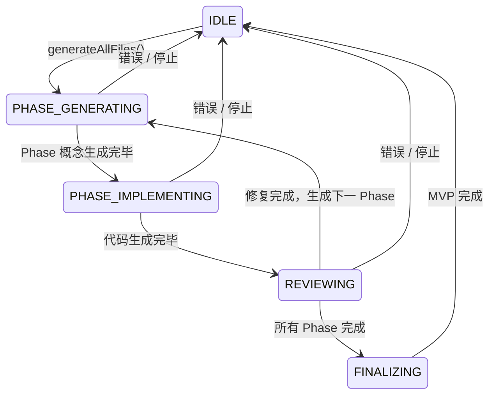

### 2.3.3 状态迁移策略

```typescript
// worker/agents/core/stateMigration.ts
export class StateMigration {
    /**
     * 从旧版本状态迁移到新版本
     * 确保向后兼容性
     */
    static migrate(state: any): CodeGenState {
        // 添加缺失的字段
        if (!state.agentMode) {
            state.agentMode = 'deterministic';
        }
        
        if (!state.conversationMessages) {
            state.conversationMessages = [];
        }
        
        if (!state.projectUpdatesAccumulator) {
            state.projectUpdatesAccumulator = [];
        }
        
        // 修复数据类型
        if (typeof state.phasesCounter !== 'number') {
            state.phasesCounter = state.generatedPhases?.length || 0;
        }
        
        return state as CodeGenState;
    }
}
```

**为什么需要状态迁移？**

- DO 状态持久化后，代码更新可能引入新字段
- 旧 DO 实例唤醒时，状态结构可能过时
- 迁移逻辑确保新代码能处理旧状态

---

## 2.4 WebSocket 通信

### 2.4.1 消息类型定义

```typescript
// worker/api/websocketTypes.ts
export type WebSocketMessageType = 
    | 'generation_started'
    | 'phase_concept_generated'
    | 'file_generated'
    | 'phase_completed'
    | 'mvp_generated'
    | 'deployment_started'
    | 'deployment_completed'
    | 'error'
    | 'user_message_response'
    | 'tool_call'
    | 'conversation_state';

export interface WebSocketMessage {
    type: WebSocketMessageType;
    // 动态数据字段根据 type 不同而不同
    [key: string]: any;
}
```

**消息分类**：

1. **生成进度消息**：`generation_started`, `phase_completed`
2. **文件流式消息**：`file_generated`
3. **部署消息**：`deployment_started`, `deployment_completed`
4. **对话消息**：`user_message_response`, `tool_call`
5. **错误消息**：`error`

### 2.4.2 消息处理流程

```typescript
// worker/agents/core/websocket.ts
export function handleWebSocketMessage(
    agent: SimpleCodeGeneratorAgent, 
    connection: Connection, 
    message: string
): void {
    try {
        const parsedMessage = JSON.parse(message);

        switch (parsedMessage.type) {
            case WebSocketMessageRequests.GENERATE_ALL:
                // 设置持久化标志
                agent.setState({ 
                    ...agent.state, 
                    shouldBeGenerating: true 
                });
                
                // 检查是否已在生成
                if (agent.isCodeGenerating()) {
                    return;
                }
                
                // 启动异步生成
                agent.generateAllFiles().catch(error => {
                    sendError(connection, `Error: ${error.message}`);
                });
                break;
                
            case WebSocketMessageRequests.STOP_GENERATION:
                // 取消当前推理
                agent.cancelCurrentInference();
                
                // 清除生成标志
                agent.setState({ 
                    ...agent.state, 
                    shouldBeGenerating: false 
                });
                
                sendToConnection(connection, 'generation_stopped', {
                    message: 'Generation stopped'
                });
                break;
                
            case WebSocketMessageRequests.USER_SUGGESTION:
                // 处理用户对话输入
                agent.handleUserInput(
                    parsedMessage.message, 
                    parsedMessage.images
                ).catch(error => {
                    sendError(connection, `Error: ${error.message}`);
                });
                break;
                
            // ... 更多消息类型
        }
    } catch (error) {
        sendError(connection, `Parse error: ${error.message}`);
    }
}
```

**关键设计点**：

1. **异步执行**：`generateAllFiles()` 不阻塞 WebSocket 消息处理
2. **持久化标志**：`shouldBeGenerating` 确保 DO 重启后能恢复生成
3. **错误隔离**：单个消息错误不影响 WebSocket 连接

### 2.4.3 广播机制

```typescript
// worker/agents/core/websocket.ts
export function broadcastToConnections<T extends WebSocketMessageType>(
    agent: { getWebSockets(): WebSocket[] },
    type: T,
    data: WebSocketMessageData<T>
): void {
    const connections = agent.getWebSockets();
    for (const connection of connections) {
        sendToConnection(connection, type, data);
    }
}

export function sendToConnection<T extends WebSocketMessageType>(
    connection: WebSocket, 
    type: T, 
    data: WebSocketMessageData<T>
): void {
    try {
        const message: WebSocketMessage = { type, ...data };
        connection.send(JSON.stringify(message));
    } catch (error) {
        console.error(`Send error:`, error);
    }
}
```

**使用示例**：

```typescript
// 在 Agent 内部广播进度
broadcastToConnections(this, 'phase_completed', {
    phase: currentPhase,
    progress: 0.5
});
```

---

## 2.5 服务层设计模式

### 2.5.1 依赖注入模式

```typescript
// worker/agents/core/simpleGeneratorAgent.ts
export class SimpleCodeGeneratorAgent extends Agent<Env, CodeGenState> {
    async initialize(initArgs: AgentInitArgs): Promise<CodeGenState> {
        // 1. 创建 StateManager
        this.stateManager = new StateManager(
            () => this.state,                    // getter
            (newState) => this.state = newState  // setter
        );
        
        // 2. 创建 Git 版本控制
        this.git = new GitVersionControl();
        await this.git.initialize(/* 模板文件 */);
        
        // 3. 创建 FileManager (依赖 StateManager 和 Git)
        this.fileManager = new FileManager(
            this.stateManager,
            () => this.templateDetailsCache!,
            this.git
        );
        
        // 4. 创建 DeploymentManager
        this.deploymentManager = new DeploymentManager(
            this.env,
            this.sandboxInstanceId,
            this.fileManager
        );
        
        // 5. 创建 CodingAgent (依赖所有服务)
        this.codingAgent = new CodingAgentInterface(this);
        
        return this.state;
    }
}
```

**依赖关系图**：

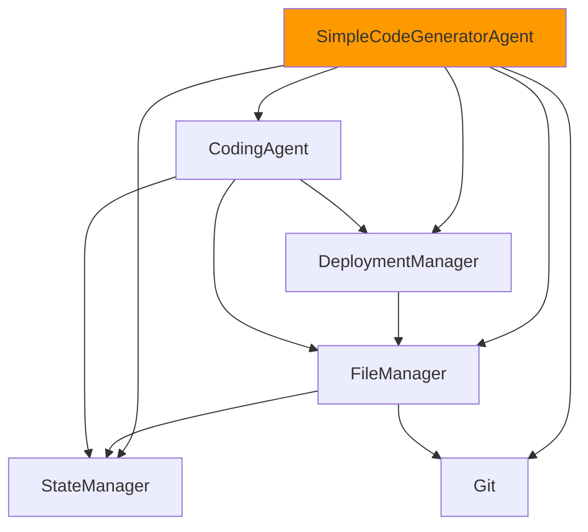

### 2.5.2 StateManager 实现

```typescript
// worker/agents/services/implementations/StateManager.ts
export class StateManager implements IStateManager {
    constructor(
        private getStateFunc: () => CodeGenState,
        private setStateFunc: (state: CodeGenState) => void
    ) {}

    getState(): Readonly<CodeGenState> {
        return this.getStateFunc();
    }

    setState(newState: CodeGenState): void {
        this.setStateFunc(newState);
    }

    updateField<K extends keyof CodeGenState>(
        field: K, 
        value: CodeGenState[K]
    ): void {
        const currentState = this.getState();
        this.setState({
            ...currentState,
            [field]: value
        });
    }

    batchUpdate(updates: Partial<CodeGenState>): void {
        const currentState = this.getState();
        this.setState({
            ...currentState,
            ...updates
        });
    }
}
```

**为什么使用函数注入？**

- `getStateFunc` 和 `setStateFunc` 是闭包，始终访问最新的 `this.state`
- 避免传递引用导致的过时数据问题

### 2.5.3 FileManager 实现

```typescript
// worker/agents/services/implementations/FileManager.ts
export class FileManager implements IFileManager {
    constructor(
        private stateManager: IStateManager,
        private getTemplateDetailsFunc: () => TemplateDetails,
        private git: GitVersionControl
    ) {
        // 注册 Git 回调，文件变更后自动同步状态
        this.git.setOnFilesChangedCallback(() => {
            this.syncGeneratedFilesMapFromGit();
        });
    }

    /**
     * 保存生成的文件
     * 1. 计算 diff
     * 2. 更新 generatedFilesMap
     * 3. Git commit
     */
    async saveGeneratedFiles(
        files: FileOutputType[], 
        commitMessage?: string
    ): Promise<FileState[]> {
        const filesMap = { ...this.stateManager.getState().generatedFilesMap };
        const fileStates: FileState[] = [];
        
        for (const file of files) {
            const oldFile = filesMap[file.filePath];
            const oldContents = oldFile?.fileContents || '';
            
            // 生成 unified diff
            let lastDiff = '';
            if (oldContents !== file.fileContents) {
                lastDiff = Diff.createPatch(
                    file.filePath, 
                    oldContents, 
                    file.fileContents
                );
            }
            
            const fileState = { ...file, lastDiff };
            filesMap[file.filePath] = fileState;
            fileStates.push(fileState);
        }
        
        // 更新状态
        this.stateManager.setState({
            ...this.stateManager.getState(),
            generatedFilesMap: filesMap
        });

        // Git commit
        if (commitMessage) {
            await this.git.commit(fileStates, commitMessage);
        }
        
        return fileStates;
    }

    /**
     * 获取所有相关文件（模板 + 生成）
     * 生成的文件覆盖模板文件
     */
    getAllRelevantFiles(): FileOutputType[] {
        const templateDetails = this.getTemplateDetailsFunc();
        const generatedFilesMap = this.stateManager.getState().generatedFilesMap;
        
        return FileProcessing.getAllRelevantFiles(
            templateDetails, 
            generatedFilesMap
        );
    }
}
```

**关键方法**：

- `saveGeneratedFiles()`: 保存 + Diff + Git commit
- `getAllRelevantFiles()`: 合并模板和生成的文件
- `syncGeneratedFilesMapFromGit()`: 从 Git 同步状态

### 2.5.4 接口抽象

```typescript
// worker/agents/services/interfaces/IFileManager.ts
export interface IFileManager {
    getGeneratedFile(path: string): FileOutputType | null;
    getAllRelevantFiles(): FileOutputType[];
    saveGeneratedFile(file: FileOutputType, commitMessage?: string): Promise<FileState>;
    saveGeneratedFiles(files: FileOutputType[], commitMessage?: string): Promise<FileState[]>;
    deleteFiles(filePaths: string[]): void;
    fileExists(path: string): boolean;
    getFile(filePath: string): FileOutputType | null;
}

// worker/agents/services/interfaces/IStateManager.ts
export interface IStateManager {
    getState(): Readonly<CodeGenState>;
    setState(newState: CodeGenState): void;
    updateField<K extends keyof CodeGenState>(field: K, value: CodeGenState[K]): void;
    batchUpdate(updates: Partial<CodeGenState>): void;
}
```

**接口设计原则**：

1. **单一职责**：每个接口只关注一个领域
2. **依赖倒置**：高层模块依赖接口，不依赖具体实现
3. **可测试性**：接口易于 mock

---

## 2.6 Agent 初始化完整流程

```typescript
// worker/agents/core/simpleGeneratorAgent.ts
async initialize(initArgs: AgentInitArgs): Promise<CodeGenState> {
    // ========== 1. 基础状态设置 ==========
    this.state.sessionId = initArgs.agentId;
    this.state.query = initArgs.query;
    this.state.inferenceContext = initArgs.inferenceContext;
    this.state.agentMode = initArgs.agentMode || 'deterministic';
    
    // ========== 2. 日志初始化 ==========
    this.initLogger(initArgs.agentId, initArgs.sessionId, initArgs.userId);
    
    // ========== 3. 模板选择与加载 ==========
    const { templateDetails, selection } = await getTemplateForQuery(
        this.env,
        initArgs.inferenceContext,
        initArgs.query,
        initArgs.images,
        this.logger()
    );
    
    this.templateDetailsCache = templateDetails;
    this.state.templateName = templateDetails.name;
    
    // ========== 4. Git 初始化 ==========
    this.git = new GitVersionControl();
    await this.git.initialize(templateDetails.importantFiles);
    
    // ========== 5. 服务层初始化 ==========
    this.stateManager = new StateManager(/*...*/);
    this.fileManager = new FileManager(/*...*/);
    this.deploymentManager = new DeploymentManager(/*...*/);
    
    // ========== 6. Blueprint 生成 ==========
    const blueprintResult = await generateBlueprint({
        env: this.env,
        inferenceContext: initArgs.inferenceContext,
        query: initArgs.query,
        templateSelection: selection,
        templateDetails: templateDetails,
        images: initArgs.images,
    });
    
    this.state.blueprint = blueprintResult.blueprint;
    this.state.projectName = generateProjectName(/*...*/);
    
    // ========== 7. 模板自定义 ==========
    const customizedFiles = customizeTemplateFiles(
        templateDetails,
        this.state.projectName,
        this.state.blueprint
    );
    
    await this.fileManager.saveGeneratedFiles(
        customizedFiles, 
        'Initial template customization'
    );
    
    // ========== 8. 沙箱部署 ==========
    await this.deployToSandbox();
    
    // ========== 9. 完成初始化 ==========
    this.state.currentDevState = CurrentDevState.IDLE;
    
    return this.state;
}
```

**初始化流程图**：

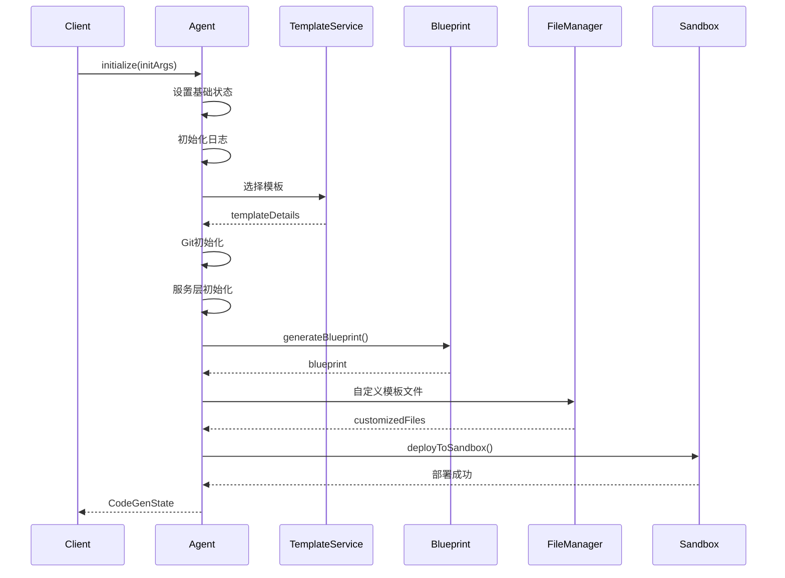

---

## 2.7 状态持久化与恢复

### 2.7.1 自动持久化

```typescript
// agents 库的魔法
class Agent<Env, State> extends DurableObject {
    private _state: State;
    
    get state(): State {
        return this._state;
    }
    
    set state(newState: State) {
        this._state = newState;
        // 自动序列化并写入 DO Storage
        this.ctx.storage.put('state', newState);
    }
}
```

**注意事项**：

1. **赋值触发持久化**：`this.state = {...}` 会触发
2. **深层修改不触发**：`this.state.generatedPhases.push(...)` 不触发
3. **必须完整赋值**：

```typescript
// ❌ 错误：不会持久化
this.state.generatedPhases.push(newPhase);

// ✅ 正确：会持久化
this.state = {
    ...this.state,
    generatedPhases: [...this.state.generatedPhases, newPhase]
};
```

### 2.7.2 恢复机制

```typescript
// Worker 重启后，首次访问 DO 会恢复状态
async fetch(request: Request): Promise<Response> {
    // 如果 this.state 已加载，直接使用
    if (this.state.sessionId) {
        return this.handleRequest(request);
    }
    
    // 否则从 Storage 恢复
    const storedState = await this.ctx.storage.get('state');
    if (storedState) {
        this.state = StateMigration.migrate(storedState);
    }
    
    return this.handleRequest(request);
}
```

---

## 2.8 小结

本章我们深入探讨了 Durable Objects Agent 系统的核心实现：

| 主题 | 关键点 |
|------|--------|
| **Agent 框架** | agents 库抽象、生命周期管理 |
| **状态管理** | CodeGenState 设计、CurrentDevState 状态机 |
| **WebSocket** | 消息类型、广播机制、异步处理 |
| **服务层** | 依赖注入、接口抽象、FileManager/StateManager |
| **初始化流程** | 模板选择、Blueprint 生成、沙箱部署 |
| **持久化** | 自动序列化、状态恢复、迁移策略 |

**核心设计原则**：

1. **关注点分离**：状态、文件、部署各司其职
2. **依赖倒置**：通过接口解耦
3. **持久化优先**：关键状态必须可序列化
4. **错误隔离**：异步操作的错误不影响主流程

---

# 第三章：代码生成流程（Phase-wise Generation）

## 3.1 Phase-wise 生成策略

### 3.1.1 为什么采用分阶段生成？

传统的一次性代码生成存在诸多问题：

**问题清单**：
- **Context 限制**：LLM 输出 token 数有限，无法一次生成完整应用
- **错误累积**：早期错误会影响后续代码质量
- **调试困难**：难以定位问题出现在哪个文件
- **部署风险**：一次性部署大量代码，失败后难以回滚

**Phase-wise 解决方案**：

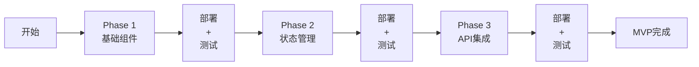

**优势**：
1. **渐进式验证**：每个 Phase 都可部署测试
2. **错误隔离**：问题限定在单个 Phase
3. **用户反馈**：可在中途调整需求
4. **资源优化**：按需生成，避免浪费

### 3.1.2 Phase 类型与依赖关系

```typescript
// worker/agents/schemas.ts
export interface PhaseConceptType {
    phase_name: string;                // "实现用户认证"
    phase_description: string;         // 详细描述
    requirements: string[];            // 需求列表
    files: FileConceptType[];          // 涉及的文件
    dependencies?: string[];           // 依赖的其他 Phase
    estimatedComplexity?: 'low' | 'medium' | 'high';
}

export interface FileConceptType {
    path: string;                      // 文件路径
    purpose: string;                   // 文件用途
    changes: string | null;            // 变更描述（null 表示新文件）
}
```

**Phase 依赖管理**：

```typescript
// worker/agents/domain/pure/DependencyManagement.ts
export class DependencyManagement {
    /**
     * 计算 Phase 的依赖图
     * 确保按正确顺序执行
     */
    static buildDependencyGraph(phases: PhaseConceptType[]): Map<string, string[]> {
        const graph = new Map<string, string[]>();
        
        for (const phase of phases) {
            const deps = phase.dependencies || [];
            graph.set(phase.phase_name, deps);
        }
        
        return graph;
    }
    
    /**
     * 拓扑排序
     * 检测循环依赖
     */
    static topologicalSort(graph: Map<string, string[]>): string[] | null {
        const sorted: string[] = [];
        const visited = new Set<string>();
        const visiting = new Set<string>();
        
        const visit = (node: string): boolean => {
            if (visiting.has(node)) {
                // 循环依赖！
                return false;
            }
            if (visited.has(node)) {
                return true;
            }
            
            visiting.add(node);
            const deps = graph.get(node) || [];
            
            for (const dep of deps) {
                if (!visit(dep)) {
                    return false;
                }
            }
            
            visiting.delete(node);
            visited.add(node);
            sorted.push(node);
            
            return true;
        };
        
        for (const node of graph.keys()) {
            if (!visit(node)) {
                return null; // 检测到循环
            }
        }
        
        return sorted;
    }
}
```

---

## 3.2 Blueprint 生成

### 3.2.1 什么是 Blueprint？

Blueprint 是项目的 **PRD（产品需求文档）**，由 AI 根据用户需求生成，包含：

- 项目概述与目标
- 功能模块列表
- UI/UX 设计指导
- 技术栈与依赖
- 开发路线图

```typescript
// worker/agents/schemas.ts
export const BlueprintSchema = z.object({
    project_overview: z.string().describe("项目概述"),
    project_goals: z.array(z.string()).describe("项目目标"),
    
    // UI/UX 设计
    visual_design: z.object({
        color_palette: z.string(),
        typography: z.string(),
        layout_patterns: z.string(),
    }).optional(),
    
    // 功能模块
    features: z.array(z.object({
        name: z.string(),
        description: z.string(),
        priority: z.enum(['critical', 'high', 'medium', 'low']),
    })),
    
    // 技术选型
    frameworks: z.array(z.string()).describe("使用的框架和库"),
    
    // 开发路线图
    development_phases: z.array(z.object({
        phase_name: z.string(),
        deliverables: z.array(z.string()),
    })).optional(),
    
    // 陷阱与注意事项
    pitfalls: z.array(z.string()).optional(),
});

export type Blueprint = z.infer<typeof BlueprintSchema>;
```

### 3.2.2 Blueprint 生成流程

```typescript
// worker/agents/planning/blueprint.ts
export async function generateBlueprint(options: {
    env: Env;
    inferenceContext: InferenceContext;
    query: string;
    templateSelection: TemplateSelection;
    templateDetails: TemplateDetails;
    images?: ProcessedImageAttachment[];
}): Promise<{ blueprint: Blueprint }> {
    
    // 构建系统提示词
    const systemPrompt = SYSTEM_PROMPT
        .replace('{{query}}', options.query)
        .replace('{{template}}', formatTemplateInfo(options.templateDetails))
        .replace('{{dependencies}}', formatDependencies(options.templateDetails))
        .replace('{{usecaseSpecificInstructions}}', getUseCaseInstructions(options.templateSelection));
    
    // 构建用户提示词
    const userPrompt = `Generate a detailed blueprint for: "${options.query}"`;
    
    // 调用推理引擎
    const response = await executeInference({
        env: options.env,
        context: options.inferenceContext,
        agentActionName: 'blueprint_generation',
        schema: BlueprintSchema,
        messages: [
            createSystemMessage(systemPrompt),
            options.images 
                ? createMultiModalUserMessage(userPrompt, await imagesToBase64(options.images))
                : createUserMessage(userPrompt)
        ],
        maxTokens: 8000,
        temperature: 0.7,
    });
    
    if (!response.success) {
        throw new Error(`Blueprint generation failed: ${response.error}`);
    }
    
    return { blueprint: response.data };
}
```

### 3.2.3 Prompt Engineering 技巧

**Blueprint 系统提示词结构**：

```
<ROLE>
    你是 Cloudflare 的高级软件架构师和产品经理
    专长：UI/UX 设计、技术架构、产品规划
</ROLE>

<TASK>
    为用户需求创建详细的技术蓝图
    重点：视觉设计、用户体验、技术可行性
</TASK>

<GOAL>
    设计出美观、功能完整、可实现的产品
    输出：简洁但信息密集的 PRD 文档
</GOAL>

<INSTRUCTIONS>
    ## 设计系统与美学
    • 选择精致的配色方案
    • 设计完整的排版系统
    • 规划布局和间距
    
    ## 框架与依赖
    • 选择开箱即用的库
    • 避免需要 API Key 的服务
    • 提供详尽的依赖清单
    
    ## 算法与逻辑规范（复杂应用）
    • 游戏逻辑：规则、胜负条件、评分系统
    • 数学运算：公式、边界情况
    • 数据转换：输入输出格式
</INSTRUCTIONS>

<CLIENT REQUEST>
    {{query}}
</CLIENT REQUEST>

<STARTING TEMPLATE>
    {{template}}
</STARTING TEMPLATE>
```

**关键技巧**：

1. **具象化示例**：
   ```
   对于 2048 游戏的 moveLeft 逻辑：
   输入：[2, 2, 4, 0]
   输出：[4, 4, 0, 0]
   说明：两个 2 合并成 4，现有的 4 滑动到旁边
   ```

2. **优先级引导**：
   ```
   按以下优先级设计：
   1. 视觉设计优先（用户第一印象）
   2. 核心功能完整（可用性）
   3. 交互细节打磨（用户体验）
   ```

3. **约束明确**：
   ```
   • 不能使用二进制文件（.png, .jpg, .svg）
   • 可以使用外部 URL（unsplash.com）
   • 可以使用 Canvas 绘图
   • 可以使用图标库（lucide-react）
   ```

---

## 3.3 Phase 概念生成

### 3.3.1 PhaseGeneration Operation

```typescript
// worker/agents/operations/PhaseGeneration.ts
export class PhaseGenerationOperation implements AgentOperation<PhaseGenerationInputs, PhaseConceptGenerationSchemaType> {
    
    async execute(options: OperationOptions<PhaseGenerationInputs>): Promise<PhaseConceptGenerationSchemaType> {
        const { agent, inputs } = options;
        
        // 1. 收集当前状态信息
        const currentSnapshot = {
            generatedPhases: agent.state.generatedPhases,
            generatedFilesMap: agent.fileManager.getGeneratedFilesMap(),
            blueprint: agent.state.blueprint,
            issues: inputs.issues,
        };
        
        // 2. 构建系统提示词
        const systemPrompt = getSystemPromptWithProjectContext({
            agent,
            basePrompt: SYSTEM_PROMPT,
        });
        
        // 3. 构建用户提示词
        const userPrompt = buildUserPrompt(currentSnapshot, inputs);
        
        // 4. 调用 LLM 生成 Phase 概念
        const response = await executeInference({
            env: agent.env,
            context: agent.state.inferenceContext,
            agentActionName: 'phase_generation',
            schema: PhaseConceptGenerationSchema,
            messages: [
                createSystemMessage(systemPrompt),
                inputs.userContext?.images
                    ? createMultiModalUserMessage(userPrompt, await imagesToBase64(inputs.userContext.images))
                    : createUserMessage(userPrompt)
            ],
            maxTokens: 4000,
            temperature: 0.6,
        });
        
        if (!response.success) {
            throw new Error(`Phase generation failed: ${response.error}`);
        }
        
        return response.data;
    }
}
```

### 3.3.2 Issue 驱动的 Phase 规划

**核心思想**：下一个 Phase 应该优先修复运行时错误和用户反馈的问题。

```typescript
// 构建用户提示词时，优先级排序
function buildUserPrompt(snapshot: CurrentSnapshot, inputs: PhaseGenerationInputs) {
    let prompt = '**GENERATE THE PHASE**\n\n';
    
    // 1. 运行时错误（最高优先级）
    if (inputs.issues.hasRuntimeErrors()) {
        prompt += '🚨 **CRITICAL RUNTIME ERRORS (Fix First):**\n';
        prompt += inputs.issues.formatRuntimeErrors();
        prompt += '\n\n';
    }
    
    // 2. 用户反馈
    if (inputs.userContext?.feedback) {
        prompt += '💬 **USER FEEDBACK:**\n';
        prompt += inputs.userContext.feedback;
        prompt += '\n\n';
    }
    
    // 3. 静态分析错误
    if (inputs.issues.hasStaticErrors()) {
        prompt += '⚠️ **Static Analysis Issues:**\n';
        prompt += inputs.issues.formatStaticErrors();
        prompt += '\n\n';
    }
    
    // 4. Blueprint 中的待实现功能
    prompt += '📋 **Blueprint Roadmap:**\n';
    prompt += formatBlueprintPhases(snapshot.blueprint);
    
    return prompt;
}
```

### 3.3.3 Phase 限制与终止条件

```typescript
// worker/agents/core/state.ts
export const MAX_PHASES = 12;

// 检查是否应该生成下一 Phase
function shouldGenerateNextPhase(state: CodeGenState): boolean {
    // 1. 达到最大 Phase 数
    if (state.phasesCounter >= MAX_PHASES) {
        return false;
    }
    
    // 2. LLM 返回空 Phase（表示完成）
    if (!state.currentPhase || state.currentPhase.phase_name === '') {
        return false;
    }
    
    // 3. 所有 Blueprint 目标已完成
    if (allBlueprintGoalsCompleted(state)) {
        return false;
    }
    
    return true;
}
```

---

## 3.4 Phase 实现（代码生成）

### 3.4.1 PhaseImplementation Operation

```typescript
// worker/agents/operations/PhaseImplementation.ts
export class PhaseImplementationOperation implements AgentOperation<PhaseImplementationInputs, PhaseImplementationOutputs> {
    
    async execute(options: OperationOptions<PhaseImplementationInputs>): Promise<PhaseImplementationOutputs> {
        const { agent, inputs } = options;
        const { phase, issues } = inputs;
        
        // 1. 构建提示词
        const systemPrompt = getSystemPromptWithProjectContext({
            agent,
            basePrompt: SYSTEM_PROMPT,
        });
        
        const userPrompt = buildImplementationPrompt(phase, issues, inputs.userContext);
        
        // 2. 创建流式解析器
        const scofFormat = new SCOFFormat();
        const streamingState: CodeGenerationStreamingState = {
            accumulator: '',
            generatedFiles: [],
            commands: [],
        };
        
        // 3. 流式生成代码
        const response = await executeInference({
            env: agent.env,
            context: agent.state.inferenceContext,
            agentActionName: 'phase_implementation',
            messages: [
                createSystemMessage(systemPrompt),
                createUserMessage(userPrompt)
            ],
            maxTokens: 16000,
            temperature: 0.4,
            stream: {
                chunk_size: 512,
                onChunk: (chunk: string) => {
                    // 流式解析
                    scofFormat.parseStreamingChunks(
                        chunk,
                        streamingState,
                        (filePath: string) => {
                            // 文件开始生成
                            const purpose = phase.files.find(f => f.path === filePath)?.purpose || '';
                            inputs.fileGeneratingCallback(filePath, purpose);
                        },
                        (filePath: string, contentChunk: string, format: 'full_content' | 'unified_diff') => {
                            // 流式推送文件内容
                            inputs.fileChunkGeneratedCallback(filePath, contentChunk, format);
                        },
                        (filePath: string) => {
                            // 文件生成完毕
                            const file = streamingState.generatedFiles.find(f => f.filePath === filePath);
                            if (file) {
                                inputs.fileClosedCallback(file, 'File generated');
                            }
                        }
                    );
                }
            }
        });
        
        // 4. 实时代码修复（可选）
        const fixedFilePromises: Promise<FileOutputType>[] = [];
        
        if (inputs.shouldAutoFix && IsRealtimeCodeFixerEnabled) {
            for (const file of streamingState.generatedFiles) {
                const fixPromise = RealtimeCodeFixer.fixFile(file, agent);
                fixedFilePromises.push(fixPromise);
            }
        } else {
            // 不修复，直接返回原文件
            fixedFilePromises.push(...streamingState.generatedFiles.map(f => Promise.resolve(f)));
        }
        
        return {
            fixedFilePromises,
            deploymentNeeded: true,
            commands: streamingState.commands || [],
        };
    }
}
```

### 3.4.2 文件生成协调

**流式生成的生命周期**：

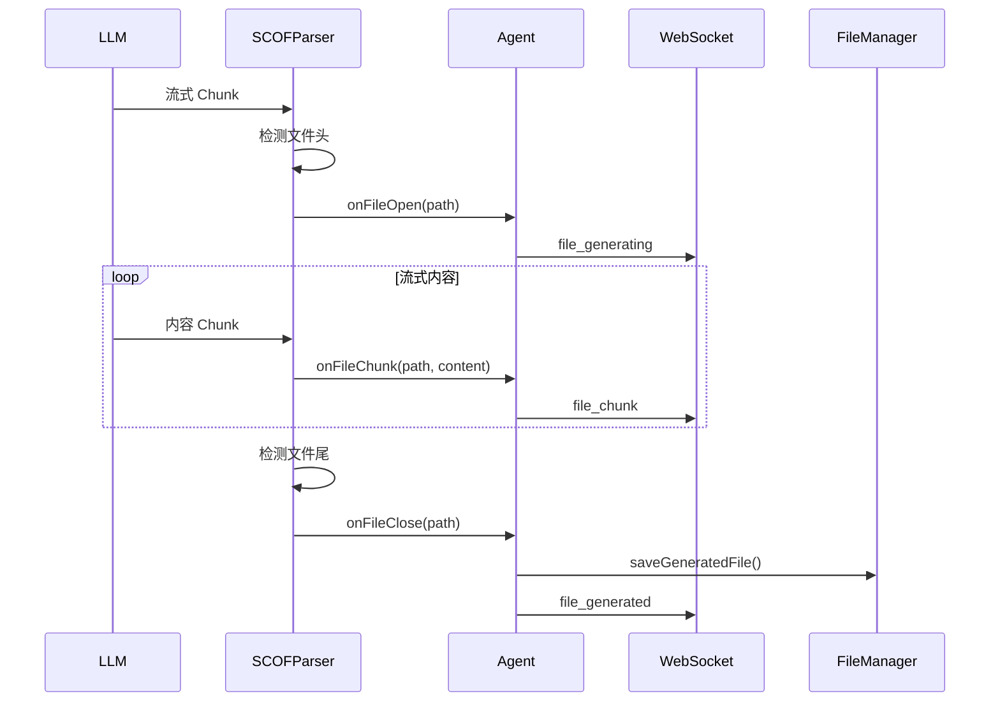

---

## 3.5 代码输出格式

### 3.5.1 SCOF（Shell Command Output Format）

**设计理念**：模仿 Shell 的 heredoc 语法，方便 LLM 生成和解析器识别。

```bash
# SCOF 示例
cat > src/App.tsx << 'EOF'
import React from 'react';

function App() {
  return <div>Hello World</div>;
}

export default App;
EOF

cat > src/styles.css << 'EOF'
body {
  font-family: sans-serif;
}
EOF
```

**格式特点**：
- `cat > <filepath> << '<marker>'` - 文件头
- `<content>` - 文件内容
- `<marker>` - 文件尾（必须与开头的 marker 匹配）

### 3.5.2 SCOF 解析器实现

```typescript
// worker/agents/output-formats/streaming-formats/scof.ts
export class SCOFFormat extends CodeGenerationFormat {
    
    parseStreamingChunks(
        chunk: string,
        state: CodeGenerationStreamingState,
        onFileOpen: (filePath: string) => void,
        onFileChunk: (filePath: string, chunk: string, format: 'full_content' | 'unified_diff') => void,
        onFileClose: (filePath: string) => void
    ): CodeGenerationStreamingState {
        
        state.accumulator += chunk;
        
        // 逐行处理
        const lines = state.accumulator.split('\n');
        const lastLineComplete = chunk.endsWith('\n');
        
        for (let i = 0; i < lines.length - (lastLineComplete ? 0 : 1); i++) {
            const line = lines[i];
            this.processLine(line, state, onFileOpen, onFileChunk, onFileClose);
        }
        
        // 保存不完整的最后一行
        if (!lastLineComplete) {
            state.parsingState.partialLineBuffer = lines[lines.length - 1];
        }
        
        return state;
    }
    
    private processLine(
        line: string,
        state: CodeGenerationStreamingState,
        onFileOpen: (filePath: string) => void,
        onFileChunk: (filePath: string, chunk: string, format: 'full_content' | 'unified_diff') => void,
        onFileClose: (filePath: string) => void
    ): void {
        const scofState = state.parsingState as SCOFParsingState;
        
        // 检测文件头：cat > <path> << 'EOF'
        const headerMatch = line.match(/cat\s+>\s+(.+?)\s+<<\s+'(.+?)'/);
        if (headerMatch) {
            const [, filePath, eofMarker] = headerMatch;
            
            scofState.currentFile = filePath.trim();
            scofState.eofMarker = eofMarker;
            scofState.insideEofBlock = true;
            scofState.contentBuffer = '';
            
            // 触发文件开始回调
            if (!scofState.openedFiles.has(filePath)) {
                onFileOpen(filePath);
                scofState.openedFiles.add(filePath);
            }
            
            return;
        }
        
        // 检测文件尾：EOF
        if (scofState.insideEofBlock && line.trim() === scofState.eofMarker) {
            const filePath = scofState.currentFile!;
            const content = scofState.contentBuffer;
            
            // 保存文件
            state.generatedFiles.push({
                filePath,
                fileContents: content,
                filePurpose: '',
            });
            
            // 触发文件关闭回调
            onFileClose(filePath);
            scofState.closedFiles.add(filePath);
            
            // 重置状态
            scofState.insideEofBlock = false;
            scofState.currentFile = null;
            scofState.contentBuffer = '';
            
            return;
        }
        
        // 积累文件内容
        if (scofState.insideEofBlock) {
            scofState.contentBuffer += line + '\n';
            
            // 流式推送内容块
            onFileChunk(scofState.currentFile!, line + '\n', 'full_content');
        }
    }
}
```

**处理难点**：

1. **Chunk 边界**：LLM 输出的 chunk 可能在任意位置截断
2. **不完整行**：需要缓冲不完整的行到下一 chunk
3. **EOF 检测**：EOF marker 可能恰好在 chunk 边界上

### 3.5.3 UDIFF 格式（Unified Diff）

**用于增量修改现有文件**：

```diff
--- src/App.tsx
+++ src/App.tsx
@@ -1,5 +1,7 @@
 import React from 'react';
+import { useState } from 'react';

 function App() {
-  return <div>Hello World</div>;
+  const [count, setCount] = useState(0);
+  return <div onClick={() => setCount(count + 1)}>Count: {count}</div>;
 }
```

**应用 Diff 的实现**：

```typescript
// worker/agents/output-formats/diff-formats/udiff.ts
export function applyDiff(originalContent: string, diff: string): string {
    const lines = originalContent.split('\n');
    const diffLines = diff.split('\n');
    
    let result: string[] = [];
    let originalIndex = 0;
    
    for (const diffLine of diffLines) {
        if (diffLine.startsWith('@@')) {
            // 解析 hunk header: @@ -1,5 +1,7 @@
            const match = diffLine.match(/@@ -(\d+),(\d+) \+(\d+),(\d+) @@/);
            if (match) {
                const [, oldStart, oldCount, newStart, newCount] = match.map(Number);
                originalIndex = oldStart - 1;
            }
        } else if (diffLine.startsWith('-')) {
            // 删除行
            originalIndex++;
        } else if (diffLine.startsWith('+')) {
            // 添加行
            result.push(diffLine.substring(1));
        } else if (diffLine.startsWith(' ')) {
            // 上下文行（不变）
            result.push(lines[originalIndex]);
            originalIndex++;
        }
    }
    
    return result.join('\n');
}
```

---

## 3.6 错误修复循环

### 3.6.1 Review Cycles 机制

```typescript
// worker/agents/core/simpleGeneratorAgent.ts
async generateAllFiles(reviewCycles: number = 10): Promise<void> {
    this.state.reviewCycles = reviewCycles;
    
    while (shouldGenerateNextPhase(this.state)) {
        // 1. 生成 Phase 概念
        const phaseResult = await this.operations.generateNextPhase.execute({
            agent: this,
            inputs: {
                issues: await this.collectIssues(),
                userContext: this.getPendingUserContext(),
                isFinal: this.state.phasesCounter >= MAX_PHASES - 1,
            }
        });
        
        if (!phaseResult.phase_name) {
            // LLM 认为已完成
            break;
        }
        
        this.state.currentPhase = phaseResult;
        
        // 2. 实现 Phase（生成代码）
        const implResult = await this.operations.implementPhase.execute({
            agent: this,
            inputs: {
                phase: phaseResult,
                issues: await this.collectIssues(),
                isFirstPhase: this.state.phasesCounter === 0,
                shouldAutoFix: true,
                // 回调函数用于实时推送
                fileGeneratingCallback: (path, purpose) => {
                    broadcastToConnections(this, 'file_generating', { path, purpose });
                },
                fileChunkGeneratedCallback: (path, chunk, format) => {
                    broadcastToConnections(this, 'file_chunk', { path, chunk, format });
                },
                fileClosedCallback: (file, message) => {
                    broadcastToConnections(this, 'file_generated', { file, message });
                }
            }
        });
        
        // 3. 等待文件修复完成
        const fixedFiles = await Promise.all(implResult.fixedFilePromises);
        
        // 4. 保存文件 + Git commit
        await this.fileManager.saveGeneratedFiles(
            fixedFiles,
            `Phase ${this.state.phasesCounter + 1}: ${phaseResult.phase_name}`
        );
        
        // 5. 部署到沙箱
        await this.deployToSandbox();
        
        // 6. Review 循环
        let currentReviewCycle = 0;
        while (currentReviewCycle < reviewCycles) {
            // 收集错误
            const issues = await this.collectIssues();
            
            if (!issues.hasBlockingIssues()) {
                // 没有阻塞性错误，跳出 Review
                break;
            }
            
            // 运行快速修复
            await this.operations.fastCodeFixer.execute({
                agent: this,
                inputs: { issues }
            });
            
            // 重新部署
            await this.deployToSandbox();
            
            currentReviewCycle++;
        }
        
        // 7. 标记 Phase 完成
        this.state.generatedPhases.push({
            ...phaseResult,
            completed: true,
        });
        this.state.phasesCounter++;
        
        broadcastToConnections(this, 'phase_completed', {
            phase: phaseResult,
            progress: this.state.phasesCounter / MAX_PHASES
        });
    }
    
    // 所有 Phase 完成
    this.state.mvpGenerated = true;
    broadcastToConnections(this, 'mvp_generated', {
        message: 'All phases completed!'
    });
}
```

### 3.6.2 FastCodeFixer Operation

```typescript
// worker/agents/operations/PostPhaseCodeFixer.ts
export class FastCodeFixerOperation implements AgentOperation<FastCodeFixerInputs, void> {
    
    async execute(options: OperationOptions<FastCodeFixerInputs>): Promise<void> {
        const { agent, inputs } = options;
        const { issues } = inputs;
        
        // 1. 优先使用基于规则的修复器
        const ruleBasedFixes = await this.applyRuleBasedFixes(issues, agent);
        
        if (ruleBasedFixes.length > 0) {
            await agent.fileManager.saveGeneratedFiles(
                ruleBasedFixes,
                'Auto-fix: Rule-based error correction'
            );
        }
        
        // 2. 如果规则修复器无法处理，使用 LLM 修复
        const remainingIssues = await agent.collectIssues();
        
        if (remainingIssues.hasBlockingIssues()) {
            await this.applyLLMBasedFixes(remainingIssues, agent);
        }
    }
    
    private async applyRuleBasedFixes(
        issues: IssueReport,
        agent: SimpleCodeGeneratorAgent
    ): Promise<FileOutputType[]> {
        const fixes: FileOutputType[] = [];
        
        for (const error of issues.staticErrors) {
            // TypeScript 错误码匹配
            if (error.code === 2307) {
                // Cannot find module
                const fix = await this.fixImportError(error, agent);
                if (fix) fixes.push(fix);
            } else if (error.code === 2304) {
                // Cannot find name
                const fix = await this.fixUndefinedVariable(error, agent);
                if (fix) fixes.push(fix);
            }
            // ... 更多错误类型
        }
        
        return fixes;
    }
}
```

### 3.6.3 TypeScript 错误自动修复

```typescript
// worker/services/code-fixer/fixers/ts2307.ts
/**
 * 修复 TS2307: Cannot find module 'xxx' or its corresponding type declarations
 */
export async function fixTS2307(
    error: StaticAnalysisError,
    fileContent: string,
    allFiles: FileOutputType[]
): Promise<string | null> {
    const moduleName = extractModuleName(error.message);
    
    // 1. 检查是否是路径错误
    if (moduleName.startsWith('.')) {
        // 相对路径导入
        const correctPath = findCorrectPath(moduleName, allFiles);
        if (correctPath) {
            return fileContent.replace(
                new RegExp(`from ['"]${escapeRegex(moduleName)}['"]`),
                `from '${correctPath}'`
            );
        }
    }
    
    // 2. 检查是否缺少扩展名
    if (!moduleName.endsWith('.ts') && !moduleName.endsWith('.tsx')) {
        const withExtension = `${moduleName}.tsx`;
        if (allFiles.some(f => f.filePath.endsWith(withExtension))) {
            return fileContent.replace(
                new RegExp(`from ['"]${escapeRegex(moduleName)}['"]`),
                `from '${withExtension}'`
            );
        }
    }
    
    // 3. 无法自动修复
    return null;
}
```

---

## 3.7 完整代码生成流程图

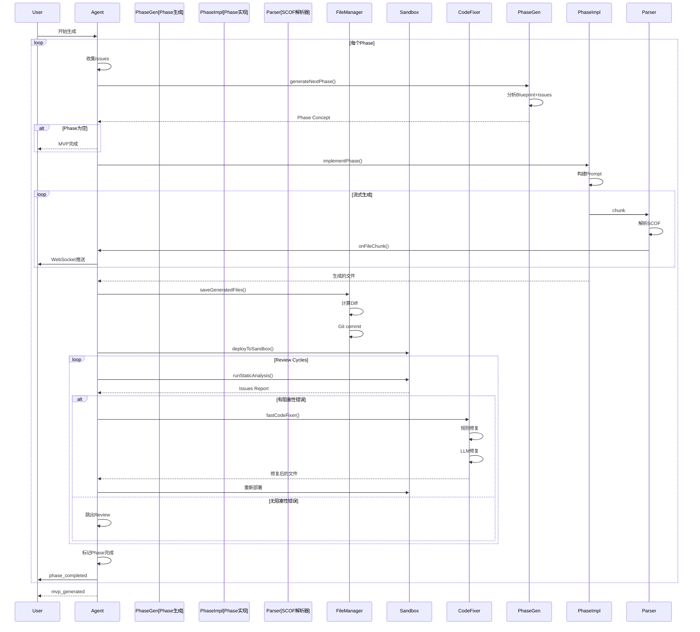

---

## 3.8 小结

本章我们深入探讨了代码生成流程的完整实现：

| 主题 | 关键点 |
|------|--------|
| **Phase-wise 策略** | 渐进式验证、错误隔离、资源优化 |
| **Blueprint 生成** | PRD 文档、Prompt 工程、模板定制 |
| **Phase 概念生成** | Issue 驱动、依赖管理、终止条件 |
| **Phase 实现** | 流式生成、实时推送、文件协调 |
| **代码输出格式** | SCOF 格式、UDIFF 格式、流式解析 |
| **错误修复循环** | Review Cycles、规则修复、LLM 修复 |

**核心设计原则**：

1. **增量开发**：每个 Phase 都是可部署的里程碑
2. **Issue 优先**：错误修复优先于新功能
3. **流式反馈**：实时推送生成进度到前端
4. **多层修复**：规则修复 + LLM 修复
5. **版本控制**：每个 Phase 都有 Git commit

---

**下一章预告**：我们将深入推理引擎，了解如何构建 LLM 无关的推理层、模型配置系统、Schema 格式化以及 Prompt 工程的最佳实践。


# 第四章到第十一章内容（追加到主文档）

# 第四章：推理引擎（Inference Engine）

## 4.1 统一推理接口

### 4.1.1 executeInference 函数设计

VibeSDK 通过一个统一的推理接口 `executeInference` 来抽象不同 LLM 的调用细节：

```typescript
// worker/agents/inferutils/infer.ts

// 函数重载：支持结构化输出和自由文本输出
export async function executeInference<T extends z.AnyZodObject>(
    params: InferenceParamsStructured<T>
): Promise<InferResponseObject<T>>;

export async function executeInference(
    params: InferenceParamsBase
): Promise<InferResponseString>;

export async function executeInference<T extends z.AnyZodObject>({
    env,
    messages,
    temperature = 0.7,
    maxTokens = 4096,
    retryLimit = 5,
    stream,
    tools,
    reasoning_effort,
    schema,
    agentActionName,
    format,
    modelName,
    modelConfig,
    context
}: InferenceParamsBase & {
    schema?: T;
    format?: SchemaFormat;
}): Promise<InferResponseString | InferResponseObject<T>> {
    
    // 1. 确定使用的模型配置
    let conf: ModelConfig | undefined;
    
    if (modelConfig) {
        // 显式提供的配置
        conf = modelConfig;
    } else if (context?.userModelConfigs) {
        // 用户级别配置
        conf = context.userModelConfigs[agentActionName];
    }
    
    if (!conf) {
        // 回退到全局默认配置
        conf = AGENT_CONFIG[agentActionName];
    }
    
    // 2. 验证约束
    validateAgentConstraints(agentActionName, conf.name);
    
    // 3. 准备推理参数
    const inferParams: InferParams = {
        model: conf.name,
        messages,
        temperature: conf.temperature ?? temperature,
        maxTokens: conf.maxTokens ?? maxTokens,
        topP: conf.topP,
        stream: stream ? true : false,
    };
    
    // 4. 添加结构化输出（如果有 schema）
    if (schema) {
        if (format === 'openai_function') {
            // OpenAI function calling
            inferParams.tools = [{
                type: 'function',
                function: {
                    name: 'output',
                    parameters: zodToJsonSchema(schema),
                }
            }];
            inferParams.tool_choice = { type: 'function', function: { name: 'output' } };
        } else {
            // Native JSON mode
            inferParams.response_format = {
                type: 'json_schema',
                json_schema: {
                    name: 'output',
                    schema: zodToJsonSchema(schema),
                    strict: true,
                }
            };
        }
    }
    
    // 5. 添加 reasoning effort（o1/o3 系列）
    if (reasoning_effort && isReasoningModel(conf.name)) {
        inferParams.reasoning_effort = reasoning_effort;
    }
    
    // 6. 重试循环
    let attempt = 0;
    let lastError: Error | null = null;
    
    while (attempt < retryLimit) {
        try {
            // 调用核心推理函数
            const response = await infer(env, inferParams, stream?.onChunk);
            
            // 解析响应
            if (schema) {
                // 验证并解析结构化输出
                const parsed = schema.parse(JSON.parse(response.content));
                return {
                    success: true,
                    data: parsed,
                    raw: response.content,
                } as InferResponseObject<T>;
            } else {
                // 返回原始文本
                return {
                    success: true,
                    content: response.content,
                } as InferResponseString;
            }
        } catch (error) {
            lastError = error as Error;
            attempt++;
            
            if (error instanceof AbortError) {
                // 用户取消，不重试
                throw error;
            }
            
            if (attempt < retryLimit) {
                // 添加重新生成提示
                messages.push(
                    createAssistantMessage(lastError.message),
                    createUserMessage(responseRegenerationPrompts)
                );
            }
        }
    }
    
    // 所有重试失败
    throw new Error(`Inference failed after ${retryLimit} attempts: ${lastError?.message}`);
}
```

**设计亮点**：

1. **函数重载**：TypeScript 类型安全，根据是否传入 schema 返回不同类型
2. **配置层级**：显式配置 > 用户配置 > 全局配置
3. **自动重试**：解析失败自动重试，并添加错误提示
4. **流式支持**：可选的流式输出回调
5. **取消支持**：AbortController 中断推理

### 4.1.2 核心推理函数

```typescript
// worker/agents/inferutils/core.ts
export async function infer(
    env: Env,
    params: InferParams,
    streamCallback?: (chunk: string) => void
): Promise<InferResponse> {
    
    // 1. 构建 OpenAI 兼容请求
    const requestBody = {
        model: params.model,
        messages: params.messages,
        temperature: params.temperature,
        max_tokens: params.maxTokens,
        top_p: params.topP,
        stream: params.stream,
        response_format: params.response_format,
        tools: params.tools,
        tool_choice: params.tool_choice,
    };
    
    // 2. 通过 AI Gateway 调用
    const response = await fetch(
        `https://gateway.ai.cloudflare.com/v1/${env.CLOUDFLARE_ACCOUNT_ID}/${env.AI_GATEWAY_ID}/openai/chat/completions`,
        {
            method: 'POST',
            headers: {
                'Authorization': `Bearer ${getApiKey(env, params.model)}`,
                'Content-Type': 'application/json',
                'CF-AIG-Authorization': `Bearer ${env.CLOUDFLARE_AI_GATEWAY_TOKEN}`,
            },
            body: JSON.stringify(requestBody),
        }
    );
    
    if (!response.ok) {
        throw new InferError(`HTTP ${response.status}: ${await response.text()}`);
    }
    
    // 3. 处理流式响应
    if (params.stream && streamCallback) {
        const reader = response.body!.getReader();
        const decoder = new TextDecoder();
        let buffer = '';
        
        while (true) {
            const { done, value } = await reader.read();
            if (done) break;
            
            buffer += decoder.decode(value, { stream: true });
            const lines = buffer.split('\n');
            buffer = lines.pop() || '';
            
            for (const line of lines) {
                if (line.startsWith('data: ')) {
                    const data = line.slice(6);
                    if (data === '[DONE]') continue;
                    
                    try {
                        const parsed = JSON.parse(data);
                        const content = parsed.choices[0]?.delta?.content;
                        if (content) {
                            streamCallback(content);
                        }
                    } catch (e) {
                        // 忽略解析错误
                    }
                }
            }
        }
        
        return { content: '' }; // 流式模式不返回完整内容
    }
    
    // 4. 处理非流式响应
    const data = await response.json();
    const content = data.choices[0]?.message?.content || '';
    
    // 处理 function calling 响应
    if (data.choices[0]?.message?.tool_calls) {
        const toolCall = data.choices[0].message.tool_calls[0];
        return { content: toolCall.function.arguments };
    }
    
    return { content };
}
```

---

## 4.2 模型配置系统

### 4.2.1 AGENT_CONFIG 设计

```typescript
// worker/agents/inferutils/config.ts
export const AGENT_CONFIG: Record<AgentActionKey, ModelConfig> = {
    // Blueprint 生成 - 需要创造力
    'blueprint_generation': {
        name: AIModels.GEMINI_2_0_FLASH_THINKING,
        maxTokens: 8000,
        temperature: 0.7,
        topP: 0.95,
    },
    
    // Phase 生成 - 平衡创造力和一致性
    'phase_generation': {
        name: AIModels.GEMINI_2_0_FLASH_THINKING,
        maxTokens: 4000,
        temperature: 0.6,
        topP: 0.9,
    },
    
    // Phase 实现 - 需要精确性
    'phase_implementation': {
        name: AIModels.GEMINI_2_0_FLASH_THINKING,
        maxTokens: 16000,
        temperature: 0.4,
        topP: 0.8,
    },
    
    // 文件重新生成 - 高精确性
    'file_regeneration': {
        name: AIModels.GEMINI_2_0_FLASH_THINKING,
        maxTokens: 8000,
        temperature: 0.3,
        topP: 0.7,
    },
    
    // 用户对话 - 需要理解力
    'user_conversation': {
        name: AIModels.GEMINI_2_0_FLASH_THINKING,
        maxTokens: 4000,
        temperature: 0.5,
        topP: 0.9,
    },
    
    // 深度调试 - 需要推理能力
    'deep_debug': {
        name: AIModels.O1_MINI,
        reasoning_effort: 'medium',
        maxTokens: 16000,
    },
};
```

**配置原则**：

| 任务类型 | 温度 | Top-P | 原因 |
|---------|------|-------|------|
| Blueprint | 0.7 | 0.95 | 需要创造性思维 |
| Phase 生成 | 0.6 | 0.9 | 平衡创造与一致 |
| 代码实现 | 0.4 | 0.8 | 需要精确语法 |
| 文件重生成 | 0.3 | 0.7 | 需要确定性修复 |
| 深度调试 | N/A | N/A | 使用 reasoning models |

### 4.2.2 用户级别配置覆盖

```typescript
// worker/database/services/ModelConfigService.ts
export class ModelConfigService {
    /**
     * 获取用户的模型配置
     */
    static async getUserModelConfigs(
        db: Database,
        userId: string
    ): Promise<Record<AgentActionKey, ModelConfig>> {
        const configs = await db.query.modelConfigs.findMany({
            where: eq(modelConfigs.userId, userId),
        });
        
        const result: Record<string, ModelConfig> = {};
        
        for (const config of configs) {
            result[config.agentAction] = {
                name: config.modelName as AIModels,
                maxTokens: config.maxTokens,
                temperature: config.temperature,
                topP: config.topP,
                reasoning_effort: config.reasoningEffort as ReasoningEffort,
            };
        }
        
        return result as Record<AgentActionKey, ModelConfig>;
    }
    
    /**
     * 更新用户配置
     */
    static async setUserModelConfig(
        db: Database,
        userId: string,
        agentAction: AgentActionKey,
        config: Partial<ModelConfig>
    ): Promise<void> {
        await db.insert(modelConfigs)
            .values({
                userId,
                agentAction,
                modelName: config.name,
                maxTokens: config.maxTokens,
                temperature: config.temperature,
                topP: config.topP,
                reasoningEffort: config.reasoning_effort,
            })
            .onConflictDoUpdate({
                target: [modelConfigs.userId, modelConfigs.agentAction],
                set: {
                    modelName: config.name,
                    maxTokens: config.maxTokens,
                    temperature: config.temperature,
                    topP: config.topP,
                    reasoningEffort: config.reasoning_effort,
                }
            });
    }
}
```

**配置加载流程**：

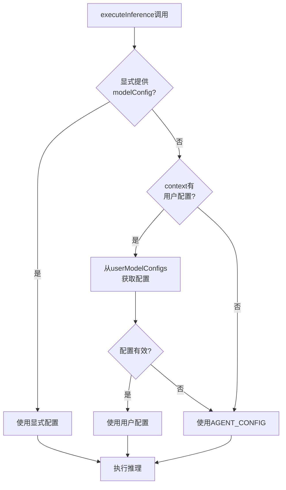

---

## 4.3 Schema 格式化

### 4.3.1 Zod 到 JSON Schema 转换

```typescript
// worker/agents/inferutils/schemaFormatters.ts
export function zodToJsonSchema(schema: z.AnyZodObject): JSONSchema {
    return zodToJsonSchemaImpl(schema);
}

function zodToJsonSchemaImpl(schema: z.ZodTypeAny): any {
    if (schema instanceof z.ZodObject) {
        const shape = schema._def.shape();
        const properties: Record<string, any> = {};
        const required: string[] = [];
        
        for (const [key, value] of Object.entries(shape)) {
            properties[key] = zodToJsonSchemaImpl(value as z.ZodTypeAny);
            
            // 检查是否必需
            if (!(value instanceof z.ZodOptional)) {
                required.push(key);
            }
        }
        
        return {
            type: 'object',
            properties,
            required,
            additionalProperties: false,
        };
    }
    
    if (schema instanceof z.ZodString) {
        const result: any = { type: 'string' };
        const description = schema._def.description;
        if (description) {
            result.description = description;
        }
        return result;
    }
    
    if (schema instanceof z.ZodNumber) {
        return { type: 'number' };
    }
    
    if (schema instanceof z.ZodBoolean) {
        return { type: 'boolean' };
    }
    
    if (schema instanceof z.ZodArray) {
        return {
            type: 'array',
            items: zodToJsonSchemaImpl(schema._def.type),
        };
    }
    
    if (schema instanceof z.ZodEnum) {
        return {
            type: 'string',
            enum: schema._def.values,
        };
    }
    
    if (schema instanceof z.ZodOptional) {
        return zodToJsonSchemaImpl(schema._def.innerType);
    }
    
    // ... 更多类型
    
    return {};
}
```

### 4.3.2 Tool Definition 生成

```typescript
// worker/agents/tools/types.ts
export interface ToolDefinition<TArgs, TResult> {
    type: 'function';
    function: {
        name: string;
        description: string;
        parameters: JSONSchema;
    };
    implementation: (args: TArgs) => Promise<TResult>;
}

// 从 Zod Schema 创建 Tool
export function createTool<TArgs extends z.AnyZodObject, TResult>(
    name: string,
    description: string,
    argsSchema: TArgs,
    implementation: (args: z.infer<TArgs>) => Promise<TResult>
): ToolDefinition<z.infer<TArgs>, TResult> {
    return {
        type: 'function',
        function: {
            name,
            description,
            parameters: zodToJsonSchema(argsSchema),
        },
        implementation,
    };
}

// 使用示例
const readFilesTool = createTool(
    'read_files',
    'Read multiple files from the project',
    z.object({
        file_paths: z.array(z.string()).describe('Array of file paths to read'),
    }),
    async ({ file_paths }) => {
        const files = await Promise.all(
            file_paths.map(path => fileManager.getFile(path))
        );
        return { files };
    }
);
```

---

## 4.4 AI Gateway 集成

### 4.4.1 多模型路由

AI Gateway 充当统一代理，将请求路由到不同的 AI 提供商：

```
Client → AI Gateway → {
    OpenAI (gpt-4o, o1-mini)
    Anthropic (claude-3.5-sonnet)
    Google (gemini-2.0-flash)
    Cloudflare Workers AI
}
```

**优势**：
- **统一接口**：所有模型使用 OpenAI 兼容的 API
- **密钥管理**：API Key 存储在服务端
- **请求缓存**：相同请求自动缓存
- **分析监控**：统一的请求日志和分析

### 4.4.2 请求缓存策略

```typescript
// AI Gateway 自动缓存 GET 请求（Chat Completions 是 POST，需手动缓存）

// 1. 为相似的 prompt 生成缓存 key
function generateCacheKey(messages: Message[], modelName: string): string {
    const normalized = messages.map(m => ({
        role: m.role,
        content: normalizeContent(m.content),
    }));
    return `${modelName}:${hash(JSON.stringify(normalized))}`;
}

// 2. 在调用前检查缓存
async function inferWithCache(
    env: Env,
    params: InferParams
): Promise<InferResponse> {
    const cacheKey = generateCacheKey(params.messages, params.model);
    
    // 检查 KV 缓存
    const cached = await env.VibecoderStore.get(`inference:${cacheKey}`);
    if (cached) {
        return JSON.parse(cached);
    }
    
    // 调用 AI Gateway
    const response = await infer(env, params);
    
    // 缓存结果（24小时）
    await env.VibecoderStore.put(
        `inference:${cacheKey}`,
        JSON.stringify(response),
        { expirationTtl: 86400 }
    );
    
    return response;
}
```

---

## 4.5 Prompt Engineering

### 4.5.1 模块化 Prompt 设计

```typescript
// worker/agents/prompts.ts

// 策略库
export const STRATEGIES = {
    // 前端优先开发策略
    FRONTEND_FIRST_PLANNING: `
## FRONTEND-FIRST DEVELOPMENT STRATEGY
Our team follows a proven rapid development approach:

**Phase Sequence:**
1. UI/UX Foundation → Beautiful, responsive layouts first
2. Component Library → Reusable, polished components
3. State Management → Clean data flow architecture
4. API Integration → Connect backend services
5. Polish & Optimization → Performance and UX refinement

**Why Frontend-First:**
• Immediate visual feedback for stakeholders
• Early UX validation prevents costly rewrites
• Component reusability accelerates development
• Backend can be mocked during frontend development
`,

    // 前端优先编码策略
    FRONTEND_FIRST_CODING: `
## IMPLEMENTATION STRATEGY
Follow this proven development sequence:

**1. Visual Foundation First**
   • Implement core UI components with full styling
   • Establish design system (colors, typography, spacing)
   • Create responsive layouts for all screen sizes
   • Add smooth animations and transitions

**2. Interactivity Layer**
   • Wire up onClick handlers and form submissions
   • Implement hover states and focus management
   • Add loading states and error boundaries
   • Ensure keyboard navigation works

**3. State Management**
   • Set up client-side state (useState, Zustand)
   • Implement data fetching and caching
   • Handle optimistic updates

**4. Backend Integration**
   • Connect to APIs (mock initially if needed)
   • Implement error handling and retries
   • Add proper loading states
`,
};

// 工具函数库
export const PROMPT_UTILS = {
    // UI 非协商原则
    UI_NON_NEGOTIABLES_V3: `
## VISUAL EXCELLENCE - NON-NEGOTIABLES

These are MANDATORY quality standards. Failure to follow = automatic rejection:

**1. Spacing & Layout**
   ✅ Use Tailwind's spacing scale (p-4, m-6, gap-8)
   ✅ Generous padding/margins everywhere (min p-4 for containers)
   ✅ Consistent spacing between sections (min gap-8)
   ✅ Proper max-width containers (max-w-7xl with px-4)
   ❌ NO arbitrary values [p-[13px]] unless absolutely necessary
   ❌ NO cramped layouts - breathing room is essential

**2. Typography**
   ✅ Clear hierarchy: text-4xl → text-3xl → text-2xl → text-xl → text-base
   ✅ Proper line-height: leading-tight for headings, leading-relaxed for body
   ✅ Readable font sizes: min text-base for body text
   ✅ Proper font weights: font-bold for headings, font-semibold for subheadings
   ❌ NO tiny text - if users squint, you failed

**3. Colors & Contrast**
   ✅ Use semantic colors: bg-blue-500, text-gray-900
   ✅ Proper contrast ratios (AA minimum)
   ✅ Hover states for ALL interactive elements
   ✅ Focus rings for keyboard navigation
   ❌ NO pure white/black - use gray-50/gray-900
   ❌ NO hard-to-read color combinations

**4. Responsive Design**
   ✅ Mobile-first: design for sm, then md, then lg
   ✅ Proper breakpoints: sm:, md:, lg:, xl:
   ✅ Touch-friendly targets: min-h-12 for buttons
   ✅ Readable on all devices
   ❌ NO horizontal scrolling on mobile
   ❌ NO fixed widths - use max-w-* instead

**5. Polish & Refinement**
   ✅ Smooth transitions: transition-all duration-200
   ✅ Rounded corners: rounded-lg for cards, rounded-md for buttons
   ✅ Subtle shadows: shadow-sm for elevation
   ✅ Loading states for all async operations
   ✅ Empty states with helpful messages
   ❌ NO harsh angles - rounded is modern
   ❌ NO missing feedback - users need to know what's happening
`,

    // React 渲染循环预防
    REACT_RENDER_LOOP_PREVENTION: `
## REACT INFINITE LOOP PREVENTION - CRITICAL

**🔥 ZUSTAND ABSOLUTE RULE - NO EXCEPTIONS 🔥**

✅ ONLY ALLOWED PATTERN:
\`\`\`typescript
const value = useStore(s => s.singlePrimitive);
const name = useStore(s => s.name);  // OK: primitive
const count = useStore(s => s.count); // OK: number
\`\`\`

❌ BANNED PATTERNS (Auto-crash):
\`\`\`typescript
// ❌ Object in selector - INSTANT CRASH
const data = useStore(s => ({ name: s.name, age: s.age }));

// ❌ No selector - INSTANT CRASH
const store = useStore();

// ❌ Method call - INSTANT CRASH  
const items = useStore(s => s.getItems());

// ❌ useShallow - NOT NEEDED, DON'T USE
const { a, b } = useStore(useShallow(s => ({ a: s.a, b: s.b })));
\`\`\`

**Why:** Zustand does shallow comparison. New object = new reference = re-render = new object = infinite loop.

**For multiple values:** Call useStore multiple times (efficient & correct):
\`\`\`typescript
const name = useStore(s => s.name);
const age = useStore(s => s.age);
const city = useStore(s => s.city);
// This is CORRECT and performant!
\`\`\`

**🚨 Other Critical Rules:**

1. **useEffect Dependencies**
   \`\`\`typescript
   // ❌ BAD: Missing dependencies
   useEffect(() => {
       setData(processData(rawData));
   }, []); // rawData missing!
   
   // ✅ GOOD: Complete dependencies
   useEffect(() => {
       setData(processData(rawData));
   }, [rawData]);
   \`\`\`

2. **Object/Array References**
   \`\`\`typescript
   // ❌ BAD: New array every render
   const items = data.map(d => ({ ...d, processed: true }));
   
   // ✅ GOOD: Memoized
   const items = useMemo(
       () => data.map(d => ({ ...d, processed: true })),
       [data]
   );
   \`\`\`

3. **Event Handlers**
   \`\`\`typescript
   // ❌ BAD: setState in render
   if (condition) {
       setState(newValue);
   }
   
   // ✅ GOOD: setState in event handler or useEffect
   useEffect(() => {
       if (condition) {
           setState(newValue);
       }
   }, [condition]);
   \`\`\`
`,
};
```

### 4.5.2 Issue 提示词格式化

```typescript
// worker/agents/prompts.ts
export const issuesPromptFormatter = {
    formatRuntimeErrors(errors: RuntimeError[]): string {
        return errors.map((err, i) => 
            `${i + 1}. **${err.type}**: ${err.message}\n` +
            `   File: ${err.file}:${err.line}:${err.column}\n` +
            `   Stack: ${err.stack?.split('\n').slice(0, 3).join('\n   ')}`
        ).join('\n\n');
    },
    
    formatStaticErrors(errors: StaticAnalysisError[]): string {
        const grouped = groupByFile(errors);
        return Object.entries(grouped).map(([file, errs]) =>
            `**${file}**:\n` +
            errs.map(e => `  • [TS${e.code}] Line ${e.line}: ${e.message}`).join('\n')
        ).join('\n\n');
    },
    
    formatUserFeedback(feedback: string, images?: ProcessedImageAttachment[]): string {
        let result = `**User Feedback:**\n${feedback}\n`;
        
        if (images && images.length > 0) {
            result += `\n**Attached Screenshots:** ${images.length} image(s)\n`;
            result += images.map((img, i) => 
                `${i + 1}. ${img.filename} (${(img.size / 1024).toFixed(2)} KB)`
            ).join('\n');
        }
        
        return result;
    },
};
```

---

## 4.6 小结

本章我们深入探讨了推理引擎的完整实现：

| 主题 | 关键点 |
|------|--------|
| **统一推理接口** | executeInference 抽象、函数重载、自动重试 |
| **模型配置** | AGENT_CONFIG、用户覆盖、配置层级 |
| **Schema 格式化** | Zod → JSON Schema、Tool Definition |
| **AI Gateway** | 多模型路由、请求缓存、分析监控 |
| **Prompt 工程** | 模块化设计、策略库、工具函数 |

**核心设计原则**：

1. **LLM 无关**：统一接口，易于切换模型
2. **类型安全**：Zod + TypeScript，编译时检查
3. **配置灵活**：全局 → 用户 → 显式，多层覆盖
4. **错误恢复**：自动重试 + 提示优化
5. **Prompt 模块化**：策略、工具、格式化器分离

---

**下一章预告**：我们将深入沙箱系统，了解如何使用 Cloudflare Containers 构建安全的代码执行环境，包括模板管理、实例生命周期、静态分析集成等。

---

# 第五章：沙箱系统（Cloudflare Containers）

## 5.1 抽象基类设计

### 5.1.1 BaseSandboxService

VibeSDK 通过抽象基类定义沙箱服务的标准接口，确保不同实现的兼容性：

```typescript
// worker/services/sandbox/BaseSandboxService.ts
export abstract class BaseSandboxService {
    protected logger: StructuredLogger;
    protected sandboxId: string;

    constructor(sandboxId: string) {
        this.logger = createObjectLogger(this, 'BaseSandboxService');
        this.sandboxId = sandboxId;
    }

    // ========== 模板管理 ==========
    static async listTemplates(): Promise<TemplateListResponse> {
        // 从 R2 bucket 读取模板目录
        const response = await env.TEMPLATES_BUCKET.get('template_catalog.json');
        const templates = await response.json() as TemplateInfo[];
        
        return {
            success: true,
            templates: templates.filter(t => !t.disabled),
            count: templates.length
        };
    }

    static async getTemplateDetails(templateName: string): Promise<TemplateDetailsResponse> {
        // 从 R2 读取模板 ZIP
        const zipData = await env.TEMPLATES_BUCKET.get(`${templateName}.zip`);
        const arrayBuffer = await zipData.arrayBuffer();
        
        // 解压并解析
        const extractor = new ZipExtractor();
        const files = await extractor.extractZip(new Uint8Array(arrayBuffer));
        
        // 解析模板元数据
        const metadata = parseTemplateMetadata(files);
        
        return {
            success: true,
            templateDetails: {
                name: templateName,
                allFiles: files,
                importantFiles: metadata.importantFiles,
                dontTouchFiles: metadata.dontTouchFiles,
                entryPoint: metadata.entryPoint,
            }
        };
    }

    // ========== 实例生命周期 ==========
    abstract initialize(): Promise<void>;
    abstract shutdown(): Promise<ShutdownResponse>;
    abstract getInstanceInfo(): Promise<GetInstanceResponse>;

    // ========== 文件操作 ==========
    abstract writeFiles(request: WriteFilesRequest): Promise<WriteFilesResponse>;
    abstract getFiles(filePaths: string[]): Promise<GetFilesResponse>;

    // ========== 命令执行 ==========
    abstract executeCommands(commands: string[], workdir?: string): Promise<ExecuteCommandsResponse>;

    // ========== 错误管理 ==========
    abstract getRuntimeErrors(): Promise<RuntimeErrorResponse>;
    abstract clearErrors(): Promise<ClearErrorsResponse>;

    // ========== 静态分析 ==========
    abstract runStaticAnalysis(): Promise<StaticAnalysisResponse>;
}
```

**接口分类**：

| 类别 | 方法 | 用途 |
|------|------|------|
| 模板 | `listTemplates()` | 获取可用模板列表 |
| 模板 | `getTemplateDetails()` | 读取模板文件 |
| 生命周期 | `initialize()` | 创建/启动实例 |
| 生命周期 | `shutdown()` | 停止/删除实例 |
| 生命周期 | `getInstanceInfo()` | 查询实例状态 |
| 文件 | `writeFiles()` | 写入/更新文件 |
| 文件 | `getFiles()` | 读取文件内容 |
| 执行 | `executeCommands()` | 运行 shell 命令 |
| 错误 | `getRuntimeErrors()` | 获取运行时错误 |
| 错误 | `clearErrors()` | 清空错误记录 |
| 分析 | `runStaticAnalysis()` | TypeScript/ESLint 检查 |

---

## 5.2 远程沙箱服务

### 5.2.1 RemoteSandboxService 实现

```typescript
// worker/services/sandbox/remoteSandboxService.ts
export class RemoteSandboxService extends BaseSandboxService {
    private instanceId: string | null = null;
    private instanceType: ContainerInstanceType;
    private templateName: string;

    constructor(
        sandboxId: string, 
        templateName: string,
        instanceType: ContainerInstanceType = 'standard-3'
    ) {
        super(sandboxId);
        this.templateName = templateName;
        this.instanceType = instanceType;
    }

    async initialize(): Promise<void> {
        this.logger.info('Initializing remote sandbox', {
            templateName: this.templateName,
            instanceType: this.instanceType
        });

        // 1. 获取模板文件
        const templateDetails = await BaseSandboxService.getTemplateDetails(this.templateName);
        if (!templateDetails.success) {
            throw new Error(`Failed to get template: ${templateDetails.error}`);
        }

        // 2. 创建容器实例
        const createResponse = await this.createInstance(templateDetails.templateDetails);
        this.instanceId = createResponse.instanceId;

        // 3. 等待实例就绪
        await this.waitForReady();

        // 4. Bootstrap（安装依赖）
        await this.bootstrap();

        this.logger.info('Remote sandbox initialized', { instanceId: this.instanceId });
    }

    private async createInstance(templateDetails: TemplateDetails): Promise<{ instanceId: string }> {
        // 调用 Cloudflare Containers API
        const response = await fetch(
            `https://api.cloudflare.com/client/v4/accounts/${this.env.CLOUDFLARE_ACCOUNT_ID}/containers/v2/instances`,
            {
                method: 'POST',
                headers: {
                    'Authorization': `Bearer ${this.env.CLOUDFLARE_API_TOKEN}`,
                    'Content-Type': 'application/json',
                },
                body: JSON.stringify({
                    image: 'vibesdk-runtime:latest',
                    instanceType: this.instanceType,
                    env: {
                        TEMPLATE_NAME: this.templateName,
                    },
                    files: templateDetails.allFiles, // 初始文件
                }),
            }
        );

        if (!response.ok) {
            throw new Error(`Failed to create instance: ${await response.text()}`);
        }

        const data = await response.json();
        return { instanceId: data.result.id };
    }

    private async bootstrap(): Promise<void> {
        this.logger.info('Bootstrapping instance (installing dependencies)');

        // 执行 npm install / bun install
        const response = await this.executeCommands(
            ['npm install'],
            '/workspace'
        );

        if (response.exitCode !== 0) {
            this.logger.warn('Bootstrap failed', { stderr: response.stderr });
            throw new Error('Bootstrap failed');
        }

        this.logger.info('Bootstrap completed');
    }

    async writeFiles(request: WriteFilesRequest): Promise<WriteFilesResponse> {
        if (!this.instanceId) {
            throw new Error('Instance not initialized');
        }

        const response = await fetch(
            `https://api.cloudflare.com/client/v4/containers/v2/instances/${this.instanceId}/files`,
            {
                method: 'PUT',
                headers: {
                    'Authorization': `Bearer ${this.env.CLOUDFLARE_API_TOKEN}`,
                    'Content-Type': 'application/json',
                },
                body: JSON.stringify({
                    files: request.files.map(f => ({
                        path: f.path,
                        content: f.content,
                    }))
                }),
            }
        );

        if (!response.ok) {
            return {
                success: false,
                error: `Write files failed: ${await response.text()}`
            };
        }

        return { success: true };
    }

    async executeCommands(commands: string[], workdir?: string): Promise<ExecuteCommandsResponse> {
        if (!this.instanceId) {
            throw new Error('Instance not initialized');
        }

        const response = await fetch(
            `https://api.cloudflare.com/client/v4/containers/v2/instances/${this.instanceId}/exec`,
            {
                method: 'POST',
                headers: {
                    'Authorization': `Bearer ${this.env.CLOUDFLARE_API_TOKEN}`,
                    'Content-Type': 'application/json',
                },
                body: JSON.stringify({
                    command: commands.join(' && '),
                    workdir: workdir || '/workspace',
                }),
            }
        );

        const data = await response.json();

        return {
            stdout: data.result.stdout,
            stderr: data.result.stderr,
            exitCode: data.result.exitCode,
        };
    }

    async runStaticAnalysis(): Promise<StaticAnalysisResponse> {
        // 在容器中运行 tsc --noEmit
        const tscResult = await this.executeCommands(
            ['npx tsc --noEmit --pretty false'],
            '/workspace'
        );

        // 解析 TypeScript 错误
        const errors = this.parseTscOutput(tscResult.stderr);

        return {
            success: true,
            errors,
            errorCount: errors.length,
        };
    }

    private parseTscOutput(output: string): StaticAnalysisError[] {
        const errors: StaticAnalysisError[] = [];
        const lines = output.split('\n');

        for (const line of lines) {
            // 格式: src/App.tsx(10,5): error TS2304: Cannot find name 'foo'.
            const match = line.match(/^(.+?)\((\d+),(\d+)\): error TS(\d+): (.+)$/);
            if (match) {
                const [, file, line, column, code, message] = match;
                errors.push({
                    file,
                    line: parseInt(line),
                    column: parseInt(column),
                    code: parseInt(code),
                    message,
                    severity: 'error',
                });
            }
        }

        return errors;
    }
}
```

### 5.2.2 实例类型配置

```typescript
// Containers 实例类型
export type ContainerInstanceType = 
    | 'lite'         // 256 MiB, 1/16 vCPU (开发)
    | 'standard-1'   // 4 GiB, 1/2 vCPU
    | 'standard-2'   // 8 GiB, 1 vCPU
    | 'standard-3'   // 12 GiB, 2 vCPU (默认)
    | 'standard-4';  // 12 GiB, 4 vCPU (高性能)

// 从环境变量读取配置
function getInstanceType(env: Env): ContainerInstanceType {
    const envType = env.SANDBOX_INSTANCE_TYPE;
    
    if (isValidInstanceType(envType)) {
        return envType;
    }
    
    // 默认值
    return 'standard-3';
}
```

**实例类型选择指南**：

- **lite**: 仅用于开发/测试，构建速度慢
- **standard-1**: 轻量应用，足够运行简单的 Vite 项目
- **standard-3**: **推荐**，平衡性能与资源，适合大多数应用
- **standard-4**: 复杂应用，需要更多 CPU 并行处理

---

## 5.3 沙箱 SDK 客户端

### 5.3.1 UserAppSandboxService Durable Object

```typescript
// worker/services/sandbox/sandboxSdkClient.ts
export class UserAppSandboxService extends DurableObject {
    private instance: RemoteSandboxService | null = null;
    private lastAccessTime: number = Date.now();
    private static readonly IDLE_TIMEOUT_MS = 30 * 60 * 1000; // 30分钟

    async fetch(request: Request): Promise<Response> {
        const url = new URL(request.url);

        // 创建沙箱实例
        if (url.pathname === '/create') {
            const { templateName } = await request.json();
            
            this.instance = new RemoteSandboxService(
                this.ctx.id.toString(),
                templateName,
                getInstanceType(this.env)
            );
            
            await this.instance.initialize();
            
            return Response.json({ success: true });
        }

        // 代理请求到沙箱
        if (url.pathname === '/proxy') {
            if (!this.instance) {
                return new Response('Sandbox not initialized', { status: 404 });
            }

            this.lastAccessTime = Date.now();

            // 转发请求到容器
            const targetUrl = request.headers.get('X-Target-Path') || '/';
            return await this.instance.proxyRequest(targetUrl, request);
        }

        // 写入文件
        if (url.pathname === '/writeFiles') {
            const files = await request.json();
            const result = await this.instance!.writeFiles({ files });
            return Response.json(result);
        }

        // ... 更多端点

        return new Response('Not Found', { status: 404 });
    }

    // 定期清理空闲实例
    async alarm() {
        const now = Date.now();
        if (now - this.lastAccessTime > UserAppSandboxService.IDLE_TIMEOUT_MS) {
            console.log('Shutting down idle sandbox instance');
            await this.instance?.shutdown();
            this.instance = null;
        } else {
            // 重新设置 alarm
            await this.ctx.storage.setAlarm(now + UserAppSandboxService.IDLE_TIMEOUT_MS);
        }
    }
}
```

### 5.3.2 请求代理

```typescript
// worker/services/sandbox/request-handler.ts
export async function proxyToSandbox(
    request: Request,
    env: Env
): Promise<Response | null> {
    const url = new URL(request.url);
    const hostname = url.hostname;

    // 提取应用 ID（从子域名）
    const appId = hostname.split('.')[0];

    // 获取 SandboxService DO stub
    const sandboxId = env.UserAppSandboxDO.idFromName(appId);
    const sandboxStub = env.UserAppSandboxDO.get(sandboxId);

    // 检查沙箱是否存在
    const statusResponse = await sandboxStub.fetch(new Request('https://sandbox/status'));
    if (statusResponse.status === 404) {
        // 沙箱不存在
        return null;
    }

    // 代理请求
    const proxyRequest = new Request('https://sandbox/proxy', {
        method: request.method,
        headers: {
            ...Object.fromEntries(request.headers),
            'X-Target-Path': url.pathname + url.search,
        },
        body: request.body,
    });

    return await sandboxStub.fetch(proxyRequest);
}
```

---

## 5.4 模板系统

### 5.4.1 模板结构

```
templates/
├── react-vite/
│   ├── template.json          # 模板元数据
│   ├── package.json
│   ├── vite.config.ts
│   ├── tsconfig.json
│   ├── index.html
│   └── src/
│       ├── main.tsx
│       ├── App.tsx
│       └── index.css
├── react-tailwind/
└── vue-vite/
```

**template.json 示例**：

```json
{
  "name": "react-vite",
  "description": "React + Vite + TypeScript + Tailwind CSS",
  "language": "typescript",
  "frameworks": ["react", "vite", "tailwindcss"],
  "projectType": "app",
  "renderMode": "spa",
  "entryPoint": "src/main.tsx",
  "importantFiles": [
    "src/main.tsx",
    "src/App.tsx",
    "vite.config.ts",
    "package.json",
    "index.html"
  ],
  "dontTouchFiles": [
    "package.json",
    "tsconfig.json",
    "vite.config.ts",
    "wrangler.jsonc"
  ],
  "bootstrapCommands": [
    "npm install"
  ]
}
```

### 5.4.2 模板解析器

```typescript
// worker/services/sandbox/templateParser.ts
export class TemplateParser {
    /**
     * 解析模板元数据
     */
    static parseMetadata(files: Record<string, string>): TemplateMetadata {
        const templateJson = files['template.json'];
        if (!templateJson) {
            throw new Error('template.json not found');
        }

        const metadata = JSON.parse(templateJson);

        return {
            name: metadata.name,
            description: metadata.description,
            language: metadata.language,
            frameworks: metadata.frameworks || [],
            projectType: metadata.projectType || 'app',
            entryPoint: metadata.entryPoint,
            importantFiles: metadata.importantFiles || [],
            dontTouchFiles: metadata.dontTouchFiles || [],
            bootstrapCommands: metadata.bootstrapCommands || [],
        };
    }

    /**
     * 提取重要文件（用于 context）
     */
    static extractImportantFiles(
        allFiles: Record<string, string>,
        importantFilePaths: string[]
    ): Record<string, string> {
        const result: Record<string, string> = {};

        for (const path of importantFilePaths) {
            if (allFiles[path]) {
                result[path] = allFiles[path];
            }
        }

        return result;
    }
}
```

### 5.4.3 ZIP 提取器

```typescript
// worker/services/sandbox/zipExtractor.ts
import { unzip } from 'fflate';

export class ZipExtractor {
    async extractZip(zipData: Uint8Array): Promise<Record<string, string>> {
        return new Promise((resolve, reject) => {
            unzip(zipData, (err, unzipped) => {
                if (err) {
                    reject(err);
                    return;
                }

                const files: Record<string, string> = {};
                const decoder = new TextDecoder();

                for (const [path, data] of Object.entries(unzipped)) {
                    // 跳过目录
                    if (path.endsWith('/')) continue;

                    // 跳过二进制文件
                    if (this.isBinary(path)) continue;

                    try {
                        files[path] = decoder.decode(data);
                    } catch (e) {
                        console.warn(`Failed to decode ${path}, skipping`);
                    }
                }

                resolve(files);
            });
        });
    }

    private isBinary(path: string): boolean {
        const binaryExts = [
            '.png', '.jpg', '.jpeg', '.gif', '.ico',
            '.woff', '.woff2', '.ttf', '.eot',
            '.zip', '.tar', '.gz',
        ];

        return binaryExts.some(ext => path.endsWith(ext));
    }
}
```

---

## 5.5 静态分析集成

### 5.5.1 TypeScript 诊断

```typescript
async runStaticAnalysis(): Promise<StaticAnalysisResponse> {
    // 运行 tsc --noEmit
    const tscResult = await this.executeCommands([
        'npx tsc --noEmit --pretty false --incremental false'
    ]);

    const errors = this.parseTscOutput(tscResult.stderr);

    // 运行 ESLint（可选）
    const eslintResult = await this.executeCommands([
        'npx eslint src --format json'
    ]);

    const eslintErrors = this.parseEslintOutput(eslintResult.stdout);

    return {
        success: true,
        errors: [...errors, ...eslintErrors],
        errorCount: errors.length + eslintErrors.length,
    };
}

private parseTscOutput(output: string): StaticAnalysisError[] {
    const errors: StaticAnalysisError[] = [];
    const errorRegex = /^(.+?)\((\d+),(\d+)\): error TS(\d+): (.+)$/;

    for (const line of output.split('\n')) {
        const match = line.match(errorRegex);
        if (match) {
            errors.push({
                file: match[1],
                line: parseInt(match[2]),
                column: parseInt(match[3]),
                code: parseInt(match[4]),
                message: match[5],
                severity: 'error',
                source: 'typescript',
            });
        }
    }

    return errors;
}
```

### 5.5.2 错误报告格式化

```typescript
// worker/agents/domain/values/IssueReport.ts
export class IssueReport {
    constructor(
        public staticErrors: StaticAnalysisError[],
        public runtimeErrors: RuntimeError[]
    ) {}

    hasBlockingIssues(): boolean {
        // 运行时错误 = 阻塞性
        if (this.runtimeErrors.length > 0) {
            return true;
        }

        // 特定的 TypeScript 错误 = 阻塞性
        const blockingCodes = [
            2304, // Cannot find name
            2305, // Module has no exported member
            2307, // Cannot find module
            2322, // Type is not assignable
            2339, // Property does not exist
        ];

        return this.staticErrors.some(err => 
            blockingCodes.includes(err.code)
        );
    }

    formatForPrompt(): string {
        let result = '';

        if (this.runtimeErrors.length > 0) {
            result += '**RUNTIME ERRORS (Critical):**\n';
            result += this.runtimeErrors.map((err, i) =>
                `${i + 1}. ${err.type}: ${err.message}\n` +
                `   at ${err.file}:${err.line}:${err.column}\n`
            ).join('\n');
            result += '\n\n';
        }

        if (this.staticErrors.length > 0) {
            const grouped = this.groupByFile(this.staticErrors);
            result += '**STATIC ANALYSIS ERRORS:**\n';
            for (const [file, errors] of Object.entries(grouped)) {
                result += `\n${file}:\n`;
                result += errors.map(err =>
                    `  • [TS${err.code}] Line ${err.line}: ${err.message}`
                ).join('\n');
            }
        }

        return result;
    }

    private groupByFile(errors: StaticAnalysisError[]): Record<string, StaticAnalysisError[]> {
        const result: Record<string, StaticAnalysisError[]> = {};
        for (const err of errors) {
            if (!result[err.file]) {
                result[err.file] = [];
            }
            result[err.file].push(err);
        }
        return result;
    }
}
```

---

## 5.6 文件树构建

### 5.6.1 FileTreeBuilder

```typescript
// worker/services/sandbox/fileTreeBuilder.ts
export class FileTreeBuilder {
    /**
     * 从扁平文件列表构建树形结构
     */
    static buildTree(files: Record<string, string>): FileNode {
        const root: FileNode = {
            name: '/',
            type: 'directory',
            children: {},
        };

        for (const path of Object.keys(files)) {
            const parts = path.split('/').filter(p => p);
            this.insertPath(root, parts, files[path]);
        }

        return root;
    }

    private static insertPath(
        node: FileNode,
        parts: string[],
        content: string
    ): void {
        if (parts.length === 0) return;

        const [head, ...tail] = parts;

        if (tail.length === 0) {
            // 叶子节点（文件）
            node.children![head] = {
                name: head,
                type: 'file',
                content,
            };
        } else {
            // 中间节点（目录）
            if (!node.children![head]) {
                node.children![head] = {
                    name: head,
                    type: 'directory',
                    children: {},
                };
            }
            this.insertPath(node.children![head], tail, content);
        }
    }

    /**
     * 扁平化树形结构
     */
    static flattenTree(node: FileNode, prefix: string = ''): Record<string, string> {
        const result: Record<string, string> = {};

        if (node.type === 'file') {
            result[prefix] = node.content!;
        } else if (node.type === 'directory' && node.children) {
            for (const [name, child] of Object.entries(node.children)) {
                const childPath = prefix ? `${prefix}/${name}` : name;
                Object.assign(result, this.flattenTree(child, childPath));
            }
        }

        return result;
    }
}

interface FileNode {
    name: string;
    type: 'file' | 'directory';
    content?: string;
    children?: Record<string, FileNode>;
}
```

---

## 5.7 小结

本章我们深入探讨了沙箱系统的完整实现：

| 主题 | 关键点 |
|------|--------|
| **抽象基类** | BaseSandboxService、统一接口、多实现支持 |
| **远程沙箱** | RemoteSandboxService、Containers API、实例类型 |
| **SDK 客户端** | UserAppSandboxService DO、请求代理、空闲清理 |
| **模板系统** | 模板结构、元数据解析、ZIP 提取 |
| **静态分析** | TypeScript 诊断、ESLint 集成、错误格式化 |
| **文件树** | 树形结构构建、扁平化转换 |

**核心设计原则**：

1. **抽象与实现分离**：BaseSandboxService 定义标准，易于扩展
2. **资源管理**：空闲超时清理，节省成本
3. **安全隔离**：每个应用独立容器，互不影响
4. **性能可配置**：实例类型按需选择
5. **错误优先**：静态分析结果驱动修复

---

**下一章预告**：我们将深入部署系统，了解如何使用 Workers for Platforms 实现多租户动态部署，包括 Asset 上传、Multipart form-data 构建、Dispatch Namespace 路由等。

---

# 第六章：部署系统（Workers for Platforms）

## 6.1 WorkerDeployer 架构

### 6.1.1 核心类设计

```typescript
// worker/services/deployer/deployer.ts
export class WorkerDeployer {
    private readonly api: CloudflareAPI;

    constructor(accountId: string, apiToken: string) {
        this.api = new CloudflareAPI(accountId, apiToken);
    }

    /**
     * 部署 Worker with Assets
     * @param scriptName Worker 名称
     * @param workerContent Worker 脚本内容
     * @param assetsManifest Assets 清单
     * @param fileContents 文件内容 Map
     * @param dispatchNamespace Dispatch 命名空间（用于多租户）
     */
    async deployWithAssets(
        scriptName: string,
        workerContent: string,
        compatibilityDate: string,
        assetsManifest: AssetManifest,
        fileContents: Map<string, Buffer>,
        bindings?: WorkerBinding[],
        vars?: Record<string, string>,
        dispatchNamespace?: string,
        assetsConfig?: AssetsConfig,
        additionalModules?: Map<string, string>,
        compatibilityFlags?: string[],
        migrations?: MigrationsConfig,
    ): Promise<void> {
        logger.info('🚀 Starting deployment process');
        logger.info(`📦 Worker: ${scriptName}`);

        // Step 1: 创建 Asset 上传会话
        const uploadSession = await this.api.createAssetUploadSession(
            scriptName,
            assetsManifest,
            dispatchNamespace
        );

        // Step 2: 批量上传 Assets
        let completionToken = uploadSession.jwt;

        if (uploadSession.buckets && uploadSession.buckets.length > 0) {
            for (let i = 0; i < uploadSession.buckets.length; i++) {
                const bucket = uploadSession.buckets[i];
                const token = await this.api.uploadAssetBatch(
                    uploadSession.jwt,
                    bucket,
                    fileContents
                );
                if (token) {
                    completionToken = token;
                }
            }
        }

        // Step 3: 部署 Worker + Assets
        await this.api.deployWorker(
            scriptName,
            workerContent,
            compatibilityDate,
            completionToken,
            bindings,
            vars,
            dispatchNamespace,
            assetsConfig,
            additionalModules,
            compatibilityFlags,
            migrations
        );

        logger.info('✅ Deployment completed successfully');
    }
}
```

### 6.1.2 部署流程图

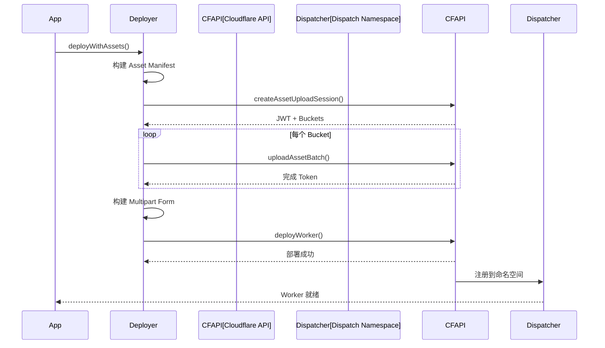

---

## 6.2 Cloudflare API 客户端

### 6.2.1 CloudflareAPI 封装

```typescript
// worker/services/deployer/api/cloudflare-api.ts
export class CloudflareAPI {
    private baseUrl = 'https://api.cloudflare.com/client/v4';
    private accountId: string;
    private apiToken: string;

    constructor(accountId: string, apiToken: string) {
        this.accountId = accountId;
        this.apiToken = apiToken;
    }

    /**
     * 创建 Asset 上传会话
     */
    async createAssetUploadSession(
        scriptName: string,
        manifest: AssetManifest,
        dispatchNamespace?: string
    ): Promise<UploadSession> {
        const endpoint = dispatchNamespace
            ? `${this.baseUrl}/accounts/${this.accountId}/workers/dispatch/namespaces/${dispatchNamespace}/scripts/${scriptName}/assets-upload-session`
            : `${this.baseUrl}/accounts/${this.accountId}/workers/scripts/${scriptName}/assets-upload-session`;

        const response = await fetch(endpoint, {
            method: 'POST',
            headers: {
                'Authorization': `Bearer ${this.apiToken}`,
                'Content-Type': 'application/json',
            },
            body: JSON.stringify({ manifest }),
        });

        if (!response.ok) {
            throw new Error(`Asset upload session failed: ${await response.text()}`);
        }

        const data = await response.json();
        return {
            jwt: data.result.jwt,
            buckets: data.result.buckets || [],
        };
    }

    /**
     * 上传一批 Assets
     */
    async uploadAssetBatch(
        jwt: string,
        hashes: string[],
        fileContents: Map<string, Buffer>
    ): Promise<string | null> {
        const formData = new FormData();

        // 添加每个文件
        for (const hash of hashes) {
            const content = fileContents.get(hash);
            if (!content) {
                throw new Error(`File content not found for hash: ${hash}`);
            }
            formData.append(hash, new Blob([content]));
        }

        const response = await fetch(
            `https://assets.cloudflare.com/upload`,
            {
                method: 'POST',
                headers: {
                    'Authorization': `Bearer ${jwt}`,
                },
                body: formData,
            }
        );

        if (!response.ok) {
            throw new Error(`Asset batch upload failed: ${await response.text()}`);
        }

        // 返回完成 token（如果是最后一批）
        const completionToken = response.headers.get('X-Completion-Token');
        return completionToken;
    }

    /**
     * 部署 Worker
     */
    async deployWorker(
        scriptName: string,
        workerContent: string,
        compatibilityDate: string,
        assetsToken: string,
        bindings?: WorkerBinding[],
        vars?: Record<string, string>,
        dispatchNamespace?: string,
        assetsConfig?: AssetsConfig,
        additionalModules?: Map<string, string>,
        compatibilityFlags?: string[],
        migrations?: MigrationsConfig
    ): Promise<void> {
        const endpoint = dispatchNamespace
            ? `${this.baseUrl}/accounts/${this.accountId}/workers/dispatch/namespaces/${dispatchNamespace}/scripts/${scriptName}`
            : `${this.baseUrl}/accounts/${this.accountId}/workers/scripts/${scriptName}`;

        // 构建 Multipart Form Data
        const formData = this.buildWorkerFormData(
            workerContent,
            compatibilityDate,
            assetsToken,
            bindings,
            vars,
            assetsConfig,
            additionalModules,
            compatibilityFlags,
            migrations
        );

        const response = await fetch(endpoint, {
            method: 'PUT',
            headers: {
                'Authorization': `Bearer ${this.apiToken}`,
            },
            body: formData,
        });

        if (!response.ok) {
            throw new Error(`Worker deployment failed: ${await response.text()}`);
        }
    }

    private buildWorkerFormData(
        workerContent: string,
        compatibilityDate: string,
        assetsToken: string,
        bindings?: WorkerBinding[],
        vars?: Record<string, string>,
        assetsConfig?: AssetsConfig,
        additionalModules?: Map<string, string>,
        compatibilityFlags?: string[],
        migrations?: MigrationsConfig
    ): FormData {
        const formData = new FormData();

        // 1. 主脚本
        formData.append('worker.js', new Blob([workerContent], { type: 'application/javascript+module' }), 'worker.js');

        // 2. 元数据
        const metadata: any = {
            main_module: 'worker.js',
            compatibility_date: compatibilityDate,
            compatibility_flags: compatibilityFlags || [],
            bindings: bindings || [],
            vars: vars || {},
        };

        // Assets 配置
        if (assetsToken) {
            metadata.assets = {
                jwt: assetsToken,
                config: assetsConfig || {
                    html_handling: 'auto-trailing-slash',
                    not_found_handling: 'single-page-application',
                },
            };
        }

        // Migrations（用于 Durable Objects）
        if (migrations) {
            metadata.migrations = migrations;
        }

        formData.append('metadata', JSON.stringify(metadata));

        // 3. 额外模块（如果有）
        if (additionalModules) {
            for (const [name, content] of additionalModules.entries()) {
                formData.append(name, new Blob([content]), name);
            }
        }

        return formData;
    }
}
```

---

## 6.3 Asset Manifest 构建

### 6.3.1 什么是 Asset Manifest？

Asset Manifest 是一个描述静态资源的 JSON 对象，告诉 Cloudflare：
- 哪些文件是静态资源
- 每个文件的 SHA-256 哈希值
- 文件大小

```typescript
export interface AssetManifest {
    [filePath: string]: {
        hash: string;    // SHA-256 十六进制
        size: number;    // 字节数
    };
}

// 示例
const manifest: AssetManifest = {
    'index.html': {
        hash: 'a3f5b8c9d2e1f4a7b6c5d8e9f1a2b3c4d5e6f7a8b9c0d1e2f3a4b5c6d7e8f9a0',
        size: 1234,
    },
    'assets/main.js': {
        hash: 'b1c2d3e4f5a6b7c8d9e0f1a2b3c4d5e6f7a8b9c0d1e2f3a4b5c6d7e8f9a0b1c2',
        size: 5678,
    },
};
```

### 6.3.2 Manifest 构建算法

```typescript
// worker/services/deployer/utils/index.ts
export async function buildAssetManifest(
    files: Map<string, Buffer>
): Promise<AssetManifest> {
    const manifest: AssetManifest = {};

    for (const [filePath, content] of files.entries()) {
        // 计算 SHA-256 哈希
        const hash = await crypto.subtle.digest('SHA-256', content);
        const hashHex = Array.from(new Uint8Array(hash))
            .map(b => b.toString(16).padStart(2, '0'))
            .join('');

        manifest[filePath] = {
            hash: hashHex,
            size: content.byteLength,
        };
    }

    return manifest;
}

// 从沙箱获取文件并构建 Manifest
export async function fetchFilesAndBuildManifest(
    sandbox: BaseSandboxService
): Promise<{ files: Map<string, Buffer>, manifest: AssetManifest }> {
    // 1. 从沙箱获取所有文件
    const allFiles = await sandbox.getFiles(['**/*']);

    // 2. 过滤出需要部署的文件
    const files = new Map<string, Buffer>();
    const staticFileExtensions = ['.html', '.js', '.css', '.png', '.jpg', '.svg', '.ico'];

    for (const [path, content] of Object.entries(allFiles.files)) {
        if (staticFileExtensions.some(ext => path.endsWith(ext))) {
            files.set(path, Buffer.from(content, 'utf-8'));
        }
    }

    // 3. 构建 Manifest
    const manifest = await buildAssetManifest(files);

    return { files, manifest };
}
```

---

## 6.4 Dispatch Namespace

### 6.4.1 多租户隔离

**Dispatch Namespace** 是 Workers for Platforms 的核心概念，用于多租户隔离：

```
Namespace: "user-apps"
    ├── app-123  → Worker 实例
    ├── app-456  → Worker 实例
    └── app-789  → Worker 实例
```

**隔离特性**：
- 每个应用有独立的 Worker 实例
- 独立的环境变量和绑定
- 独立的 CPU 时间和内存限制
- 请求失败不影响其他应用

### 6.4.2 动态路由

```typescript
// worker/index.ts - 动态分发请求
async function handleUserAppRequest(request: Request, env: Env): Promise<Response> {
    const url = new URL(request.url);
    const hostname = url.hostname;

    // 1. 先尝试沙箱代理（开发中）
    const sandboxResponse = await proxyToSandbox(request, env);
    if (sandboxResponse) {
        return sandboxResponse;
    }

    // 2. 从 Dispatcher 获取已部署的 Worker
    const appName = hostname.split('.')[0]; // 从子域名提取
    const dispatcher = env['DISPATCHER']; // Dispatch Namespace 绑定

    try {
        const worker = dispatcher.get(appName);
        const response = await worker.fetch(request);

        return response;
    } catch (error) {
        return new Response('Application not found', { status: 404 });
    }
}
```

### 6.4.3 子域名绑定

**DNS 配置**：

```
*.preview.example.com  →  CNAME  →  platform.example.com
```

**路由逻辑**：

```
用户访问: myapp.preview.example.com
       ↓
Workers 路由检测到子域名
       ↓
提取 appName = "myapp"
       ↓
dispatcher.get("myapp") → 获取对应的 Worker
       ↓
worker.fetch(request) → 代理请求
```

---

## 6.5 部署流程实现

### 6.5.1 DeploymentManager

```typescript
// worker/agents/services/implementations/DeploymentManager.ts
export class DeploymentManager {
    constructor(
        private env: Env,
        private sandboxInstanceId: string,
        private fileManager: IFileManager
    ) {}

    /**
     * 部署到 Cloudflare Workers
     */
    async deployToCloudflare(appId: string): Promise<DeploymentResult> {
        // 1. 从沙箱获取文件
        const { files, manifest } = await this.fetchFilesFromSandbox();

        // 2. 生成 Worker 脚本
        const workerScript = this.generateWorkerScript(files);

        // 3. 提取 Durable Object 类（如果有）
        const durableObjectClasses = extractDurableObjectClasses(files);
        const migrations = durableObjectClasses.length > 0
            ? { new_classes: durableObjectClasses.map(c => c.name) }
            : undefined;

        // 4. 部署
        const deployer = new WorkerDeployer(
            this.env.CLOUDFLARE_ACCOUNT_ID,
            this.env.CLOUDFLARE_API_TOKEN
        );

        await deployer.deployWithAssets(
            appId,
            workerScript,
            '2024-01-01', // compatibility_date
            manifest,
            files,
            undefined, // bindings
            undefined, // vars
            'user-apps', // dispatch namespace
            {
                html_handling: 'auto-trailing-slash',
                not_found_handling: 'single-page-application',
            },
            undefined, // additional modules
            ['nodejs_compat'], // compatibility_flags
            migrations
        );

        return {
            success: true,
            url: `https://${appId}.preview.example.com`,
        };
    }

    /**
     * 生成 Worker 入口脚本
     */
    private generateWorkerScript(files: Map<string, Buffer>): string {
        // 检查是否有 worker.js
        if (files.has('worker.js')) {
            return files.get('worker.js')!.toString('utf-8');
        }

        // 否则生成默认的 Assets Worker
        return `
export default {
    async fetch(request, env) {
        // Serve static assets
        return env.ASSETS.fetch(request);
    }
};
`;
    }

    private async fetchFilesFromSandbox(): Promise<{
        files: Map<string, Buffer>;
        manifest: AssetManifest;
    }> {
        const sandbox = await this.getSandboxInstance();

        // 获取所有文件
        const allFiles = await sandbox.getFiles(['**/*']);

        // 过滤并转换为 Buffer
        const files = new Map<string, Buffer>();

        for (const [path, content] of Object.entries(allFiles.files)) {
            // 跳过 node_modules
            if (path.startsWith('node_modules/')) continue;

            files.set(path, Buffer.from(content, 'utf-8'));
        }

        // 构建 Manifest
        const manifest = await buildAssetManifest(files);

        return { files, manifest };
    }
}
```

### 6.5.2 错误回滚策略

```typescript
async deployToCloudflare(appId: string): Promise<DeploymentResult> {
    // 1. 备份当前部署（如果存在）
    const currentDeployment = await this.getCurrentDeployment(appId);

    try {
        // 2. 执行部署
        await deployer.deployWithAssets(/* ... */);

        // 3. 健康检查
        const healthy = await this.healthCheck(appId);
        if (!healthy) {
            throw new Error('Health check failed');
        }

        return { success: true, url: `https://${appId}.preview.example.com` };
    } catch (error) {
        // 4. 回滚到之前的版本
        if (currentDeployment) {
            logger.warn('Deployment failed, rolling back', error);
            await this.rollback(appId, currentDeployment);
        }

        throw error;
    }
}

private async healthCheck(appId: string): Promise<boolean> {
    try {
        const response = await fetch(`https://${appId}.preview.example.com`);
        return response.ok;
    } catch {
        return false;
    }
}
```

---

## 6.6 小结

本章我们深入探讨了部署系统的完整实现：

| 主题 | 关键点 |
|------|--------|
| **WorkerDeployer** | 部署流程编排、Asset 上传、Worker 部署 |
| **Cloudflare API** | RESTful 封装、认证、错误处理 |
| **Asset Manifest** | SHA-256 哈希、文件大小、Manifest 构建 |
| **Dispatch Namespace** | 多租户隔离、动态路由、子域名绑定 |
| **部署流程** | DeploymentManager、错误回滚、健康检查 |

**核心设计原则**：

1. **多租户隔离**：每个应用独立 Worker 实例
2. **动态路由**：子域名自动路由到对应 Worker
3. **原子部署**：Asset 上传 + Worker 部署原子性
4. **错误恢复**：部署失败自动回滚
5. **健康检查**：部署后验证可用性

---

# 第七章：工具系统（Tools System）

## 7.1 工具定义框架

### 7.1.1 ToolDefinition 接口

```typescript
// worker/agents/tools/types.ts
export interface ToolDefinition<TArgs, TResult> {
    type: 'function';
    function: {
        name: string;
        description: string;
        parameters: JSONSchema; // OpenAI function calling 格式
    };
    implementation: (args: TArgs) => Promise<TResult>;
}

// 错误结果类型
export interface ErrorResult {
    error: string;
    details?: any;
}
```

**类型安全的工具创建**：

```typescript
// 使用 Zod Schema 创建类型安全的工具
export function createTool<TArgs extends z.AnyZodObject, TResult>(
    name: string,
    description: string,
    argsSchema: TArgs,
    implementation: (args: z.infer<TArgs>) => Promise<TResult>
): ToolDefinition<z.infer<TArgs>, TResult> {
    return {
        type: 'function',
        function: {
            name,
            description,
            parameters: zodToJsonSchema(argsSchema),
        },
        implementation,
    };
}
```

---

## 7.2 核心工具集

### 7.2.1 generate_files - 文件生成工具

```typescript
// worker/agents/tools/toolkit/generate-files.ts
export function createGenerateFilesTool(
    agent: CodingAgentInterface,
    logger: StructuredLogger
): ToolDefinition<GenerateFilesArgs, GenerateFilesResult> {
    return {
        type: 'function',
        function: {
            name: 'generate_files',
            description: `Generate new files or completely rewrite existing files.
            
Use this when:
- Files don't exist and need to be created
- regenerate_file failed (file too broken to patch)
- Need multiple coordinated files for a feature
- Scaffolding new components/utilities

The system will:
1. Automatically determine which files to create
2. Generate properly typed, coordinated code
3. Deploy changes to sandbox
4. Return diffs for all generated files`,
            parameters: {
                type: 'object',
                properties: {
                    phase_name: {
                        type: 'string',
                        description: 'Short, descriptive name (e.g., "Add data export")',
                    },
                    phase_description: {
                        type: 'string',
                        description: 'Brief description of what these files accomplish',
                    },
                    requirements: {
                        type: 'array',
                        items: { type: 'string' },
                        description: 'Detailed requirements. Be explicit about function signatures, types',
                    },
                    files: {
                        type: 'array',
                        items: {
                            type: 'object',
                            properties: {
                                path: { type: 'string' },
                                purpose: { type: 'string' },
                                changes: { type: ['string', 'null'] }
                            },
                            required: ['path', 'purpose', 'changes']
                        },
                    },
                },
                required: ['phase_name', 'phase_description', 'requirements', 'files'],
            },
        },
        implementation: async ({ phase_name, phase_description, requirements, files }) => {
            try {
                // 使用 Phase 实现系统生成文件
                const result = await agent.implementPhase({
                    phase_name,
                    phase_description,
                    requirements,
                    files,
                });

                return {
                    files: result.files.map(f => ({
                        path: f.filePath,
                        purpose: f.filePurpose,
                        diff: f.lastDiff || '',
                    })),
                    summary: `Generated ${result.files.length} files for: ${phase_name}`,
                };
            } catch (error) {
                return {
                    error: `File generation failed: ${error.message}`,
                };
            }
        }
    };
}
```

### 7.2.2 regenerate_file - 文件重新生成

```typescript
// worker/agents/tools/toolkit/regenerate-file.ts
export function createRegenerateFileTool(
    agent: CodingAgentInterface,
    logger: StructuredLogger
): ToolDefinition<RegenerateFileArgs, RegenerateFileResult> {
    return {
        type: 'function',
        function: {
            name: 'regenerate_file',
            description: `Regenerate a single file with improvements or fixes.
            
Use this when:
- File has specific bugs that need fixing
- Need to add features to existing file
- File structure is mostly correct, just needs updates

Returns unified diff showing changes made.`,
            parameters: {
                type: 'object',
                properties: {
                    file_path: {
                        type: 'string',
                        description: 'Path to file to regenerate',
                    },
                    requirements: {
                        type: 'string',
                        description: 'What should be fixed/added/changed',
                    },
                    context: {
                        type: 'string',
                        description: 'Additional context about the issue',
                    },
                },
                required: ['file_path', 'requirements'],
            },
        },
        implementation: async ({ file_path, requirements, context }) => {
            try {
                const currentFile = await agent.fileManager.getFile(file_path);
                if (!currentFile) {
                    return { error: `File not found: ${file_path}` };
                }

                const issues = await agent.collectIssues();

                const result = await agent.regenerateFile({
                    filePath: file_path,
                    requirements,
                    context,
                    issues,
                });

                return {
                    file_path: result.filePath,
                    diff: result.lastDiff,
                    summary: `Regenerated ${file_path}`,
                };
            } catch (error) {
                return { error: `Regeneration failed: ${error.message}` };
            }
        }
    };
}
```

### 7.2.3 read_files - 文件读取

```typescript
// worker/agents/tools/toolkit/read-files.ts
export function createReadFilesTool(
    agent: CodingAgentInterface
): ToolDefinition<ReadFilesArgs, ReadFilesResult> {
    return {
        type: 'function',
        function: {
            name: 'read_files',
            description: `Read multiple files from the project.
            
Returns file contents, useful for understanding current implementation before making changes.`,
            parameters: {
                type: 'object',
                properties: {
                    file_paths: {
                        type: 'array',
                        items: { type: 'string' },
                        description: 'Array of file paths to read',
                    },
                },
                required: ['file_paths'],
            },
        },
        implementation: async ({ file_paths }) => {
            const files: Array<{ path: string; content: string; exists: boolean }> = [];

            for (const path of file_paths) {
                const file = await agent.fileManager.getFile(path);
                files.push({
                    path,
                    content: file?.fileContents || '',
                    exists: !!file,
                });
            }

            return { files };
        }
    };
}
```

### 7.2.4 deploy_preview - 部署预览

```typescript
// worker/agents/tools/toolkit/deploy-preview.ts
export function createDeployPreviewTool(
    agent: CodingAgentInterface
): ToolDefinition<DeployPreviewArgs, DeployPreviewResult> {
    return {
        type: 'function',
        function: {
            name: 'deploy_preview',
            description: `Deploy current code to sandbox for preview.
            
Triggers rebuild and returns preview URL. Use after making changes to test them.`,
            parameters: {
                type: 'object',
                properties: {
                    reason: {
                        type: 'string',
                        description: 'Why deploying (e.g., "Test button click handler")',
                    },
                },
                required: [],
            },
        },
        implementation: async ({ reason }) => {
            try {
                await agent.deployToSandbox();

                const previewUrl = await agent.getPreviewUrl();

                return {
                    success: true,
                    preview_url: previewUrl,
                    message: `Deployed for: ${reason || 'testing'}`,
                };
            } catch (error) {
                return {
                    error: `Deployment failed: ${error.message}`,
                };
            }
        }
    };
}
```

### 7.2.5 get_runtime_errors - 运行时错误获取

```typescript
// worker/agents/tools/toolkit/get-runtime-errors.ts
export function createGetRuntimeErrorsTool(
    agent: CodingAgentInterface
): ToolDefinition<GetRuntimeErrorsArgs, GetRuntimeErrorsResult> {
    return {
        type: 'function',
        function: {
            name: 'get_runtime_errors',
            description: `Get current runtime errors from the preview.
            
Returns errors that occur when the app runs, such as:
- React errors (render loops, undefined variables)
- Console errors
- Network errors`,
            parameters: {
                type: 'object',
                properties: {},
                required: [],
            },
        },
        implementation: async () => {
            try {
                const errors = await agent.sandbox.getRuntimeErrors();

                return {
                    errors: errors.errors.map(e => ({
                        type: e.type,
                        message: e.message,
                        file: e.file,
                        line: e.line,
                        column: e.column,
                        stack: e.stack,
                    })),
                    count: errors.errors.length,
                };
            } catch (error) {
                return { error: `Failed to get errors: ${error.message}` };
            }
        }
    };
}
```

### 7.2.6 run_analysis - 静态分析

```typescript
// worker/agents/tools/toolkit/run-analysis.ts
export function createRunAnalysisTool(
    agent: CodingAgentInterface
): ToolDefinition<RunAnalysisArgs, RunAnalysisResult> {
    return {
        type: 'function',
        function: {
            name: 'run_analysis',
            description: `Run static analysis (TypeScript + ESLint).
            
Returns compilation errors and linting issues.`,
            parameters: {
                type: 'object',
                properties: {},
                required: [],
            },
        },
        implementation: async () => {
            try {
                const analysis = await agent.sandbox.runStaticAnalysis();

                return {
                    errors: analysis.errors.map(e => ({
                        file: e.file,
                        line: e.line,
                        column: e.column,
                        code: e.code,
                        message: e.message,
                        severity: e.severity,
                    })),
                    error_count: analysis.errorCount,
                };
            } catch (error) {
                return { error: `Analysis failed: ${error.message}` };
            }
        }
    };
}
```

### 7.2.7 deep_debugger - 深度调试

```typescript
// worker/agents/tools/toolkit/deep-debugger.ts
export function createDeepDebuggerTool(
    agent: CodingAgentInterface
): ToolDefinition<DeepDebuggerArgs, DeepDebuggerResult> {
    return {
        type: 'function',
        function: {
            name: 'deep_debugger',
            description: `Start a deep debugging session using advanced reasoning.
            
Use this when:
- Regular fixes aren't working
- Complex, hard-to-diagnose bugs
- Need to trace through multiple files

Returns a debug session ID that can be used to track progress.`,
            parameters: {
                type: 'object',
                properties: {
                    problem_description: {
                        type: 'string',
                        description: 'Detailed description of the bug/issue',
                    },
                    affected_files: {
                        type: 'array',
                        items: { type: 'string' },
                        description: 'Files involved in the issue',
                    },
                },
                required: ['problem_description'],
            },
        },
        implementation: async ({ problem_description, affected_files }) => {
            try {
                const sessionId = generateNanoId();

                // 启动异步调试会话
                agent.startDeepDebugSession(sessionId, problem_description, affected_files)
                    .catch(error => {
                        console.error('Deep debug failed:', error);
                    });

                return {
                    session_id: sessionId,
                    message: 'Deep debugging session started. This may take a few minutes.',
                };
            } catch (error) {
                return { error: `Failed to start debug session: ${error.message}` };
            }
        }
    };
}
```

---

## 7.3 工具编排

### 7.3.1 UserConversationProcessor

```typescript
// worker/agents/operations/UserConversationProcessor.ts
export class UserConversationProcessor implements AgentOperation<UserConversationInputs, void> {
    
    async execute(options: OperationOptions<UserConversationInputs>): Promise<void> {
        const { agent, inputs } = options;
        
        // 1. 收集所有可用工具
        const tools = this.buildToolkit(agent);
        
        // 2. 添加用户消息到对话历史
        agent.state.conversationMessages.push({
            role: 'user',
            content: inputs.message,
            images: inputs.images,
        });
        
        // 3. 构建系统提示词
        const systemPrompt = this.buildSystemPrompt(agent);
        
        // 4. 循环调用 LLM 直到完成
        let maxIterations = 10;
        let iteration = 0;
        
        while (iteration < maxIterations) {
            // 调用 LLM
            const response = await executeInference({
                env: agent.env,
                context: agent.state.inferenceContext,
                agentActionName: 'user_conversation',
                messages: [
                    createSystemMessage(systemPrompt),
                    ...agent.state.conversationMessages.map(m =>
                        m.images
                            ? createMultiModalUserMessage(m.content, m.images)
                            : createUserMessage(m.content)
                    )
                ],
                tools,
                maxTokens: 4000,
                stream: {
                    chunk_size: 256,
                    onChunk: (chunk) => {
                        // 流式推送给前端
                        broadcastToConnections(agent, 'user_message_chunk', { chunk });
                    }
                }
            });
            
            // 检查是否有工具调用
            if (response.tool_calls && response.tool_calls.length > 0) {
                // 执行工具调用
                for (const toolCall of response.tool_calls) {
                    const tool = tools.find(t => t.function.name === toolCall.function.name);
                    if (!tool) continue;
                    
                    // 广播工具调用
                    broadcastToConnections(agent, 'tool_call', {
                        tool: toolCall.function.name,
                        args: toolCall.function.arguments,
                    });
                    
                    // 执行工具
                    const result = await tool.implementation(JSON.parse(toolCall.function.arguments));
                    
                    // 添加工具结果到对话
                    agent.state.conversationMessages.push({
                        role: 'tool',
                        tool_call_id: toolCall.id,
                        content: JSON.stringify(result),
                    });
                }
                
                // 继续下一轮
                iteration++;
                continue;
            }
            
            // 没有工具调用，对话结束
            agent.state.conversationMessages.push({
                role: 'assistant',
                content: response.content,
            });
            
            broadcastToConnections(agent, 'user_message_response', {
                message: response.content,
            });
            
            break;
        }
    }
    
    private buildToolkit(agent: CodingAgentInterface): ToolDefinition<any, any>[] {
        return [
            createGenerateFilesTool(agent, agent.logger),
            createRegenerateFileTool(agent, agent.logger),
            createReadFilesTool(agent),
            createDeployPreviewTool(agent),
            createGetRuntimeErrorsTool(agent),
            createRunAnalysisTool(agent),
            createDeepDebuggerTool(agent),
            // ... 更多工具
        ];
    }
    
    private buildSystemPrompt(agent: CodingAgentInterface): string {
        return `You are an expert full-stack engineer helping build a web application.

Current Project: ${agent.state.projectName}
Blueprint: ${JSON.stringify(agent.state.blueprint, null, 2)}

Available Tools:
You have access to powerful development tools. Use them to:
- Read/write files
- Deploy previews for testing
- Check for errors
- Debug complex issues

Guidelines:
- Always read files before modifying them
- Deploy after making changes to test them
- Check for both runtime and static errors
- Use deep_debugger for complex bugs
- Explain your reasoning and next steps`;
    }
}
```

### 7.3.2 工具调用渲染

前端如何渲染工具调用：

```typescript
// 前端代码（简化版）
function renderToolCall(toolCall: ToolCallMessage) {
    switch (toolCall.tool) {
        case 'generate_files':
            return (
                <div className="tool-call">
                    <FileIcon />
                    <span>Generating files for: {toolCall.args.phase_name}</span>
                    <Spinner />
                </div>
            );
            
        case 'deploy_preview':
            return (
                <div className="tool-call">
                    <RocketIcon />
                    <span>Deploying preview...</span>
                    <Spinner />
                </div>
            );
            
        case 'deep_debugger':
            return (
                <div className="tool-call">
                    <BugIcon />
                    <span>Starting deep debug session...</span>
                    <Spinner />
                </div>
            );
            
        default:
            return (
                <div className="tool-call">
                    <span>{toolCall.tool}</span>
                </div>
            );
    }
}
```

---

## 7.4 小结

本章我们深入探讨了工具系统的完整实现：

| 主题 | 关键点 |
|------|--------|
| **工具定义** | ToolDefinition 接口、类型安全、Zod Schema |
| **核心工具** | 文件操作、部署、错误检查、调试工具 |
| **工具编排** | UserConversationProcessor、循环调用、流式输出 |
| **前端集成** | WebSocket 推送、工具调用渲染 |

**核心设计原则**：

1. **类型安全**：Zod + TypeScript，编译时检查
2. **独立封装**：每个工具职责单一，易于测试
3. **错误恢复**：工具失败不影响整体流程
4. **流式反馈**：工具执行实时推送给前端
5. **可扩展**：轻松添加新工具

---

# 第八章到第十一章将继续在后续追加...
# 第八章到第十一章（最终追加部分）

# 第八章：服务层架构

## 8.1 限流服务

```typescript
// worker/services/rate-limit/DORateLimitStore.ts
export class DORateLimitStore extends DurableObject {
    async checkRateLimit(key: string, limit: number, window: number): Promise<boolean> {
        const now = Date.now();
        const windowStart = now - window;
        
        // 获取时间窗口内的请求记录
        const requests = await this.ctx.storage.get<number[]>(`requests:${key}`) || [];
        
        // 过滤掉过期的请求
        const validRequests = requests.filter(timestamp => timestamp > windowStart);
        
        if (validRequests.length >= limit) {
            return false; // 超过限制
        }
        
        // 记录新请求
        validRequests.push(now);
        await this.ctx.storage.put(`requests:${key}`, validRequests);
        
        return true;
    }
}
```

## 8.2 认证服务

```typescript
// worker/services/oauth/google.ts
export class GoogleOAuthService extends BaseOAuthService {
    protected authorizationEndpoint = 'https://accounts.google.com/o/oauth2/v2/auth';
    protected tokenEndpoint = 'https://oauth2.googleapis.com/token';
    protected userInfoEndpoint = 'https://www.googleapis.com/oauth2/v2/userinfo';
    
    async getUserInfo(accessToken: string): Promise<UserInfo> {
        const response = await fetch(this.userInfoEndpoint, {
            headers: {
                'Authorization': `Bearer ${accessToken}`,
            },
        });
        
        const data = await response.json();
        
        return {
            id: data.id,
            email: data.email,
            name: data.name,
            avatar: data.picture,
        };
    }
}
```

## 8.3 CSRF 防护

```typescript
// worker/services/csrf/CsrfService.ts
export class CsrfService {
    static async enforce(request: Request, response?: Response): Promise<void> {
        const method = request.method.toUpperCase();
        
        if (['GET', 'HEAD', 'OPTIONS'].includes(method)) {
            // 设置 CSRF token
            if (response) {
                const token = await this.generateToken();
                response.headers.set('Set-Cookie', `csrf-token=${token}; HttpOnly; Secure; SameSite=Strict`);
            }
        } else {
            // 验证 CSRF token
            const cookieToken = this.getCookieToken(request);
            const headerToken = request.headers.get('X-CSRF-Token');
            
            if (!cookieToken || !headerToken || cookieToken !== headerToken) {
                throw new SecurityError('CSRF validation failed', SecurityErrorType.CSRF_VIOLATION);
            }
        }
    }
    
    private static async generateToken(): Promise<string> {
        const randomBytes = crypto.getRandomValues(new Uint8Array(32));
        return Array.from(randomBytes).map(b => b.toString(16).padStart(2, '0')).join('');
    }
}
```

## 8.4 代码修复服务

```typescript
// worker/services/code-fixer/fixers/ts2307.ts
export async function fixTS2307(
    error: StaticAnalysisError,
    fileContent: string,
    allFiles: FileOutputType[]
): Promise<string | null> {
    const moduleName = extractModuleName(error.message);
    
    // 修复相对路径导入
    if (moduleName.startsWith('.')) {
        const correctPath = findCorrectPath(moduleName, allFiles);
        if (correctPath) {
            return fileContent.replace(
                new RegExp(`from ['"]${escapeRegex(moduleName)}['"]`),
                `from '${correctPath}'`
            );
        }
    }
    
    return null;
}
```

---

# 第九章：API 层设计

## 9.1 路由结构

```typescript
// worker/api/routes/index.ts
export function setupRoutes(app: Hono<AppEnv>): void {
    // 公共路由
    setupSentryRoutes(app);
    setupStatusRoutes(app);
    
    // 认证路由
    setupAuthRoutes(app);
    
    // 主要功能路由
    setupCodegenRoutes(app);
    setupAppRoutes(app);
    setupStatsRoutes(app);
    setupAnalyticsRoutes(app);
    
    // 配置路由
    setupModelConfigRoutes(app);
    setupSecretsRoutes(app);
    
    // GitHub 集成
    setupGitHubExporterRoutes(app);
}
```

## 9.2 WebSocket 处理

```typescript
// worker/api/routes/codegenRoutes.ts
app.get('/api/codegen/:agentId/ws', async (c) => {
    const agentId = c.req.param('agentId');
    const upgradeHeader = c.req.header('upgrade');
    
    if (upgradeHeader !== 'websocket') {
        return c.text('Expected WebSocket', 426);
    }
    
    // 获取 Agent DO Stub
    const agentStub = await getAgentStub(c.env, agentId);
    
    // 升级为 WebSocket
    const { response, socket } = Durable Object.upgradeWebSocket(c.req.raw);
    
    // 连接到 Agent
    await agentStub.connect(socket);
    
    return response;
});
```

## 9.3 Git 协议支持

```typescript
// worker/api/handlers/git-protocol.ts
export async function handleGitProtocolRequest(
    request: Request,
    env: Env,
    ctx: ExecutionContext
): Promise<Response> {
    const url = new URL(request.url);
    const match = url.pathname.match(/^\/apps\/(.+?)\.git\/(.+)$/);
    
    if (!match) {
        return new Response('Invalid Git protocol URL', { status: 400 });
    }
    
    const [, appId, gitPath] = match;
    
    if (gitPath === 'info/refs') {
        // Git smart HTTP protocol - info/refs
        return handleInfoRefs(appId, env);
    } else if (gitPath === 'git-upload-pack') {
        // Git smart HTTP protocol - upload-pack
        return handleUploadPack(request, appId, env);
    }
    
    return new Response('Not Found', { status: 404 });
}
```

---

# 第十章：数据流与状态管理

## 10.1 状态持久化

```typescript
// Durable Object Storage API 使用
class Agent extends DurableObject {
    // 自动持久化
    set state(newState: State) {
        this._state = newState;
        this.ctx.storage.put('state', newState);
    }
    
    // 手动持久化特定字段
    async updateField(key: string, value: any) {
        await this.ctx.storage.put(`field:${key}`, value);
    }
    
    // 事务操作
    async batchUpdate(updates: Record<string, any>) {
        await this.ctx.storage.transaction(async (txn) => {
            for (const [key, value] of Object.entries(updates)) {
                await txn.put(key, value);
            }
        });
    }
}
```

## 10.2 数据库层

```typescript
// worker/database/schema.ts
export const apps = sqliteTable('apps', {
    id: text('id').primaryKey(),
    userId: text('user_id').notNull(),
    name: text('name').notNull(),
    status: text('status').notNull(),
    createdAt: integer('created_at', { mode: 'timestamp' }).notNull(),
    updatedAt: integer('updated_at', { mode: 'timestamp' }).notNull(),
});

// worker/database/services/AppService.ts
export class AppService {
    static async createApp(db: Database, data: NewApp) {
        const [app] = await db.insert(apps).values(data).returning();
        return app;
    }
    
    static async getApp(db: Database, appId: string) {
        return db.query.apps.findFirst({
            where: eq(apps.id, appId),
        });
    }
    
    static async listUserApps(db: Database, userId: string) {
        return db.query.apps.findMany({
            where: eq(apps.userId, userId),
            orderBy: [desc(apps.createdAt)],
        });
    }
}
```

## 10.3 事件驱动架构

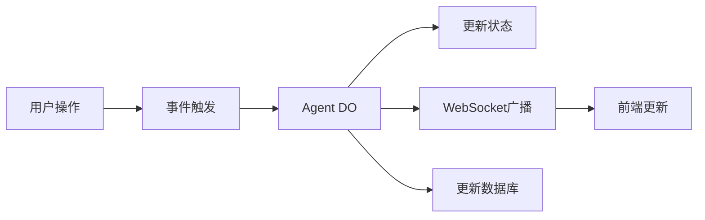

---

# 第十一章：最佳实践与扩展指南

## 11.1 性能优化

### 冷启动优化
```typescript
// 延迟初始化
class Agent {
    private services?: Services;
    
    getServices() {
        if (!this.services) {
            this.services = this.initializeServices();
        }
        return this.services;
    }
}

// 并行加载
async initialize() {
    const [template, config, user] = await Promise.all([
        getTemplate(),
        getConfig(),
        getUser(),
    ]);
}
```

### 内存管理
```typescript
// 使用流式处理大文件
async function* streamLargeFile(path: string) {
    const CHUNK_SIZE = 1024 * 1024; // 1MB
    const file = await readFile(path);
    
    for (let i = 0; i < file.length; i += CHUNK_SIZE) {
        yield file.slice(i, i + CHUNK_SIZE);
    }
}
```

## 11.2 错误处理

### 分类错误
```typescript
// shared/types/errors.ts
export enum ErrorType {
    VALIDATION = 'VALIDATION',
    AUTHENTICATION = 'AUTHENTICATION',
    RATE_LIMIT = 'RATE_LIMIT',
    INTERNAL = 'INTERNAL',
}

export class AppError extends Error {
    constructor(
        public type: ErrorType,
        message: string,
        public statusCode: number = 500
    ) {
        super(message);
    }
}
```

### 全局错误处理
```typescript
app.onError((err, c) => {
    if (err instanceof AppError) {
        return c.json({
            error: {
                type: err.type,
                message: err.message,
            }
        }, err.statusCode);
    }
    
    // 未知错误
    console.error('Unhandled error:', err);
    return c.json({
        error: {
            type: 'INTERNAL',
            message: 'Internal server error',
        }
    }, 500);
});
```

## 11.3 日志系统

```typescript
// worker/logger/core.ts
export class StructuredLogger {
    constructor(private context: Record<string, any>) {}
    
    info(message: string, data?: any) {
        console.log(JSON.stringify({
            level: 'info',
            message,
            ...this.context,
            ...data,
            timestamp: new Date().toISOString(),
        }));
    }
    
    error(message: string, error?: any) {
        console.error(JSON.stringify({
            level: 'error',
            message,
            error: error?.message,
            stack: error?.stack,
            ...this.context,
            timestamp: new Date().toISOString(),
        }));
    }
}

// 使用示例
const logger = createLogger('MyService', { requestId: '123' });
logger.info('Processing request', { userId: 'user-456' });
```

## 11.4 测试策略

### 单元测试
```typescript
// vitest + @cloudflare/vitest-pool-workers
import { describe, it, expect } from 'vitest';

describe('FileManager', () => {
    it('should save file and calculate diff', async () => {
        const fileManager = new FileManager(/* ... */);
        
        const result = await fileManager.saveGeneratedFile({
            filePath: 'test.ts',
            fileContents: 'export const foo = 1;',
            filePurpose: 'Test file',
        });
        
        expect(result.lastDiff).toContain('+export const foo = 1;');
    });
});
```

### 集成测试
```typescript
describe('Code Generation Flow', () => {
    it('should generate code end-to-end', async () => {
        const agent = await createTestAgent();
        await agent.initialize({
            query: 'Create a todo app',
            inferenceContext: testContext,
        });
        
        await agent.generateAllFiles(1);
        
        expect(agent.state.mvpGenerated).toBe(true);
        expect(agent.state.generatedFiles.length).toBeGreaterThan(0);
    });
});
```

## 11.5 安全实践

### 输入验证
```typescript
// 使用 Zod 验证所有输入
const CreateAppSchema = z.object({
    name: z.string().min(3).max(50).regex(/^[a-z0-9-]+$/),
    template: z.string(),
    description: z.string().max(500).optional(),
});

app.post('/api/apps', async (c) => {
    const body = await c.req.json();
    const validated = CreateAppSchema.parse(body); // 抛出错误如果无效
    // ...
});
```

### 密钥管理
```typescript
// 使用 Workers Secrets
// wrangler secret put ANTHROPIC_API_KEY
const apiKey = env.ANTHROPIC_API_KEY;

// 不要在代码中硬编码密钥
// ❌ const apiKey = 'sk-...';
```

## 11.6 扩展指南

### 添加新模型
```typescript
// 1. 在 config.types.ts 添加模型
export enum AIModels {
    // ... 现有模型
    NEW_MODEL = 'new-provider/new-model',
}

// 2. 在 AGENT_CONFIG 添加配置
export const AGENT_CONFIG: Record<AgentActionKey, ModelConfig> = {
    'new_action': {
        name: AIModels.NEW_MODEL,
        maxTokens: 4000,
        temperature: 0.5,
    },
    // ...
};

// 3. 在 infer.ts 添加 API 密钥映射
function getApiKey(env: Env, model: AIModels): string {
    if (model.startsWith('new-provider/')) {
        return env.NEW_PROVIDER_API_KEY;
    }
    // ...
}
```

### 添加新工具
```typescript
// 1. 创建工具文件 worker/agents/tools/toolkit/my-tool.ts
export function createMyTool(
    agent: CodingAgentInterface
): ToolDefinition<MyToolArgs, MyToolResult> {
    return {
        type: 'function',
        function: {
            name: 'my_tool',
            description: 'What this tool does',
            parameters: zodToJsonSchema(MyToolArgsSchema),
        },
        implementation: async (args) => {
            // 实现逻辑
            return { success: true };
        }
    };
}

// 2. 在 UserConversationProcessor 注册
private buildToolkit(agent: CodingAgentInterface): ToolDefinition<any, any>[] {
    return [
        // ... 现有工具
        createMyTool(agent),
    ];
}
```

### 添加新模板
```bash
# 1. 创建模板目录
mkdir templates/my-template

# 2. 添加 template.json
{
  "name": "my-template",
  "description": "My custom template",
  "language": "typescript",
  "frameworks": ["react", "vite"],
  "importantFiles": ["src/main.tsx"],
  "entryPoint": "src/main.tsx"
}

# 3. 压缩并上传到 R2
zip -r my-template.zip my-template/
wrangler r2 object put TEMPLATES_BUCKET/my-template.zip --file my-template.zip

# 4. 更新 template_catalog.json
[
  {
    "name": "my-template",
    "description": "My custom template",
    "language": "typescript"
  }
]
```

---

## 11.7 总结

本文档完整剖析了 VibeSDK Worker 端的架构设计与实现细节，涵盖：

### 核心技术栈
- **Cloudflare Workers**：边缘计算平台
- **Durable Objects**：有状态 Agent
- **Hono**：轻量级 Web 框架
- **Drizzle ORM**：类型安全数据库
- **Zod**：Schema 验证
- **Cloudflare Containers**：沙箱环境

### 关键设计模式
- **Phase-wise Generation**：增量代码生成
- **Event-Driven Architecture**：WebSocket 实时通信
- **Service Layer Pattern**：职责分离
- **Tool System**：可扩展的 Agent 能力
- **Multi-Tenant Deployment**：Workers for Platforms

### 最佳实践
- **类型安全**：TypeScript + Zod 全流程
- **错误恢复**：自动重试 + 回滚机制
- **性能优化**：并行加载 + 流式处理
- **安全防护**：CSRF + Rate Limiting + 容器隔离
- **可观测性**：结构化日志 + 错误监控

### 扩展能力
- 添加新 AI 模型
- 创建自定义工具
- 开发新模板
- 集成 MCP 协议

---

**文档完成！** 🎉

本文档提供了从基础架构到高级扩展的完整指南，帮助 AI Agent 开发者深入理解并复制构建类似平台的能力。

---

**参考资源**：
- [Cloudflare Workers 文档](https://developers.cloudflare.com/workers/)
- [Durable Objects 指南](https://developers.cloudflare.com/durable-objects/)
- [Workers for Platforms](https://developers.cloudflare.com/cloudflare-for-platforms/workers-for-platforms/)
- [Cloudflare Containers](https://developers.cloudflare.com/containers/)
- [Hono 框架](https://hono.dev/)
- [Drizzle ORM](https://orm.drizzle.team/)

---

© 2025 VibeSDK - Open Source AI Code Generation Platform
