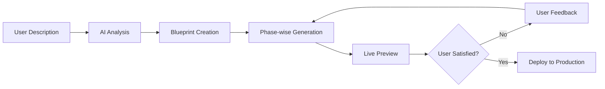
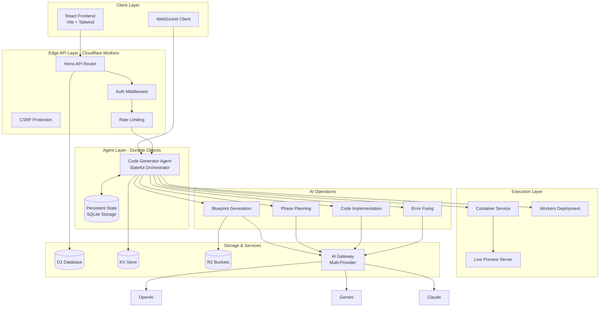
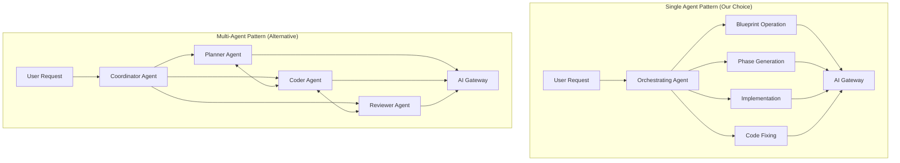
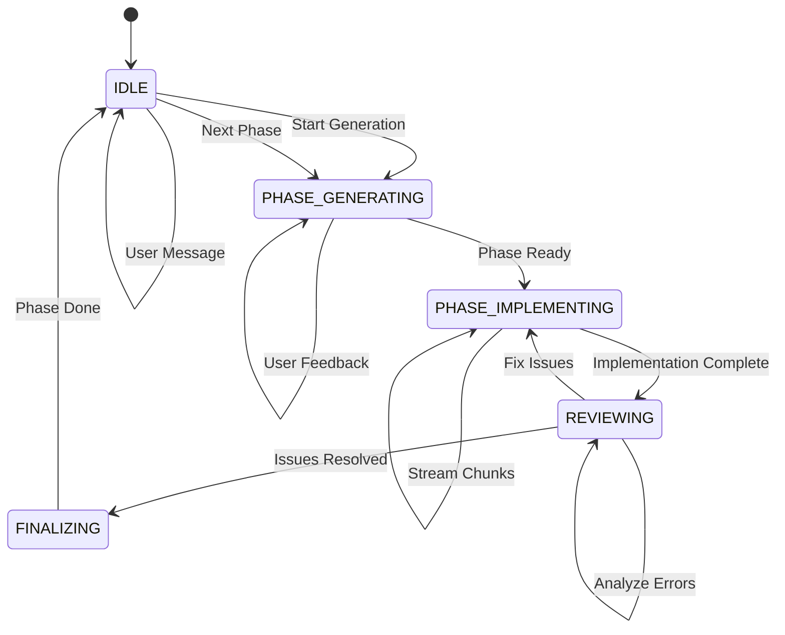
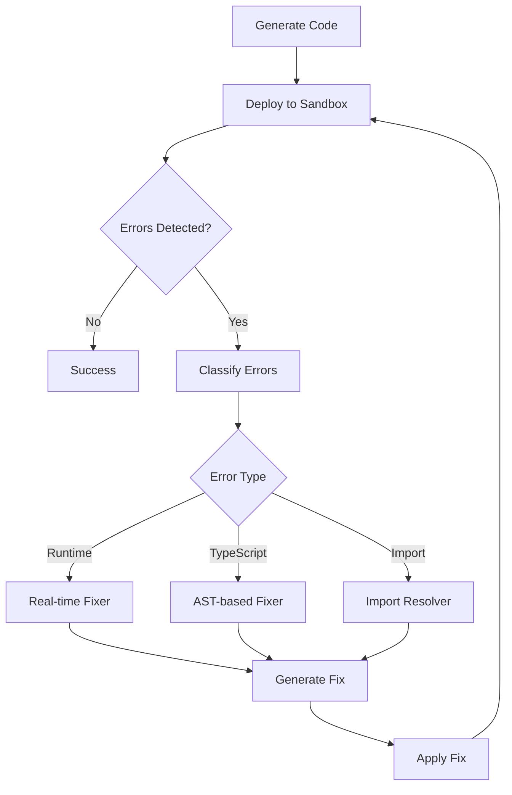
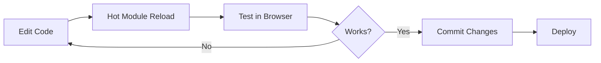
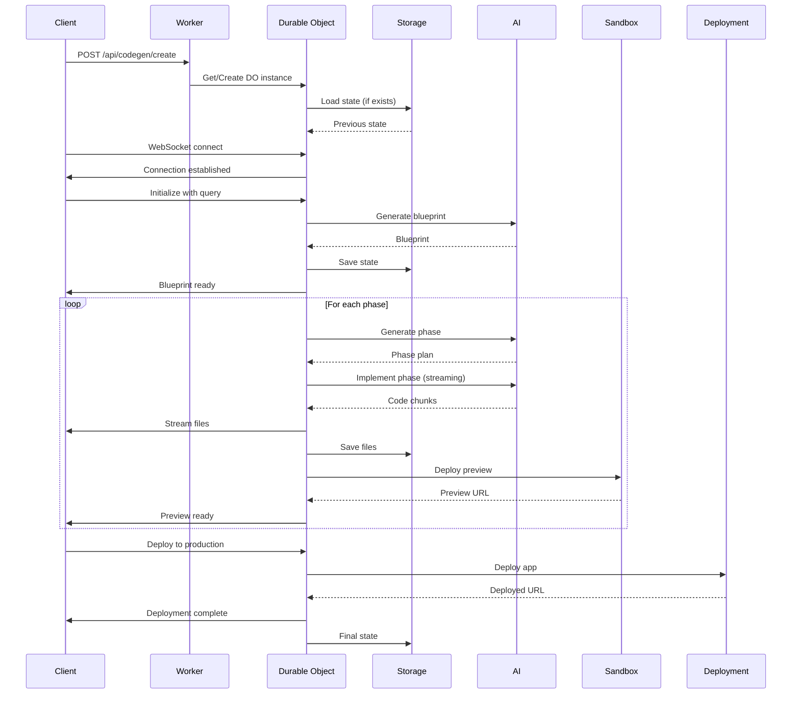
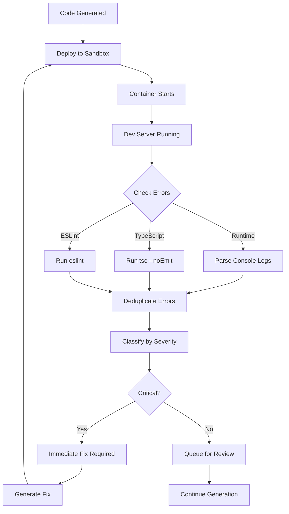

# Building an AI Code Generation Platform: A Complete Implementation Guide

**A comprehensive guide to understanding and building production-ready AI-powered code generation platforms using Cloudflare's developer platform**

---

## Table of Contents

1. [Introduction & Foundation](#1-introduction--foundation)
2. [Core Concepts & Design Patterns](#2-core-concepts--design-patterns)
3. [Setting Up the Development Environment](#3-setting-up-the-development-environment)
4. [The AI Agent System - Deep Dive](#4-the-ai-agent-system---deep-dive)
5. [Code Generation Pipeline](#5-code-generation-pipeline)
6. [Sandbox & Container System](#6-sandbox--container-system)
7. [AI Integration & Multi-Model Support](#7-ai-integration--multi-model-support)
8. [Real-time Communication](#8-real-time-communication)
9. [Database & Persistence](#9-database--persistence)
10. [Authentication & Security](#10-authentication--security)
11. [Deployment System](#11-deployment-system)
12. [API Design & Routing](#12-api-design--routing)
13. [Advanced Code Fixing](#13-advanced-code-fixing)
14. [Git Integration](#14-git-integration)
15. [Observability & Monitoring](#15-observability--monitoring)
16. [Best Practices & Patterns](#16-best-practices--patterns)
17. [Common Challenges & Solutions](#17-common-challenges--solutions)
18. [Extending the Platform](#18-extending-the-platform)
19. [Testing & Quality Assurance](#19-testing--quality-assurance)
20. [Deployment & Operations](#20-deployment--operations)

---

## 1. Introduction & Foundation

### 1.1 What This Platform Does

Cloudflare VibeSDK is an AI-powered code generation platform that transforms natural language descriptions into fully functional, deployed web applications. Unlike simple code generators, this platform:

- **Generates complete applications**: Not just code snippets, but full-stack applications with frontend, backend, database, and deployment configuration
- **Iterative development**: Implements projects in phases with continuous error detection and fixing
- **Live previews**: Runs generated code in isolated containers for immediate testing
- **Production deployment**: Deploys applications directly to Cloudflare Workers for Platforms
- **Interactive refinement**: Allows users to provide feedback and iterate on the generated code through natural conversation

**Core Workflow:**



### 1.2 Target Audience

This guide is designed for:

- **AI Agent Developers**: Building intelligent systems that generate code
- **Platform Engineers**: Creating development platforms and tools
- **Full-Stack Developers**: Understanding modern serverless architectures
- **DevOps Engineers**: Implementing automated deployment pipelines

**Prerequisites:**
- Strong TypeScript/JavaScript knowledge
- Understanding of async programming and promises
- Familiarity with React and modern web frameworks
- Basic knowledge of serverless computing concepts
- Experience with REST APIs and WebSocket communication

**Learning Path:**
1. Start with Core Concepts (Section 2) to understand architectural patterns
2. Follow the Setup guide (Section 3) to run locally
3. Deep dive into Agent System (Section 4) - the heart of the platform
4. Study Code Generation Pipeline (Section 5) for AI integration
5. Explore advanced topics based on your needs

### 1.3 Architecture Overview

The platform is built on a **hybrid architecture** combining:

1. **Stateful AI Agents** (Durable Objects) - Orchestrate code generation
2. **Serverless Backend** (Cloudflare Workers) - Handle API requests
3. **Isolated Execution** (Containers) - Run generated applications safely
4. **Edge Database** (D1, KV, R2) - Store state and assets
5. **Multi-Model AI** (AI Gateway) - Route to different LLM providers



**Key Architectural Decisions:**

1. **Single Orchestrating Agent**: Rather than multiple specialized agents, one stateful agent orchestrates all operations through a deterministic state machine
2. **Durable Objects for State**: Maintains generation state across WebSocket disconnections and worker restarts
3. **Phase-wise Generation**: Breaks down complex applications into manageable phases for better error handling
4. **Edge-First Design**: Everything runs on Cloudflare's edge network for minimal latency
5. **Streaming Everything**: Real-time updates via WebSocket for all operations

### 1.4 Technology Stack

#### Frontend Stack

| Technology | Purpose | Why Chosen |
|------------|---------|------------|
| **React 19** | UI Framework | Latest features, concurrent rendering |
| **Vite** | Build Tool | Lightning-fast HMR, optimized builds |
| **Tailwind CSS** | Styling | Utility-first, highly customizable |
| **shadcn/ui** | Component Library | Beautiful, accessible, customizable |
| **React Router v7** | Routing | Type-safe, modern routing |
| **Monaco Editor** | Code Editor | VS Code experience in browser |
| **Framer Motion** | Animations | Smooth, performant animations |

#### Backend Stack

| Technology | Purpose | Why Chosen |
|------------|---------|------------|
| **Cloudflare Workers** | Serverless Runtime | Edge deployment, 0ms cold starts |
| **Durable Objects** | Stateful Agents | Persistent state, WebSocket support |
| **Hono** | Web Framework | Fast, lightweight, TypeScript-first |
| **Drizzle ORM** | Database ORM | Type-safe, SQL-like, D1 optimized |
| **Agents SDK** | Agent Framework | Built for Durable Objects, tool calling |
| **Zod** | Schema Validation | Runtime type safety, LLM outputs |

#### Infrastructure

| Service | Purpose | Details |
|---------|---------|---------|
| **D1** | SQL Database | SQLite at the edge, user/app data |
| **KV** | Key-Value Store | Sessions, cache, rate limiting |
| **R2** | Object Storage | Templates, assets, large files |
| **Containers** | Isolated Execution | Run generated apps securely |
| **AI Gateway** | AI Proxy | Unified API for multiple LLMs |
| **Workers for Platforms** | Multi-tenancy | Deploy user apps to subdomains |

#### AI & ML

| Provider | Models | Use Case |
|----------|--------|----------|
| **OpenAI** | GPT-4o, GPT-4o-mini | Planning, conversation |
| **Anthropic** | Claude 3.5 Sonnet | Complex reasoning, code review |
| **Google** | Gemini 2.5 Pro/Flash | Code generation, fast iteration |
| **xAI** | Grok 4 Fast | Quick operations, phase planning |
| **Cerebras** | Llama variants | Cost-effective bulk generation |

#### Development Tools

- **TypeScript 5.9**: Type safety across the stack
- **Vitest**: Unit and integration testing
- **ESLint + Prettier**: Code quality and formatting
- **Wrangler**: Cloudflare deployment tool
- **Drizzle Kit**: Database migrations

---

## 2. Core Concepts & Design Patterns

### 2.1 Durable Objects Explained

**What are Durable Objects?**

Durable Objects are Cloudflare's solution for stateful serverless computing. Unlike traditional serverless functions that are stateless and ephemeral, Durable Objects provide:

1. **Persistent State**: Data survives across requests
2. **Strong Consistency**: Single-threaded execution model
3. **Automatic Coordination**: One instance per ID guaranteed
4. **WebSocket Support**: Long-lived connections
5. **SQLite Storage**: Built-in persistent storage

**Why They're Perfect for AI Agents:**

Traditional serverless functions lose state between invocations, making them unsuitable for complex, multi-step AI workflows. Durable Objects solve this by providing:

```typescript
// Traditional Serverless (Stateless)
export default {
  async fetch(request: Request, env: Env) {
    // Every request starts from scratch
    // No memory of previous interactions
    // Must reconstruct context from database
    return new Response("Stateless response");
  }
}

// Durable Object (Stateful)
export class CodeGeneratorAgent extends DurableObject<Env> {
  private state: CodeGenState; // Persists across requests
  private connections: Set<WebSocket>; // Long-lived connections
  
  async fetch(request: Request) {
    // State is preserved
    // Context is maintained
    // Can handle complex, multi-step workflows
    return this.handleRequest(request);
  }
}
```

**Key Durable Object Concepts:**

1. **Object ID**: Unique identifier for each instance
   ```typescript
   // Generate unique ID for each code generation session
   const agentId = env.CodeGenObject.idFromName(sessionId);
   const agent = env.CodeGenObject.get(agentId);
   ```

2. **Storage API**: Persistent key-value storage
   ```typescript
   // Inside Durable Object
   await this.ctx.storage.put('key', value);
   const value = await this.ctx.storage.get('key');
   ```

3. **Alarms**: Scheduled callbacks for cleanup/timeouts
   ```typescript
   // Set alarm for 1 hour
   await this.ctx.storage.setAlarm(Date.now() + 3600000);
   
   async alarm() {
     // Cleanup inactive sessions
     await this.cleanup();
   }
   ```

4. **WebSocket Hibernation**: Efficient long-lived connections
   ```typescript
   // Accept WebSocket with automatic hibernation
   const webSocketPair = new WebSocketPair();
   this.ctx.acceptWebSocket(webSocketPair[1]);
   return new Response(null, { status: 101, webSocket: webSocketPair[0] });
   ```

### 2.2 Agent-Based Architecture

**Single Orchestrating Agent vs Multi-Agent Systems**

This platform uses a **single orchestrating agent** pattern rather than multiple specialized agents. Here's why:



**Benefits of Single Agent:**

1. **Simpler State Management**: One source of truth
2. **No Coordination Overhead**: No inter-agent communication
3. **Predictable Execution**: Deterministic state machine
4. **Easier Debugging**: Single execution trace
5. **Cost Effective**: One Durable Object per session

**Agent Structure:**

```typescript
// worker/agents/core/smartGeneratorAgent.ts
export class SmartCodeGeneratorAgent extends Agent<Env, CodeGenState> {
  // Persistent state
  protected state: CodeGenState;
  
  // Service managers
  protected fileManager: FileManager;
  protected deploymentManager: DeploymentManager;
  protected stateManager: StateManager;
  
  // AI Operations
  protected operations: {
    generateBlueprint: BlueprintOperation;
    generateNextPhase: PhaseGenerationOperation;
    implementPhase: PhaseImplementationOperation;
    fixCode: CodeFixingOperation;
    processUserInput: UserConversationProcessor;
  };
  
  // WebSocket connections
  private connections: Map<string, WebSocket>;
  
  // Core lifecycle
  async initialize(args: AgentInitArgs): Promise<void> {}
  async generateAllFiles(): Promise<void> {}
  async handleUserMessage(message: string): Promise<void> {}
}
```

### 2.3 State Machine Pattern

The agent uses a **deterministic state machine** for reliable code generation:



**State Enum:**

```typescript
// worker/agents/core/state.ts
export enum CurrentDevState {
  IDLE,                  // Ready for new work
  PHASE_GENERATING,      // Planning next phase
  PHASE_IMPLEMENTING,    // Writing code files
  REVIEWING,             // Checking for errors
  FINALIZING,            // Deploying to sandbox
}
```

**State Management:**

```typescript
// State structure
export interface CodeGenState {
  // Project context
  blueprint: Blueprint;
  projectName: string;
  query: string;
  templateName: string;
  
  // Generation state
  currentDevState: CurrentDevState;
  generatedPhases: PhaseState[];
  generatedFilesMap: Record<string, FileState>;
  currentPhase?: PhaseConceptType;
  
  // Progress tracking
  phasesCounter: number;
  reviewCycles: number;
  mvpGenerated: boolean;
  
  // User interaction
  pendingUserInputs: string[];
  conversationMessages: ConversationMessage[];
  
  // Deployment
  sandboxInstanceId?: string;
  hostname: string;
  
  // AI configuration
  inferenceContext: InferenceContext;
}
```

**State Transitions:**

```typescript
// Transition handler
async transition(newState: CurrentDevState): Promise<void> {
  this.logger().info(`State transition: ${this.state.currentDevState} → ${newState}`);
  
  this.state.currentDevState = newState;
  await this.saveState();
  
  // Broadcast to WebSocket clients
  await this.broadcastStateUpdate();
  
  // Execute state-specific logic
  await this.executeStateLogic(newState);
}

async executeStateLogic(state: CurrentDevState): Promise<void> {
  switch(state) {
    case CurrentDevState.PHASE_GENERATING:
      await this.operations.generateNextPhase.execute();
      break;
    case CurrentDevState.PHASE_IMPLEMENTING:
      await this.operations.implementPhase.execute();
      break;
    case CurrentDevState.REVIEWING:
      await this.operations.reviewCode.execute();
      break;
    case CurrentDevState.FINALIZING:
      await this.deployToSandbox();
      break;
  }
}
```

### 2.4 Operations Pattern

**Modular AI Operations** separate concerns and make the system maintainable:

```typescript
// Base operation interface
interface AgentOperation<TInput, TOutput> {
  execute(
    input: TInput,
    context: GenerationContext,
    options: OperationOptions
  ): Promise<TOutput>;
}

// Example: Phase Generation Operation
class PhaseGenerationOperation implements AgentOperation<
  PhaseGenerationInputs, 
  PhaseConceptType
> {
  async execute(
    input: PhaseGenerationInputs,
    context: GenerationContext,
    options: OperationOptions
  ): Promise<PhaseConceptType> {
    // 1. Build context-aware prompt
    const prompt = this.buildPrompt(input, context);
    
    // 2. Call AI with structured output
    const phase = await executeInference({
      systemPrompt,
      userPrompt: prompt,
      schema: PhaseConceptSchema,
      config: context.modelConfig,
    });
    
    // 3. Validate and return
    return this.validate(phase);
  }
}
```

**Core Operations:**

| Operation | Purpose | Input | Output |
|-----------|---------|-------|--------|
| **Blueprint Generation** | Create project plan | User query, template | Blueprint with phases |
| **Phase Generation** | Plan next development phase | Current state, errors | Phase with file list |
| **Phase Implementation** | Write code files | Phase plan, context | Generated files |
| **Code Review** | Find issues | Generated files | Issue report |
| **Code Fixing** | Fix specific issues | Files + issues | Fixed code |
| **User Conversation** | Process feedback | User message, context | Response + actions |

### 2.5 Streaming Protocols

**SCOF (Streaming Code Output Format)** enables real-time file generation:

**Format Specification:**

```bash
# Open file with format declaration
cat > src/App.tsx <<'EOF_2f8a3b'
# File content follows
import React from 'react';

export default function App() {
  return <div>Hello World</div>;
}
# Close file with matching EOF marker
EOF_2f8a3b

# Multiple files in sequence
cat > src/utils.ts <<'EOF_9k2p1x'
export function helper() {
  return true;
}
EOF_9k2p1x
```

**Parser Implementation:**

```typescript
// worker/agents/output-formats/streaming-formats/scof.ts
class SCOFFormat extends CodeGenerationFormat {
  parseStreamingChunks(
    chunk: string,
    state: CodeGenerationStreamingState,
    onFileOpen: (filePath: string) => void,
    onFileChunk: (filePath: string, chunk: string) => void,
    onFileClose: (filePath: string) => void
  ): CodeGenerationStreamingState {
    // Handle arbitrary chunk boundaries
    state.accumulator += chunk;
    
    // Parse line by line
    const lines = state.accumulator.split('\n');
    
    for (const line of lines) {
      // Detect file open: cat > path <<'EOF_marker'
      if (line.startsWith('cat >')) {
        const match = line.match(/cat > (.*?) <<'(EOF_\w+)'/);
        if (match) {
          onFileOpen(match[1]);
          state.currentFile = match[1];
          state.eofMarker = match[2];
        }
      }
      // Detect file close: EOF_marker
      else if (line.trim() === state.eofMarker) {
        onFileClose(state.currentFile);
        state.currentFile = null;
        state.eofMarker = null;
      }
      // Stream content
      else if (state.currentFile) {
        onFileChunk(state.currentFile, line + '\n');
      }
    }
    
    return state;
  }
}
```

**Benefits:**

1. **Real-time Updates**: Users see files as they're generated
2. **Resumable**: Can handle connection drops and resume
3. **Efficient**: Streams without buffering entire response
4. **Multiple Files**: Generates many files in one response
5. **LLM-Friendly**: Natural format for code generation models

### 2.6 Error Recovery

**Self-Healing Code** through automated fixing:



**Error Detection Pipeline:**

```typescript
// 1. Runtime Error Capture
interface RuntimeError {
  timestamp: string;
  level: number;
  message: string;
  stack?: string;
}

// 2. Static Analysis
interface StaticAnalysisResult {
  typeErrors: TypeScriptError[];
  lintWarnings: LintIssue[];
  importIssues: ImportError[];
}

// 3. Error Classification
class ErrorClassifier {
  classify(errors: AllErrors): IssueReport {
    return {
      critical: this.filterCritical(errors),
      blocking: this.filterBlocking(errors),
      warnings: this.filterWarnings(errors),
    };
  }
}

// 4. Automated Fixing
class CodeFixer {
  async fix(issue: Issue): Promise<FixResult> {
    if (issue.type === 'TS2304') {
      // Missing import
      return await this.addMissingImport(issue);
    } else if (issue.type === 'runtime') {
      // Runtime error - use AI to fix
      return await this.aiFixRuntime(issue);
    }
  }
}
```

**Fix Strategies:**

1. **AST Manipulation**: Direct code fixes using Babel
   ```typescript
   // Add missing import
   const ast = parse(code);
   const importDeclaration = t.importDeclaration(
     [t.importDefaultSpecifier(t.identifier('React'))],
     t.stringLiteral('react')
   );
   ast.program.body.unshift(importDeclaration);
   const fixedCode = generate(ast).code;
   ```

2. **AI-Powered Fixes**: For complex issues
   ```typescript
   const fix = await executeInference({
     systemPrompt: "Fix this runtime error",
     userPrompt: `Error: ${error.message}\nCode: ${code}`,
     schema: CodeFixSchema,
   });
   ```

3. **Rule-Based Fixes**: Common patterns
   ```typescript
   // Fix useState in loop
   if (code.includes('useState') && isInLoop(node)) {
     return moveStateToTopLevel(code);
   }
   ```

---

## 3. Setting Up the Development Environment

### 3.1 Prerequisites

**Required:**

- **Cloudflare Account**: [Sign up](https://dash.cloudflare.com/sign-up)
  - Workers Paid Plan ($5/month minimum)
  - Workers for Platforms add-on
- **Node.js**: v18+ or v20+ (LTS recommended)
- **Bun**: Fast package manager/runtime (optional but recommended)
  ```bash
  curl -fsSL https://bun.sh/install | bash
  ```
- **Git**: For version control

**Required API Keys:**

At minimum, you need ONE of these:
- **Google AI Studio API Key**: Get from [ai.google.dev](https://ai.google.dev)
- **OpenAI API Key**: Get from [platform.openai.com](https://platform.openai.com)
- **Anthropic API Key**: Get from [console.anthropic.com](https://console.anthropic.com)

**Optional (for full features):**
- **GitHub OAuth App**: For GitHub authentication
- **Google OAuth Credentials**: For Google authentication

### 3.2 Project Structure

```
vibesdk/
├── worker/                    # Backend code
│   ├── agents/               # AI agent system
│   │   ├── core/            # Agent classes and state
│   │   ├── operations/      # AI operations
│   │   ├── planning/        # Blueprint generation
│   │   ├── tools/           # Agent tools
│   │   └── utils/           # Helpers
│   ├── api/                 # HTTP API routes
│   │   ├── controllers/     # Request handlers
│   │   └── routes/          # Route definitions
│   ├── database/            # Database layer
│   │   ├── schema.ts        # Drizzle schema
│   │   └── services/        # DB services
│   ├── services/            # Business logic
│   │   ├── sandbox/         # Container management
│   │   ├── oauth/           # Authentication
│   │   ├── deployer/        # Deployment logic
│   │   └── rate-limit/      # Rate limiting
│   ├── middleware/          # HTTP middleware
│   ├── logger/              # Logging system
│   └── index.ts             # Worker entry point
├── src/                      # Frontend code
│   ├── components/          # React components
│   ├── routes/              # Route components
│   ├── hooks/               # Custom hooks
│   ├── contexts/            # React contexts
│   └── utils/               # Frontend utilities
├── migrations/              # Database migrations
├── docs/                    # Documentation
├── wrangler.jsonc          # Cloudflare config
├── package.json
└── vite.config.ts
```

### 3.3 Local Development

**Step 1: Clone and Install**

```bash
# Clone the repository
git clone https://github.com/cloudflare/vibesdk.git
cd vibesdk

# Install dependencies
bun install  # or: npm install

# Run setup script (guided setup)
bun run setup
```

**Step 2: Configure Environment**

Create `.dev.vars` file:

```bash
# AI Provider Keys (at least one required)
GOOGLE_AI_STUDIO_API_KEY="your-gemini-key"
OPENAI_API_KEY="your-openai-key"
ANTHROPIC_API_KEY="your-anthropic-key"

# Security
JWT_SECRET="your-long-random-secret-min-32-chars"
SECRETS_ENCRYPTION_KEY="another-random-key-32-chars"
WEBHOOK_SECRET="webhook-secret"

# Application
CUSTOM_DOMAIN="localhost"
ALLOWED_EMAIL="your-email@example.com"

# Optional: OAuth (leave empty if not using)
GITHUB_CLIENT_ID=""
GITHUB_CLIENT_SECRET=""
GOOGLE_CLIENT_ID=""
GOOGLE_CLIENT_SECRET=""

# Optional: AI Gateway
CLOUDFLARE_AI_GATEWAY="your-gateway-name"
CLOUDFLARE_AI_GATEWAY_TOKEN="your-gateway-token"
```

**Step 3: Database Setup**

```bash
# Run local migrations
bun run db:migrate:local

# (Optional) View database
bun run db:studio
```

**Step 4: Start Development Server**

```bash
# Start dev server (frontend + backend)
bun run dev

# Server will start on:
# - Frontend: http://localhost:5173
# - Backend: http://localhost:8787 (proxied by Vite)
```

**Development Workflow:**



### 3.4 Environment Configuration

**Development vs Production:**

```typescript
// .dev.vars - Local development
CUSTOM_DOMAIN=localhost
DEV_MODE=true
LOG_LEVEL=debug

// .prod.vars - Production deployment
CUSTOM_DOMAIN=build.yourdomain.com
DEV_MODE=false
LOG_LEVEL=info
```

**Configuration Priority:**

1. Environment variables (highest)
2. `wrangler.jsonc` vars
3. Default values (lowest)

**Common Configuration Options:**

```typescript
// wrangler.jsonc
{
  "vars": {
    // Core settings
    "CUSTOM_DOMAIN": "build.example.com",
    "ALLOWED_EMAIL": "user@example.com",
    
    // AI Gateway
    "CLOUDFLARE_AI_GATEWAY": "vibesdk-gateway",
    
    // Sandbox configuration
    "SANDBOX_INSTANCE_TYPE": "standard-3",
    "MAX_SANDBOX_INSTANCES": "10",
    
    // Template settings
    "TEMPLATES_REPOSITORY": "https://github.com/cloudflare/vibesdk-templates",
    
    // Features
    "ENABLE_READ_REPLICAS": "true",
    "USE_CLOUDFLARE_IMAGES": "true"
  }
}
```

### 3.5 Database Migrations

**Using Drizzle Kit:**

```bash
# Generate migration from schema changes
bun run db:generate

# Apply migrations locally
bun run db:migrate:local

# Apply migrations to production
bun run db:migrate:remote

# View database in browser
bun run db:studio
```

**Creating Custom Migrations:**

```typescript
// 1. Modify schema
// worker/database/schema.ts
export const newTable = sqliteTable('new_table', {
  id: text('id').primaryKey(),
  name: text('name').notNull(),
  createdAt: integer('created_at', { mode: 'timestamp' })
    .default(sql`CURRENT_TIMESTAMP`),
});

// 2. Generate migration
// Run: bun run db:generate

// 3. Review generated SQL
// migrations/0004_new_migration.sql

// 4. Apply migration
// Run: bun run db:migrate:local
```

---

## 4. The AI Agent System - Deep Dive

### 4.1 Durable Object Architecture

The **CodeGeneratorAgent** is the heart of the system, implemented as a Durable Object that maintains state across requests and coordinates all code generation activities.

**Core Agent Class:**

```typescript
// worker/agents/core/smartGeneratorAgent.ts
export class SmartCodeGeneratorAgent extends Agent<Env, CodeGenState> {
  // Agent state persisted in DO storage
  protected state: CodeGenState;
  
  // Service managers
  protected fileManager: FileManager;
  protected deploymentManager: DeploymentManager;
  protected stateManager: StateManager;
  protected git: GitVersionControl;
  
  // AI Operations
  protected operations: Operations;
  
  // WebSocket connections
  private connections: Map<string, WebSocket>;
  
  // Execution tracking
  private generationPromise: Promise<void> | null;
  private currentAbortController?: AbortController;
  
  constructor(ctx: DurableObjectState, env: Env) {
    super(ctx, env);
    this.initializeServices();
  }
  
  // Entry point for HTTP requests
  async fetch(request: Request): Promise<Response> {
    const url = new URL(request.url);
    
    // WebSocket upgrade for real-time communication
    if (request.headers.get('Upgrade') === 'websocket') {
      return this.handleWebSocketUpgrade(request);
    }
    
    // HTTP API endpoints
    return this.handleHTTPRequest(request);
  }
  
  // Entry point for WebSocket messages
  async webSocketMessage(ws: WebSocket, message: string | ArrayBuffer) {
    const data = JSON.parse(message as string);
    await this.handleWebSocketMessage(ws, data);
  }
}
```

**Agent Lifecycle:**



**State Persistence:**

```typescript
class StateManager {
  constructor(private storage: DurableObjectStorage) {}
  
  // Save state to DO storage
  async saveState(state: CodeGenState): Promise<void> {
    await this.storage.put('state', state);
    
    // Also save individual files for efficient retrieval
    for (const [path, file] of Object.entries(state.generatedFilesMap)) {
      await this.storage.put(`file:${path}`, file);
    }
  }
  
  // Load state from storage
  async loadState(): Promise<CodeGenState | null> {
    return await this.storage.get('state');
  }
  
  // Migrate old state format to new
  async migrateState(oldState: any): Promise<CodeGenState> {
    // Handle state schema changes
    return StateMigration.migrate(oldState);
  }
}
```

**WebSocket Connection Management:**

```typescript
// worker/agents/core/websocket.ts
export async function handleWebSocketMessage(
  ws: WebSocket,
  message: WebSocketMessageData,
  agent: SimpleCodeGeneratorAgent
): Promise<void> {
  const { type, payload } = message;
  
  switch (type) {
    case 'initialize':
      await agent.initialize(payload.initArgs, payload.agentMode);
      break;
      
    case 'user_message':
      await agent.handleUserMessage(payload.message);
      break;
      
    case 'regenerate_file':
      await agent.regenerateFile(payload.filePath, payload.instructions);
      break;
      
    case 'deploy':
      await agent.deployToProduction(payload.config);
      break;
  }
}

export async function broadcastToConnections(
  connections: Map<string, WebSocket>,
  message: WebSocketMessageResponses
): Promise<void> {
  const data = JSON.stringify(message);
  
  for (const [id, ws] of connections.entries()) {
    try {
      ws.send(data);
    } catch (error) {
      // Remove dead connections
      connections.delete(id);
    }
  }
}
```

### 4.2 State Management

**State Schema:**

```typescript
// worker/agents/core/state.ts
export interface CodeGenState {
  // Project metadata
  blueprint: Blueprint;
  projectName: string;
  query: string;
  templateName: string;
  hostname: string;
  sessionId: string;
  
  // Generation state
  currentDevState: CurrentDevState;
  currentPhase?: PhaseConceptType;
  generatedPhases: PhaseState[];
  generatedFilesMap: Record<string, FileState>;
  
  // Progress tracking
  phasesCounter: number;
  reviewCycles: number;
  mvpGenerated: boolean;
  reviewingInitiated: boolean;
  shouldBeGenerating: boolean;
  
  // User interaction
  pendingUserInputs: string[];
  conversationMessages: ConversationMessage[];
  projectUpdatesAccumulator: string[];
  
  // Deployment
  sandboxInstanceId?: string;
  commandsHistory: string[];
  lastPackageJson?: string;
  
  // Configuration
  agentMode: 'deterministic' | 'smart';
  inferenceContext: InferenceContext;
  
  // Debugging
  lastDeepDebugTranscript: string | null;
}

export interface FileState extends FileOutputType {
  filePath: string;
  fileContents: string;
  filePurpose: string;
  lastDiff: string;  // For incremental updates
}

export interface PhaseState extends PhaseConceptType {
  name: string;
  description: string;
  files: FileConceptType[];
  completed: boolean;
}
```

**State Transitions:**

```typescript
export enum CurrentDevState {
  IDLE = 0,              // Ready for new work
  PHASE_GENERATING = 1,  // Planning next phase
  PHASE_IMPLEMENTING = 2,// Writing code
  REVIEWING = 3,         // Checking for errors
  FINALIZING = 4,        // Deploying
}

class StateManager {
  async transitionTo(
    newState: CurrentDevState,
    metadata?: Record<string, any>
  ): Promise<void> {
    const oldState = this.state.currentDevState;
    
    // Validate transition
    if (!this.isValidTransition(oldState, newState)) {
      throw new Error(`Invalid transition: ${oldState} -> ${newState}`);
    }
    
    // Update state
    this.state.currentDevState = newState;
    
    // Save to storage
    await this.storage.put('state', this.state);
    
    // Broadcast to clients
    await this.broadcast({
      type: 'state_change',
      payload: {
        oldState: CurrentDevState[oldState],
        newState: CurrentDevState[newState],
        metadata,
      }
    });
    
    // Execute state entry logic
    await this.onStateEnter(newState);
  }
  
  private isValidTransition(
    from: CurrentDevState,
    to: CurrentDevState
  ): boolean {
    const validTransitions: Record<CurrentDevState, CurrentDevState[]> = {
      [CurrentDevState.IDLE]: [
        CurrentDevState.PHASE_GENERATING,
      ],
      [CurrentDevState.PHASE_GENERATING]: [
        CurrentDevState.PHASE_IMPLEMENTING,
        CurrentDevState.IDLE,
      ],
      [CurrentDevState.PHASE_IMPLEMENTING]: [
        CurrentDevState.REVIEWING,
        CurrentDevState.IDLE,
      ],
      [CurrentDevState.REVIEWING]: [
        CurrentDevState.FINALIZING,
        CurrentDevState.PHASE_IMPLEMENTING,
        CurrentDevState.IDLE,
      ],
      [CurrentDevState.FINALIZING]: [
        CurrentDevState.IDLE,
        CurrentDevState.PHASE_GENERATING,
      ],
    };
    
    return validTransitions[from]?.includes(to) ?? false;
  }
}
```

**State Migration:**

```typescript
// worker/agents/core/stateMigration.ts
export class StateMigration {
  private static readonly CURRENT_VERSION = 3;
  
  static migrate(state: any): CodeGenState {
    const version = state._version || 1;
    
    // Apply migrations in sequence
    if (version < 2) {
      state = this.migrateV1ToV2(state);
    }
    if (version < 3) {
      state = this.migrateV2ToV3(state);
    }
    
    state._version = this.CURRENT_VERSION;
    return state as CodeGenState;
  }
  
  private static migrateV1ToV2(state: any): any {
    // Add new fields with defaults
    return {
      ...state,
      conversationMessages: state.conversationMessages || [],
      projectUpdatesAccumulator: [],
      lastDeepDebugTranscript: null,
    };
  }
  
  private static migrateV2ToV3(state: any): any {
    // Rename fields, transform data
    return {
      ...state,
      inferenceContext: {
        ...state.inferenceContext,
        agentId: state.sessionId,  // Added agentId field
      },
    };
  }
}
```

### 4.3 Agent Operations

Each AI operation is a self-contained module that handles a specific task:

**Base Operation Pattern:**

```typescript
// worker/agents/operations/common.ts
export interface AgentOperation<TInputs, TOutputs> {
  execute(
    inputs: TInputs,
    context: GenerationContext,
    options: OperationOptions
  ): Promise<TOutputs>;
}

export interface GenerationContext {
  blueprint: Blueprint;
  templateDetails: TemplateDetails;
  existingFiles: Record<string, FileState>;
  previousPhases: PhaseState[];
  userQuery: string;
  modelConfig: ModelConfig;
}

export interface OperationOptions {
  onProgress?: (update: string) => void;
  abortSignal?: AbortSignal;
  streaming?: boolean;
}
```

#### 4.3.1 Blueprint Generation

Generates the project blueprint (PRD) from user requirements:

```typescript
// worker/agents/planning/blueprint.ts
export async function generateBlueprint(
  query: string,
  template: TemplateDetails,
  images: ProcessedImageAttachment[],
  context: InferenceContext
): Promise<Blueprint> {
  // Build comprehensive system prompt
  const systemPrompt = buildBlueprintPrompt(template);
  
  // Build user prompt with images if provided
  const messages = images.length > 0
    ? [createMultiModalUserMessage(query, await imagesToBase64(images))]
    : [createUserMessage(query)];
  
  // Execute inference with structured output
  const blueprint = await executeInference({
    messages: [
      createSystemMessage(systemPrompt),
      ...messages
    ],
    schema: BlueprintSchema,
    config: context.modelConfig.blueprint,
    abortSignal: context.abortSignal,
  });
  
  // Validate and enrich
  return validateAndEnrichBlueprint(blueprint, template);
}

function buildBlueprintPrompt(template: TemplateDetails): string {
  return `
<ROLE>
You are a Senior Software Architect at Cloudflare creating detailed 
blueprints for production-ready web applications.
</ROLE>

<TASK>
Create a comprehensive blueprint (PRD) for a web application based on 
the user's requirements. Focus on:
- Visual design excellence and user experience
- Clear architecture and data flow
- Realistic implementation roadmap
- Potential pitfalls and challenges
</TASK>

<TEMPLATE>
Starting template: ${template.name}
Available dependencies: ${Object.keys(template.deps).join(', ')}
Important files: ${template.importantFiles.join(', ')}
</TEMPLATE>

<GUIDELINES>
- Keep complexity proportional to project scope
- Prioritize visual excellence and polish
- Be explicit about UI layout and styling
- Suggest additional dependencies if needed
- Plan for mobile-responsive design
- Include specific color palettes and typography
</GUIDELINES>
`;
}
```

**Blueprint Schema:**

```typescript
// worker/agents/schemas.ts
export const BlueprintSchema = z.object({
  title: z.string(),
  projectName: z.string(),
  description: z.string(),
  detailedDescription: z.string(),
  
  colorPalette: z.array(z.string()),
  
  views: z.array(z.object({
    name: z.string(),
    description: z.string(),
  })),
  
  userFlow: z.object({
    uiLayout: z.string(),
    uiDesign: z.string(),
    userJourney: z.string(),
  }),
  
  dataFlow: z.string(),
  architecture: z.object({
    dataFlow: z.string(),
  }),
  
  pitfalls: z.array(z.string()),
  frameworks: z.array(z.string()),
  
  implementationRoadmap: z.array(z.object({
    phase: z.string(),
    description: z.string(),
  })),
  
  initialPhase: PhaseConceptSchema,
});
```

#### 4.3.2 Phase Generation

Plans the next development phase based on current state:

```typescript
// worker/agents/operations/PhaseGeneration.ts
export class PhaseGenerationOperation implements AgentOperation {
  async execute(
    inputs: PhaseGenerationInputs,
    context: GenerationContext,
    options: OperationOptions
  ): Promise<PhaseConceptType> {
    // Build context-aware prompt
    const systemPrompt = this.buildSystemPrompt(context);
    const userPrompt = this.buildUserPrompt(inputs, context);
    
    // Execute inference
    const phase = await executeInference({
      messages: [
        createSystemMessage(systemPrompt),
        createUserMessage(userPrompt),
      ],
      schema: PhaseConceptGenerationSchema,
      config: context.modelConfig.phaseGeneration,
    });
    
    // Validate phase
    this.validatePhase(phase, context);
    
    return phase;
  }
  
  private buildUserPrompt(
    inputs: PhaseGenerationInputs,
    context: GenerationContext
  ): string {
    const { issues, isFinal, userContext } = inputs;
    
    return `
<CURRENT_STATE>
Previous phases: ${context.previousPhases.map(p => p.name).join(', ')}
Current files: ${Object.keys(context.existingFiles).length}
Runtime errors: ${issues.runtimeErrors.length}
TypeScript errors: ${issues.typeErrors.length}
</CURRENT_STATE>

<ISSUES>
${this.formatIssues(issues)}
</ISSUES>

<USER_FEEDBACK>
${userContext?.latestMessage || 'None'}
</USER_FEEDBACK>

<INSTRUCTIONS>
Generate the next phase that:
1. Fixes all critical errors (highest priority)
2. Implements remaining blueprint features
3. Improves visual design and UX
4. Is fully deployable and testable

${isFinal ? 'This should be the FINAL phase.' : ''}
</INSTRUCTIONS>
`;
  }
}
```


#### 4.3.3 Phase Implementation Operation

The phase implementation operation generates actual code files based on the phase plan. This is the most critical operation as it produces the actual application code.

**Key Responsibilities:**
- Generate multiple files in a single operation
- Stream files in real-time using SCOF format
- Apply inline fixes during generation
- Handle both full file generation and incremental updates

See Section 5 for detailed code generation pipeline.

#### 4.3.4 Code Fixing Operations

Multiple fixing strategies are employed:
- **Fast Code Fixer**: Quick fixes for known patterns
- **Real-time Fixer**: Fixes applied during generation
- **Deep Debugger**: Multi-turn conversations for complex issues
- **AST-based Fixers**: Direct code manipulation for TypeScript errors

See Section 13 for comprehensive code fixing documentation.

---

## 5. Code Generation Pipeline

### 5.1 Phase-wise Generation Strategy

**Maximum Phases**: Limited to 12 phases (configurable via MAX_PHASES constant)

**Phase Selection Algorithm:**

```typescript
async function determineNextPhase(
  state: CodeGenState,
  issues: IssueReport
): Promise<PhaseConceptType | null> {
  // Priority 1: Critical errors must be fixed first
  if (issues.critical.length > 0) {
    return await planErrorFixPhase(issues, state);
  }
  
  // Priority 2: User requested features
  if (state.pendingUserInputs.length > 0) {
    return await planUserRequestedPhase(state);
  }
  
  // Priority 3: Blueprint roadmap
  const remainingPhases = getRemainingPhases(state.blueprint, state.generatedPhases);
  if (remainingPhases.length > 0) {
    return remainingPhases[0];
  }
  
  // Priority 4: Polish if not done
  if (!state.mvpGenerated) {
    return await planPolishPhase(state);
  }
  
  // Complete!
  return null;
}
```

### 5.2 SCOF Streaming Format

**Format Benefits:**
- Natural for LLMs to generate
- Supports arbitrary chunk boundaries
- Multiple files in single response
- Standard shell syntax (heredoc)

**Parser State Management:**

```typescript
interface SCOFParsingState {
  currentMode: 'idle' | 'file_content' | 'command';
  currentFile: string | null;
  currentFileFormat: 'full_content' | 'unified_diff' | null;
  eofMarker: string | null;
  contentBuffer: string;
  partialLineBuffer: string;
  openedFiles: Set<string>;
  closedFiles: Set<string>;
}
```

### 5.3 Dependency Management

**Package.json Synchronization:**

```typescript
// worker/agents/utils/packageSyncer.ts
export async function updatePackageJson(
  currentPackageJson: string,
  newDependencies: string[]
): Promise<string> {
  const pkg = JSON.parse(currentPackageJson);
  
  for (const dep of newDependencies) {
    // Parse: package@version or just package
    const [name, version = 'latest'] = dep.split('@');
    
    if (!pkg.dependencies[name]) {
      pkg.dependencies[name] = `^${version}`;
    }
  }
  
  return JSON.stringify(pkg, null, 2);
}
```

---

## 6. Sandbox & Container System - Extended

### 6.1 Container Instance Types

Available instance types (as of Dec 2024):

| Type | vCPU | Memory | Disk | Use Case |
|------|------|--------|------|----------|
| `lite` | 1/16 | 256 MiB | 2 GB | Development |
| `standard-1` | 1/2 | 4 GiB | 8 GB | Light apps |
| `standard-2` | 1 | 8 GiB | 12 GB | Medium apps |
| `standard-3` | 2 | 12 GiB | 16 GB | Production (default) |
| `standard-4` | 4 | 12 GiB | 20 GB | High-performance |

### 6.2 Error Detection Pipeline

**Complete Flow:**



### 6.3 Template Customization

**Bootstrap Script Generation:**

```typescript
// worker/agents/utils/templateCustomizer.ts
export function generateBootstrapScript(
  template: TemplateDetails,
  blueprint: Blueprint
): string[] {
  const commands: string[] = [];
  
  // Install base dependencies
  commands.push('npm install');
  
  // Install blueprint-specified dependencies
  for (const framework of blueprint.frameworks) {
    commands.push(`npm install ${framework}`);
  }
  
  // Run any template-specific setup
  if (template.setupCommands) {
    commands.push(...template.setupCommands);
  }
  
  return commands;
}
```

---

## 7. AI Integration - Extended

### 7.1 Model Selection Strategy

**Task-Specific Models:**

- **Blueprint**: GPT-4o-mini or Gemini 2.5 Flash (creative planning)
- **Phase Planning**: Grok 4 Fast (quick decisions)
- **Implementation**: Gemini 2.5 Pro (accurate code generation)
- **Fixing**: Claude 3.5 Sonnet (reasoning about errors)
- **Conversation**: Grok 4 Fast (natural dialogue)

### 7.2 Token Optimization

**Strategies:**

1. **Prompt Caching**: Cache system prompts and templates
2. **Selective Context**: Only include relevant files
3. **Summarization**: Compress old conversation history
4. **Streaming**: Use streaming to avoid buffering
5. **Model Selection**: Use smaller models when possible

### 7.3 Fallback Handling

```typescript
async function executeWithFallback<T>(
  operation: () => Promise<T>,
  fallbackModels: string[]
): Promise<T> {
  const errors: Error[] = [];
  
  for (const model of [currentModel, ...fallbackModels]) {
    try {
      return await operation();
    } catch (error) {
      errors.push(error);
      logger.warn(`Model ${model} failed, trying fallback`);
    }
  }
  
  throw new AggregateError(errors, 'All models failed');
}
```

---

## 8. Real-time Communication - Extended

### 8.1 WebSocket Hibernation

Cloudflare Workers supports WebSocket hibernation for efficient long-lived connections:

```typescript
export class CodeGeneratorAgent extends DurableObject {
  webSocketMessage(ws: WebSocket, message: string) {
    // Handle message
    const data = JSON.parse(message);
    this.processMessage(ws, data);
  }
  
  webSocketClose(ws: WebSocket, code: number, reason: string) {
    // Cleanup
    this.removeConnection(ws);
  }
  
  webSocketError(ws: WebSocket, error: Error) {
    // Handle error
    logger.error('WebSocket error', error);
  }
}
```

### 8.2 Reconnection Strategy

**Client-side:**

```typescript
class WebSocketClient {
  private reconnectAttempts = 0;
  private maxReconnectAttempts = 5;
  
  connect() {
    this.ws = new WebSocket(this.url);
    
    this.ws.onclose = () => {
      if (this.reconnectAttempts < this.maxReconnectAttempts) {
        const delay = Math.min(1000 * Math.pow(2, this.reconnectAttempts), 30000);
        setTimeout(() => this.connect(), delay);
        this.reconnectAttempts++;
      }
    };
    
    this.ws.onopen = () => {
      this.reconnectAttempts = 0;
      // Re-sync state
      this.syncState();
    };
  }
}
```

---

## 9. Database & Persistence - Extended

### 9.1 Query Optimization

**Indexes:**

```typescript
// Add indexes for common queries
export const apps = sqliteTable('apps', {
  // ... columns
}, (table) => ({
  userIdIdx: index('apps_user_id_idx').on(table.userId),
  createdAtIdx: index('apps_created_at_idx').on(table.createdAt),
  statusIdx: index('apps_status_idx').on(table.status),
  // Composite index for user + status queries
  userStatusIdx: index('apps_user_status_idx').on(table.userId, table.status),
}));
```

**Query Examples:**

```typescript
// Efficient queries with indexes
const recentApps = await db
  .select()
  .from(apps)
  .where(
    and(
      eq(apps.userId, userId),
      eq(apps.status, 'published')
    )
  )
  .orderBy(desc(apps.createdAt))
  .limit(10);
```

### 9.2 Transactions

```typescript
// Atomic operations
await db.transaction(async (tx) => {
  // Create app
  const app = await tx.insert(apps).values(appData).returning();
  
  // Create associated metadata
  await tx.insert(appMetadata).values({
    appId: app[0].id,
    ...metadata,
  });
  
  // Update user stats
  await tx
    .update(users)
    .set({ appCount: sql`${users.appCount} + 1` })
    .where(eq(users.id, userId));
});
```

---

## 10. Authentication - Extended

### 10.1 JWT Token Structure

```typescript
interface JWTPayload {
  userId: string;
  email: string;
  sessionId: string;
  iat: number;  // Issued at
  exp: number;  // Expiry
}

async function generateTokens(user: User): Promise<Tokens> {
  const accessToken = await signJWT({
    userId: user.id,
    email: user.email,
    sessionId: generateId(),
  }, {
    expiresIn: '15m',  // Short-lived
  });
  
  const refreshToken = await signJWT({
    userId: user.id,
    sessionId: generateId(),
  }, {
    expiresIn: '7d',  // Long-lived
  });
  
  return { accessToken, refreshToken };
}
```

### 10.2 CSRF Protection

```typescript
// worker/services/csrf/CsrfService.ts
export class CsrfService {
  static async enforce(
    request: Request,
    response?: Response
  ): Promise<void> {
    const method = request.method.toUpperCase();
    
    // GET requests: set token in cookie
    if (method === 'GET' && response) {
      const token = await this.generateToken();
      this.setCookie(response, token);
      return;
    }
    
    // POST/PUT/DELETE: validate token
    if (['POST', 'PUT', 'DELETE'].includes(method)) {
      const cookieToken = this.getCookieToken(request);
      const headerToken = request.headers.get('X-CSRF-Token');
      
      if (!cookieToken || cookieToken !== headerToken) {
        throw new SecurityError('CSRF validation failed');
      }
    }
  }
}
```

---

## 11. Deployment - Extended

### 11.1 Custom Domain Routing

```typescript
// worker/index.ts - Main routing logic
const worker = {
  async fetch(request: Request, env: Env): Promise<Response> {
    const url = new URL(request.url);
    const hostname = url.hostname;
    
    // Main domain: serve platform
    if (hostname === env.CUSTOM_DOMAIN) {
      return env.ASSETS.fetch(request);
    }
    
    // Subdomain: route to user app
    if (hostname.endsWith(`.${env.CUSTOM_DOMAIN}`)) {
      const appName = hostname.split('.')[0];
      
      // Try sandbox first
      const sandboxResponse = await proxyToSandbox(request, env);
      if (sandboxResponse) return sandboxResponse;
      
      // Fall back to deployed app
      const worker = env.DISPATCHER.get(appName);
      return worker.fetch(request);
    }
    
    return new Response('Not Found', { status: 404 });
  }
};
```

### 11.2 Deployment Verification

```typescript
async function verifyDeployment(
  appId: string,
  expectedUrl: string
): Promise<boolean> {
  try {
    // Test the deployed app
    const response = await fetch(expectedUrl, {
      method: 'HEAD',
      redirect: 'manual',
    });
    
    return response.status < 500;
  } catch (error) {
    return false;
  }
}
```

---

## 12. API Design - Extended

### 12.1 Error Handling

```typescript
// Consistent error responses
app.onError((err, c) => {
  if (err instanceof ValidationError) {
    return c.json({
      error: {
        message: err.message,
        code: 'VALIDATION_ERROR',
        details: err.details,
      }
    }, 400);
  }
  
  if (err instanceof AuthenticationError) {
    return c.json({
      error: {
        message: 'Authentication required',
        code: 'AUTH_REQUIRED',
      }
    }, 401);
  }
  
  // Log unexpected errors
  logger.error('Unhandled error', err);
  
  return c.json({
    error: {
      message: 'Internal server error',
      code: 'INTERNAL_ERROR',
    }
  }, 500);
});
```

### 12.2 Request Validation

```typescript
import { z } from 'zod';

const CreateAppSchema = z.object({
  query: z.string().min(10).max(5000),
  templateName: z.string().optional(),
  images: z.array(z.object({
    url: z.string().url(),
    mimeType: z.string(),
  })).optional(),
});

app.post('/api/apps', async (c) => {
  const body = await c.req.json();
  const validated = CreateAppSchema.parse(body);
  
  // Process validated data
  // ...
});
```

---

## 13. Code Fixing - Extended

### 13.1 Common Fix Patterns

**TS2304 - Cannot find name:**

```typescript
// Detect missing React import
if (error.message.includes("Cannot find name 'React'")) {
  addImport(file, "import React from 'react';");
}

// Detect missing component import
if (error.message.includes("Cannot find name '")) {
  const name = extractName(error.message);
  const importPath = resolveComponentPath(name);
  addImport(file, `import { ${name} } from '${importPath}';`);
}
```

**TS2307 - Cannot find module:**

```typescript
// Fix relative import paths
if (error.message.includes("Cannot find module './")) {
  const correctPath = findModulePath(error.file, error.module);
  replaceImportPath(file, error.module, correctPath);
}
```

### 13.2 Fix Verification

```typescript
async function verifyFix(
  filePath: string,
  fixedContent: string
): Promise<boolean> {
  // Write to sandbox
  await sandbox.writeFiles([{
    filePath,
    fileContents: fixedContent,
  }]);
  
  // Run type check
  const analysis = await sandbox.getStaticAnalysis();
  
  // Check if error is gone
  const stillHasError = analysis.typeErrors.some(
    e => e.file === filePath && e.code === originalError.code
  );
  
  return !stillHasError;
}
```

---

## 14. Git Integration

### 14.1 In-Memory Git Operations

```typescript
// worker/agents/git/git.ts
import git from 'isomorphic-git';
import { MemFS } from './memfs';

export class GitVersionControl {
  private fs: MemFS;
  private dir: string = '/repo';
  
  async init() {
    await git.init({ fs: this.fs, dir: this.dir });
  }
  
  async commit(message: string, files: Record<string, string>) {
    // Write files
    for (const [path, content] of Object.entries(files)) {
      await this.fs.writeFile(`${this.dir}/${path}`, content);
    }
    
    // Stage all
    await git.add({ fs: this.fs, dir: this.dir, filepath: '.' });
    
    // Commit
    const sha = await git.commit({
      fs: this.fs,
      dir: this.dir,
      message,
      author: {
        name: 'VibeSDK Bot',
        email: 'bot@vibesdk.dev',
      },
    });
    
    return sha;
  }
  
  async createSnapshot(): Promise<string> {
    return await this.commit(
      `Snapshot at ${new Date().toISOString()}`,
      this.getAllFiles()
    );
  }
}
```

---

## 15. Observability - Extended

### 15.1 Performance Monitoring

```typescript
// Measure operation duration
async function measureOperation<T>(
  name: string,
  operation: () => Promise<T>
): Promise<T> {
  const start = Date.now();
  
  try {
    const result = await operation();
    const duration = Date.now() - start;
    
    logger.info(`Operation completed: ${name}`, {
      duration,
      success: true,
    });
    
    return result;
  } catch (error) {
    const duration = Date.now() - start;
    
    logger.error(`Operation failed: ${name}`, {
      duration,
      error: error.message,
    });
    
    throw error;
  }
}
```

### 15.2 AI Gateway Analytics

```typescript
// Fetch analytics from AI Gateway
async function getAIGatewayAnalytics(
  accountId: string,
  gatewayId: string
): Promise<Analytics> {
  const response = await fetch(
    `https://api.cloudflare.com/client/v4/accounts/${accountId}/ai-gateway/gateways/${gatewayId}/analytics`,
    {
      headers: {
        'Authorization': `Bearer ${apiToken}`,
      },
    }
  );
  
  const data = await response.json();
  
  return {
    totalRequests: data.result.total_requests,
    averageLatency: data.result.avg_latency,
    costSavings: data.result.cost_savings,
    topModels: data.result.top_models,
  };
}
```

---

## 16. Best Practices - Comprehensive

### 16.1 Durable Object Patterns

**✅ DO:**

```typescript
// Keep state size minimal
interface State {
  id: string;
  status: string;
  lastUpdate: number;
  // Reference large data by ID
  largeDataId: string;
}

// Clean up old data
async cleanup() {
  const cutoff = Date.now() - 7 * 24 * 60 * 60 * 1000; // 7 days
  const keys = await this.ctx.storage.list();
  
  for (const key of keys.keys()) {
    if (key.startsWith('temp:')) {
      const data = await this.ctx.storage.get(key);
      if (data.timestamp < cutoff) {
        await this.ctx.storage.delete(key);
      }
    }
  }
}

// Use alarms for scheduled tasks
async alarm() {
  await this.cleanup();
  // Schedule next cleanup
  await this.ctx.storage.setAlarm(Date.now() + 60 * 60 * 1000); // 1 hour
}
```

**❌ DON'T:**

```typescript
// Store large objects directly
interface BadState {
  allFiles: Record<string, string>; // Could be MBs!
  fullHistory: Message[]; // Unbounded growth
}

// Forget to clean up connections
class BadAgent {
  connections: WebSocket[]; // Never cleaned up
}
```

### 16.2 Prompt Engineering Patterns

**✅ DO:**

```typescript
// Provide concrete examples
const prompt = `
Generate a Button component.

Example output:
\`\`\`tsx
interface ButtonProps {
  onClick: () => void;
  children: React.ReactNode;
}

export function Button({ onClick, children }: ButtonProps) {
  return (
    <button onClick={onClick} className="px-4 py-2 bg-blue-500">
      {children}
    </button>
  );
}
\`\`\`

Now generate ${componentName}:
`;

// Use structured output
const schema = z.object({
  imports: z.array(z.string()),
  code: z.string(),
  exports: z.array(z.string()),
});
```

**❌ DON'T:**

```typescript
// Vague instructions
const badPrompt = "Make it look nice";

// No output format
const badPrompt = "Generate some code";

// Mixing concerns
const badPrompt = "Generate code and also explain how it works and write tests";
```

### 16.3 Error Recovery Strategies

```typescript
class ResilientOperation {
  async executeWithRetry<T>(
    operation: () => Promise<T>,
    maxRetries: number = 3
  ): Promise<T> {
    let lastError: Error;
    
    for (let attempt = 1; attempt <= maxRetries; attempt++) {
      try {
        return await operation();
      } catch (error) {
        lastError = error;
        
        if (this.isRetryable(error) && attempt < maxRetries) {
          const delay = Math.pow(2, attempt) * 1000; // Exponential backoff
          await sleep(delay);
          continue;
        }
        
        throw error;
      }
    }
    
    throw lastError!;
  }
  
  private isRetryable(error: Error): boolean {
    // Retry on transient errors
    return (
      error.message.includes('timeout') ||
      error.message.includes('rate limit') ||
      error.message.includes('temporarily unavailable')
    );
  }
}
```

---

## 17. Common Challenges - Detailed Solutions

### 17.1 Managing Long-Running Operations

**Problem:** Code generation can take minutes, exceeding Worker CPU time limits.

**Solution:** Use Durable Objects with alarms and state persistence:

```typescript
class LongRunningAgent extends DurableObject {
  private operationState: {
    phase: string;
    progress: number;
    resume: () => Promise<void>;
  } | null = null;
  
  async startLongOperation() {
    // Save initial state
    this.operationState = {
      phase: 'blueprint',
      progress: 0,
      resume: this.continueFromBlueprint,
    };
    await this.ctx.storage.put('operation', this.operationState);
    
    // Set alarm to continue
    await this.ctx.storage.setAlarm(Date.now() + 100); // Soon
  }
  
  async alarm() {
    // Resume operation
    if (this.operationState) {
      await this.operationState.resume();
    }
  }
}
```

### 17.2 Handling Concurrent Users

**Problem:** Multiple users creating agents simultaneously can overwhelm resources.

**Solution:** Implement queue and rate limiting:

```typescript
class AgentQueue {
  private queue: QueueItem[] = [];
  private processing = 0;
  private maxConcurrent = 5;
  
  async enqueue(item: QueueItem): Promise<void> {
    this.queue.push(item);
    await this.processQueue();
  }
  
  private async processQueue() {
    while (this.queue.length > 0 && this.processing < this.maxConcurrent) {
      const item = this.queue.shift()!;
      this.processing++;
      
      this.processItem(item)
        .finally(() => {
          this.processing--;
          this.processQueue(); // Process next
        });
    }
  }
}
```

### 17.3 Debugging Durable Objects

**Challenges:**
- State is opaque
- Logs are distributed
- Hard to reproduce issues

**Solutions:**

```typescript
class DebugDurableObject extends DurableObject {
  // Expose state inspection endpoint
  async fetch(request: Request): Promise<Response> {
    const url = new URL(request.url);
    
    if (url.pathname === '/__debug/state') {
      const state = await this.ctx.storage.list();
      return Response.json({
        state: Object.fromEntries(state),
        connections: this.connections.size,
        lastActivity: this.lastActivity,
      });
    }
    
    // Regular handling
    return this.handleRequest(request);
  }
  
  // Comprehensive logging
  private log(level: string, message: string, meta?: object) {
    console.log(JSON.stringify({
      level,
      message,
      objectId: this.getObjectId(),
      timestamp: new Date().toISOString(),
      ...meta,
    }));
  }
}
```

---

## 18. Extending the Platform - Practical Examples

### 18.1 Adding a Custom Operation

```typescript
// 1. Define the operation
export class CustomOperation implements AgentOperation<CustomInputs, CustomOutputs> {
  async execute(
    inputs: CustomInputs,
    context: GenerationContext,
    options: OperationOptions
  ): Promise<CustomOutputs> {
    // Your logic here
    const result = await this.performCustomTask(inputs);
    return result;
  }
}

// 2. Register with agent
class ExtendedAgent extends SmartCodeGeneratorAgent {
  protected operations = {
    ...super.operations,
    customOperation: new CustomOperation(),
  };
  
  async handleCustomAction() {
    const result = await this.operations.customOperation.execute(
      inputs,
      this.getContext(),
      {}
    );
  }
}
```

### 18.2 Adding New Template Support

```typescript
// 1. Create template structure
templates/
├── vue-workers/
│   ├── template.json
│   ├── package.json
│   ├── vite.config.ts
│   └── src/
│       ├── main.ts
│       ├── App.vue
│       └── worker.ts

// 2. Update template selector
const VUE_TEMPLATE_DESCRIPTION = `
Vue 3 + Composition API template optimized for Cloudflare Workers.
Best for: SPAs, dashboards, admin panels.
Includes: Vue Router, Pinia, TypeScript support.
`;

// 3. Update prompts for Vue-specific patterns
const VUE_CODING_GUIDELINES = `
<VUE_GUIDELINES>
- Use Composition API (not Options API)
- Use <script setup> syntax
- Keep components small and focused
- Use Pinia for global state
</VUE_GUIDELINES>
`;
```

### 18.3 Integrating External Tools

```typescript
// Example: Add Prisma support
class PrismaIntegration {
  async generateSchema(blueprint: Blueprint): Promise<string> {
    const schema = `
datasource db {
  provider = "postgresql"
  url      = env("DATABASE_URL")
}

generator client {
  provider = "prisma-client-js"
}

${this.generateModels(blueprint)}
    `;
    
    return schema;
  }
  
  async runMigrations() {
    await this.sandbox.executeCommands([
      'npx prisma migrate dev',
      'npx prisma generate',
    ]);
  }
}
```

---

## 19. Testing - Comprehensive Approach

### 19.1 Unit Testing Strategy

```typescript
// Mock Durable Object for testing
class MockDurableObject {
  private storage = new Map();
  
  ctx = {
    storage: {
      get: async (key: string) => this.storage.get(key),
      put: async (key: string, value: any) => this.storage.set(key, value),
      delete: async (key: string) => this.storage.delete(key),
      list: async () => this.storage,
    },
  };
}

// Test agent operations
describe('PhaseGenerationOperation', () => {
  it('generates valid phase from blueprint', async () => {
    const operation = new PhaseGenerationOperation();
    const context = createTestContext();
    
    const phase = await operation.execute(
      { issues: { runtimeErrors: [], typeErrors: [] }, isFinal: false },
      context,
      {}
    );
    
    expect(phase.name).toBeTruthy();
    expect(phase.files.length).toBeGreaterThan(0);
    expect(phase.files[0].path).toMatch(/^[a-z/]+\.[a-z]+$/);
  });
});
```

### 19.2 Integration Testing

```typescript
describe('End-to-end code generation', () => {
  it('generates working app from prompt', async () => {
    // 1. Create agent
    const agent = await createTestAgent();
    
    // 2. Initialize
    await agent.initialize({
      query: 'Create a simple todo list',
      templateName: 'react-workers',
    }, 'deterministic');
    
    // 3. Generate
    await agent.generateAllFiles();
    
    // 4. Verify
    const files = agent.getAllFiles();
    expect(files['src/App.tsx']).toBeDefined();
    
    // 5. Deploy to test sandbox
    const sandbox = await createTestSandbox();
    await sandbox.writeFiles(Object.values(files));
    
    // 6. Check it runs
    const response = await sandbox.fetch(new Request('/'));
    expect(response.ok).toBe(true);
  }, 120000); // 2 minute timeout
});
```

### 19.3 AI Output Testing

```typescript
describe('AI output validation', () => {
  it('produces valid TypeScript code', async () => {
    const code = await generateCode(prompt);
    
    // Parse with TypeScript
    const sourceFile = ts.createSourceFile(
      'test.tsx',
      code,
      ts.ScriptTarget.Latest,
      true,
      ts.ScriptKind.TSX
    );
    
    // Check for parse errors
    expect(sourceFile.parseDiagnostics).toHaveLength(0);
  });
  
  it('respects Zod schema', async () => {
    const output = await generateStructuredOutput(prompt, schema);
    
    // Should not throw
    expect(() => schema.parse(output)).not.toThrow();
  });
});
```

---

## 20. Production Operations

### 20.1 Deployment Checklist

**Pre-Deployment:**
- [ ] All tests passing
- [ ] Environment variables configured
- [ ] Database migrations applied
- [ ] API keys rotated
- [ ] Rate limits configured
- [ ] Monitoring set up

**Deployment:**
- [ ] Deploy to staging first
- [ ] Smoke test critical paths
- [ ] Monitor error rates
- [ ] Check Durable Object count
- [ ] Verify WebSocket connections

**Post-Deployment:**
- [ ] Monitor logs for errors
- [ ] Check AI Gateway analytics
- [ ] Verify user sessions
- [ ] Test new user signup
- [ ] Monitor container usage

### 20.2 Scaling Considerations

**Durable Objects:**
- Each object is single-threaded
- Scale by creating more objects (one per user/session)
- Monitor object count and storage usage

**Containers:**
- Set MAX_SANDBOX_INSTANCES appropriately
- Monitor container creation time
- Track concurrent containers

**Database:**
- D1 has per-database rate limits
- Consider read replicas for high traffic
- Optimize queries with indexes

### 20.3 Incident Response

```typescript
// Emergency shutdown of all agents
async function emergencyShutdown(env: Env) {
  // Get all active sessions
  const sessions = await env.DB
    .select()
    .from(sessions)
    .where(eq(sessions.isActive, true));
  
  // Gracefully shut down each
  for (const session of sessions) {
    const agent = env.CodeGenObject.idFromName(session.id);
    const stub = env.CodeGenObject.get(agent);
    
    try {
      await stub.fetch(new Request('http://internal/shutdown'));
    } catch (error) {
      logger.error(`Failed to shutdown session ${session.id}`, error);
    }
  }
}
```

---

## Conclusion

You now have a complete understanding of building an AI-powered code generation platform using Cloudflare's developer platform. This guide covered:

**Core Architecture:**
- Durable Objects for stateful AI agents
- Phase-wise code generation
- SCOF streaming format
- Automated error fixing

**Key Technologies:**
- Cloudflare Workers & Durable Objects
- AI Gateway for multi-model support
- Containers for isolated execution
- D1/KV/R2 for storage

**Production Patterns:**
- WebSocket communication
- State management
- Error recovery
- Monitoring & observability

**Next Steps:**

1. **Get Hands-On**: Clone the repo and run locally
2. **Experiment**: Modify prompts and operations
3. **Extend**: Add new templates and operations
4. **Deploy**: Launch your own instance
5. **Contribute**: Share improvements with the community

**Resources:**

- GitHub: https://github.com/cloudflare/vibesdk
- Live Demo: https://build.cloudflare.dev
- Docs: https://developers.cloudflare.com/workers
- Discord: https://discord.gg/cloudflaredev

**Happy Building!** 🚀🧡

---

*This guide was generated for developers building AI agent platforms. For questions or contributions, please open an issue on GitHub.*
